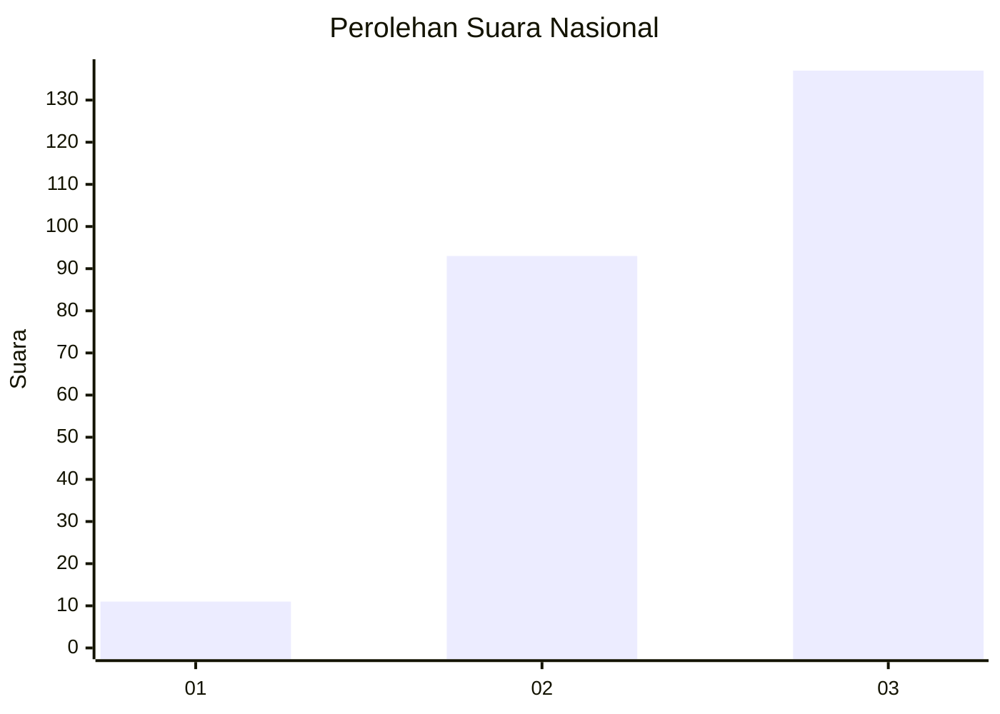
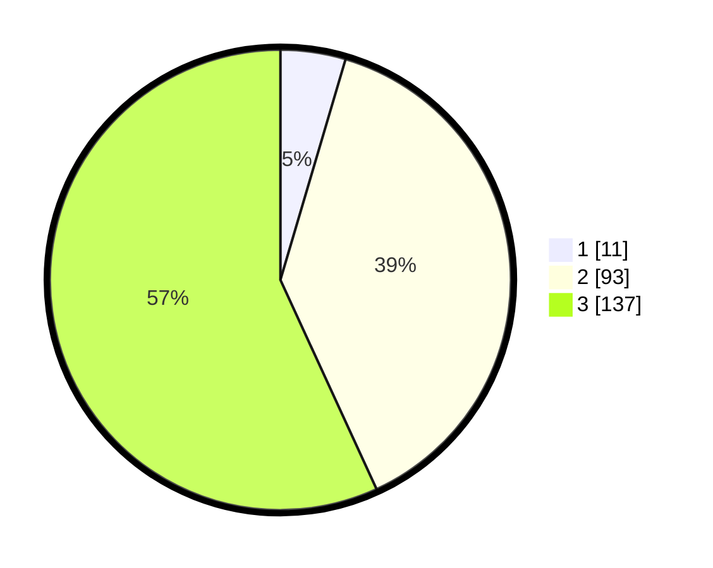

# Hasil

## Grafik

## Tabel

| No.    | Nama Paslon    | Suara | Suara (raw) | Persentase |
|:------ |:-------------- | -----:| -----------:| ----------:|
| 100025 | ANIES MUHAIMIN | 11    | [11][p-1]   | 4,56       |
| 100026 | PRABOWO GIBRAN | 93    | [93][p-2]   | 38,59      |
| 100027 | GANJAR MAHFUD  | 137   | [137][p-3]  | 56,85      |

[p-1]: https://github.com/gigit-pemilu/pemilu-2024/blob/main/pilpres/hitung-suara/sub/31-dki-jakarta/sub/72-jakarta-utara/sub/06-kelapa-gading/sub/1003-kelapa-gading-barat/sub/056-tps/sub/paslon-1.txt
[p-2]: https://github.com/gigit-pemilu/pemilu-2024/blob/main/pilpres/hitung-suara/sub/31-dki-jakarta/sub/72-jakarta-utara/sub/06-kelapa-gading/sub/1003-kelapa-gading-barat/sub/056-tps/sub/paslon-2.txt
[p-3]: https://github.com/gigit-pemilu/pemilu-2024/blob/main/pilpres/hitung-suara/sub/31-dki-jakarta/sub/72-jakarta-utara/sub/06-kelapa-gading/sub/1003-kelapa-gading-barat/sub/056-tps/sub/paslon-3.txt

## Foto C Plano

https://sirekap-obj-formc.kpu.go.id/941e/pemilu/ppwp/31/72/06/10/03/3172061003056-20240214-223432--fda844e9-d34b-4afe-a831-e991ab11a991.jpg

https://sirekap-obj-formc.kpu.go.id/941e/pemilu/ppwp/31/72/06/10/03/3172061003056-20240214-223509--87c1fef6-42b0-4f86-9db3-0adc1363cf65.jpg

https://sirekap-obj-formc.kpu.go.id/941e/pemilu/ppwp/31/72/06/10/03/3172061003056-20240214-223606--0d0c1974-9608-4495-bd17-277b63c00553.jpg

## Metadata

| Key        | Value               |
| ---------- | ------------------- |
| Time Stamp | 2024-02-21 21:00:04 |

