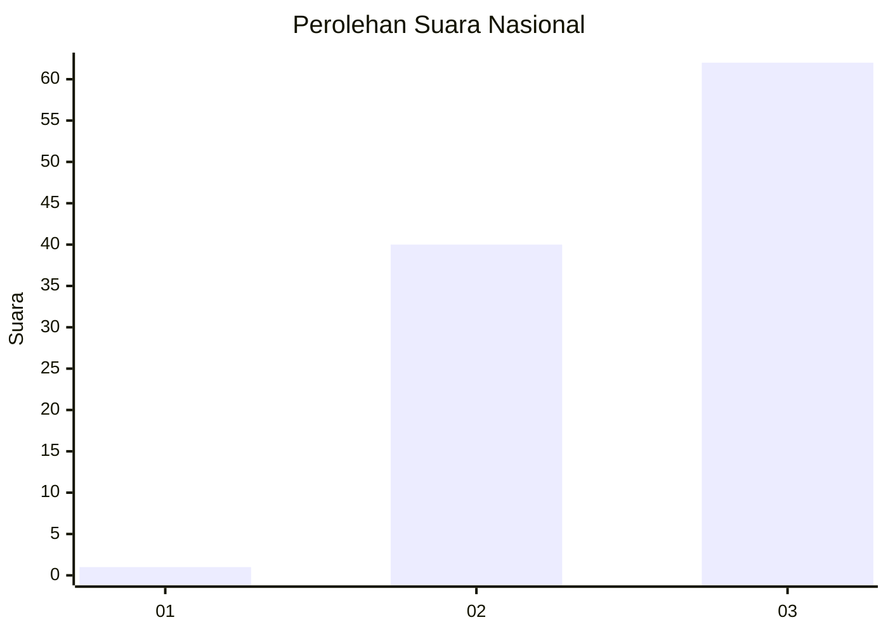
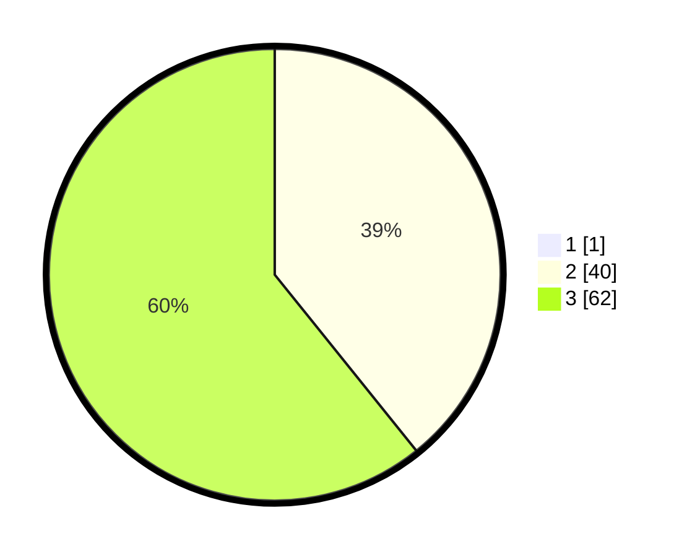

# Hasil

## Grafik

## Tabel

| No.    | Nama Paslon    | Suara | Suara (raw) | Persentase |
|:------ |:-------------- | -----:| -----------:| ----------:|
| 100025 | ANIES MUHAIMIN | 1     | [1][p-1]    | 0,97       |
| 100026 | PRABOWO GIBRAN | 40    | [40][p-2]   | 38,83      |
| 100027 | GANJAR MAHFUD  | 62    | [62][p-3]   | 60,19      |

[p-1]: https://github.com/gigit-pemilu/pemilu-2024/blob/main/pilpres/hitung-suara/sub/31-dki-jakarta/sub/72-jakarta-utara/sub/06-kelapa-gading/sub/1003-kelapa-gading-barat/sub/058-tps/sub/paslon-1.txt
[p-2]: https://github.com/gigit-pemilu/pemilu-2024/blob/main/pilpres/hitung-suara/sub/31-dki-jakarta/sub/72-jakarta-utara/sub/06-kelapa-gading/sub/1003-kelapa-gading-barat/sub/058-tps/sub/paslon-2.txt
[p-3]: https://github.com/gigit-pemilu/pemilu-2024/blob/main/pilpres/hitung-suara/sub/31-dki-jakarta/sub/72-jakarta-utara/sub/06-kelapa-gading/sub/1003-kelapa-gading-barat/sub/058-tps/sub/paslon-3.txt

## Foto C Plano

https://sirekap-obj-formc.kpu.go.id/0864/pemilu/ppwp/31/72/06/10/03/3172061003058-20240214-202815--6880c0d5-8c3f-479d-8776-84f72ad42658.jpg

https://sirekap-obj-formc.kpu.go.id/0864/pemilu/ppwp/31/72/06/10/03/3172061003058-20240214-205316--44161395-38e7-469a-bdd1-d88a3d02934f.jpg

https://sirekap-obj-formc.kpu.go.id/0864/pemilu/ppwp/31/72/06/10/03/3172061003058-20240214-205402--e4ef3236-615e-40c1-b78c-6e16af7801b2.jpg

## Metadata

| Key        | Value               |
| ---------- | ------------------- |
| Time Stamp | 2024-02-21 21:00:04 |

