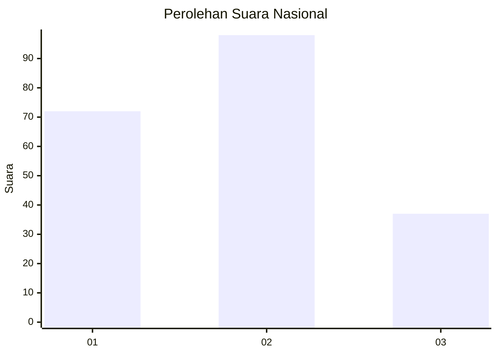
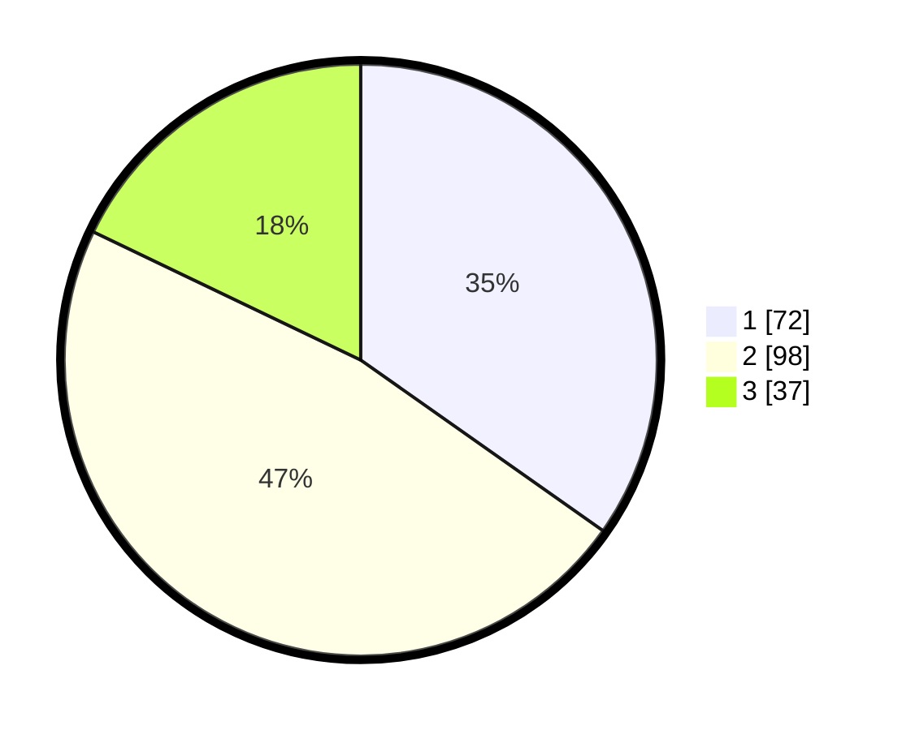

# Hasil

## Grafik

## Tabel

| No.    | Nama Paslon    | Suara | Suara (raw) | Persentase |
|:------ |:-------------- | -----:| -----------:| ----------:|
| 100025 | ANIES MUHAIMIN | 72    | [72][p-1]   | 34,78      |
| 100026 | PRABOWO GIBRAN | 98    | [98][p-2]   | 47,34      |
| 100027 | GANJAR MAHFUD  | 37    | [37][p-3]   | 17,87      |

[p-1]: https://github.com/gigit-pemilu/pemilu-2024/blob/main/pilpres/hitung-suara/sub/31-dki-jakarta/sub/72-jakarta-utara/sub/06-kelapa-gading/sub/1003-kelapa-gading-barat/sub/060-tps/sub/paslon-1.txt
[p-2]: https://github.com/gigit-pemilu/pemilu-2024/blob/main/pilpres/hitung-suara/sub/31-dki-jakarta/sub/72-jakarta-utara/sub/06-kelapa-gading/sub/1003-kelapa-gading-barat/sub/060-tps/sub/paslon-2.txt
[p-3]: https://github.com/gigit-pemilu/pemilu-2024/blob/main/pilpres/hitung-suara/sub/31-dki-jakarta/sub/72-jakarta-utara/sub/06-kelapa-gading/sub/1003-kelapa-gading-barat/sub/060-tps/sub/paslon-3.txt

## Foto C Plano

https://sirekap-obj-formc.kpu.go.id/18ed/pemilu/ppwp/31/72/06/10/03/3172061003060-20240214-214710--0cfd83b0-3dc6-4fef-9d14-b26ed29d2e0a.jpg

https://sirekap-obj-formc.kpu.go.id/18ed/pemilu/ppwp/31/72/06/10/03/3172061003060-20240214-214817--0a8fefd6-2f6b-44d7-827a-abe382ad1172.jpg

https://sirekap-obj-formc.kpu.go.id/18ed/pemilu/ppwp/31/72/06/10/03/3172061003060-20240214-214938--f335cfd2-1ee9-45d2-a40a-cc196b5aa566.jpg

## Metadata

| Key        | Value               |
| ---------- | ------------------- |
| Time Stamp | 2024-02-21 20:00:00 |

