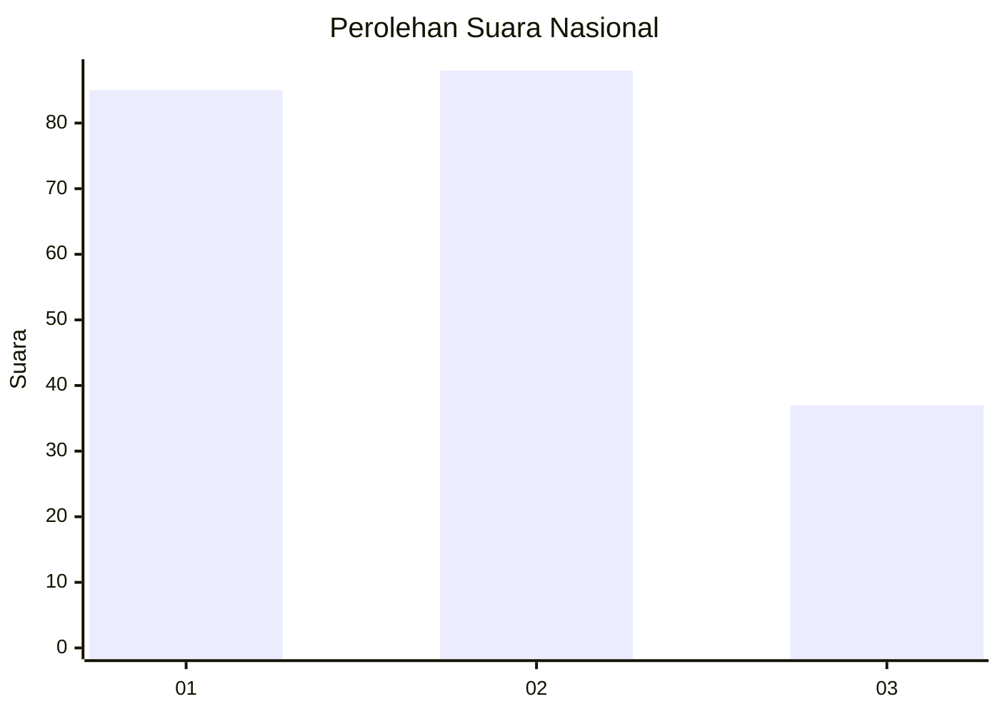
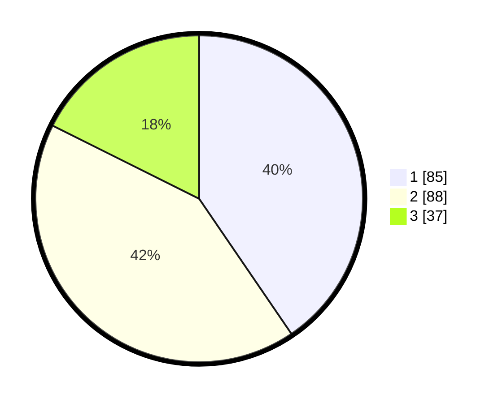

# Hasil

## Grafik

## Tabel

| No.    | Nama Paslon    | Suara | Suara (raw) | Persentase |
|:------ |:-------------- | -----:| -----------:| ----------:|
| 100025 | ANIES MUHAIMIN | 85    | [85][p-1]   | 40,48      |
| 100026 | PRABOWO GIBRAN | 88    | [88][p-2]   | 41,90      |
| 100027 | GANJAR MAHFUD  | 37    | [37][p-3]   | 17,62      |

[p-1]: https://github.com/gigit-pemilu/pemilu-2024/blob/main/pilpres/hitung-suara/sub/31-dki-jakarta/sub/72-jakarta-utara/sub/06-kelapa-gading/sub/1003-kelapa-gading-barat/sub/061-tps/sub/paslon-1.txt
[p-2]: https://github.com/gigit-pemilu/pemilu-2024/blob/main/pilpres/hitung-suara/sub/31-dki-jakarta/sub/72-jakarta-utara/sub/06-kelapa-gading/sub/1003-kelapa-gading-barat/sub/061-tps/sub/paslon-2.txt
[p-3]: https://github.com/gigit-pemilu/pemilu-2024/blob/main/pilpres/hitung-suara/sub/31-dki-jakarta/sub/72-jakarta-utara/sub/06-kelapa-gading/sub/1003-kelapa-gading-barat/sub/061-tps/sub/paslon-3.txt

## Foto C Plano

https://sirekap-obj-formc.kpu.go.id/2858/pemilu/ppwp/31/72/06/10/03/3172061003061-20240222-201220--9271212d-d560-4982-a474-f0848e113eb9.jpg

https://sirekap-obj-formc.kpu.go.id/2858/pemilu/ppwp/31/72/06/10/03/3172061003061-20240222-201317--d1655cc0-9907-441d-8a19-6d10a66e761a.jpg

https://sirekap-obj-formc.kpu.go.id/2858/pemilu/ppwp/31/72/06/10/03/3172061003061-20240222-201349--a54845dc-4203-42b8-a66f-f480c2dc0c73.jpg

## Metadata

| Key        | Value               |
| ---------- | ------------------- |
| Time Stamp | 2024-02-24 22:31:28 |

