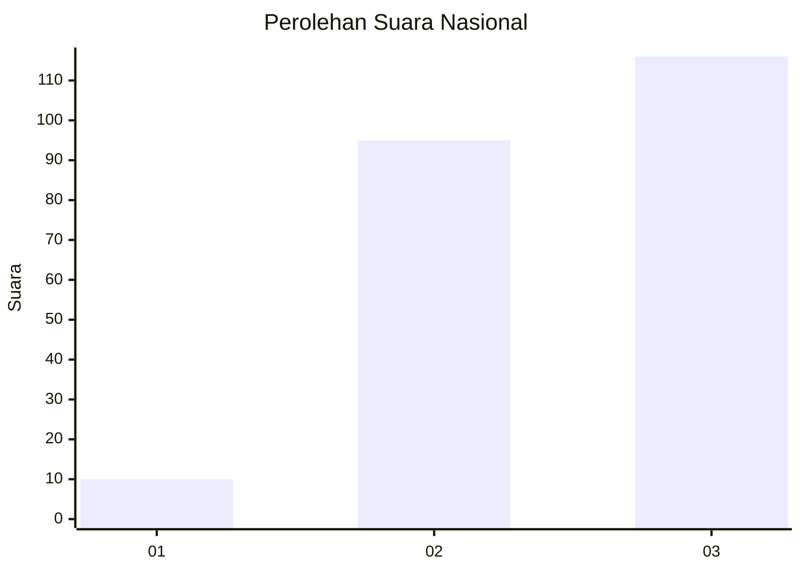
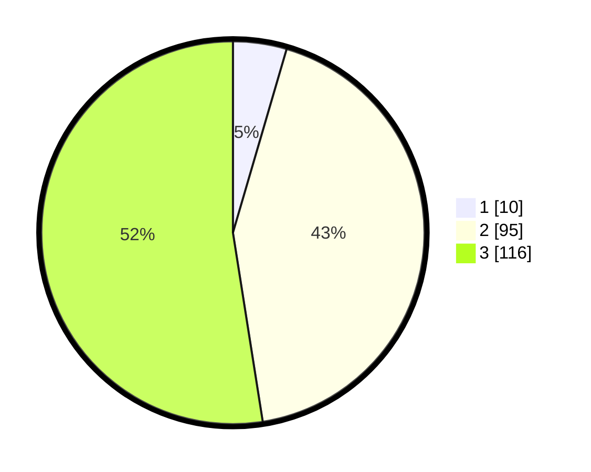

# Hasil

## Grafik

## Tabel

| No.    | Nama Paslon    | Suara | Suara (raw) | Persentase |
|:------ |:-------------- | -----:| -----------:| ----------:|
| 100025 | ANIES MUHAIMIN | 10    | [10][p-1]   | 4,52       |
| 100026 | PRABOWO GIBRAN | 95    | [95][p-2]   | 42,99      |
| 100027 | GANJAR MAHFUD  | 116   | [116][p-3]  | 52,49      |

[p-1]: https://github.com/gigit-pemilu/pemilu-2024/blob/main/pilpres/hitung-suara/sub/31-dki-jakarta/sub/72-jakarta-utara/sub/06-kelapa-gading/sub/1003-kelapa-gading-barat/sub/079-tps/sub/paslon-1.txt
[p-2]: https://github.com/gigit-pemilu/pemilu-2024/blob/main/pilpres/hitung-suara/sub/31-dki-jakarta/sub/72-jakarta-utara/sub/06-kelapa-gading/sub/1003-kelapa-gading-barat/sub/079-tps/sub/paslon-2.txt
[p-3]: https://github.com/gigit-pemilu/pemilu-2024/blob/main/pilpres/hitung-suara/sub/31-dki-jakarta/sub/72-jakarta-utara/sub/06-kelapa-gading/sub/1003-kelapa-gading-barat/sub/079-tps/sub/paslon-3.txt

## Foto C Plano

https://sirekap-obj-formc.kpu.go.id/29cf/pemilu/ppwp/31/72/06/10/03/3172061003079-20240214-202828--b99cadac-1002-4bf8-ab93-7cb3683731f6.jpg

https://sirekap-obj-formc.kpu.go.id/29cf/pemilu/ppwp/31/72/06/10/03/3172061003079-20240214-202833--0d7899e4-5a66-4c15-8ec5-9f928fd50757.jpg

https://sirekap-obj-formc.kpu.go.id/29cf/pemilu/ppwp/31/72/06/10/03/3172061003079-20240214-203051--8fbb2d9f-6d2e-4daf-92d6-d64a03ca6a85.jpg

## Metadata

| Key        | Value               |
| ---------- | ------------------- |
| Time Stamp | 2024-02-21 16:00:00 |

