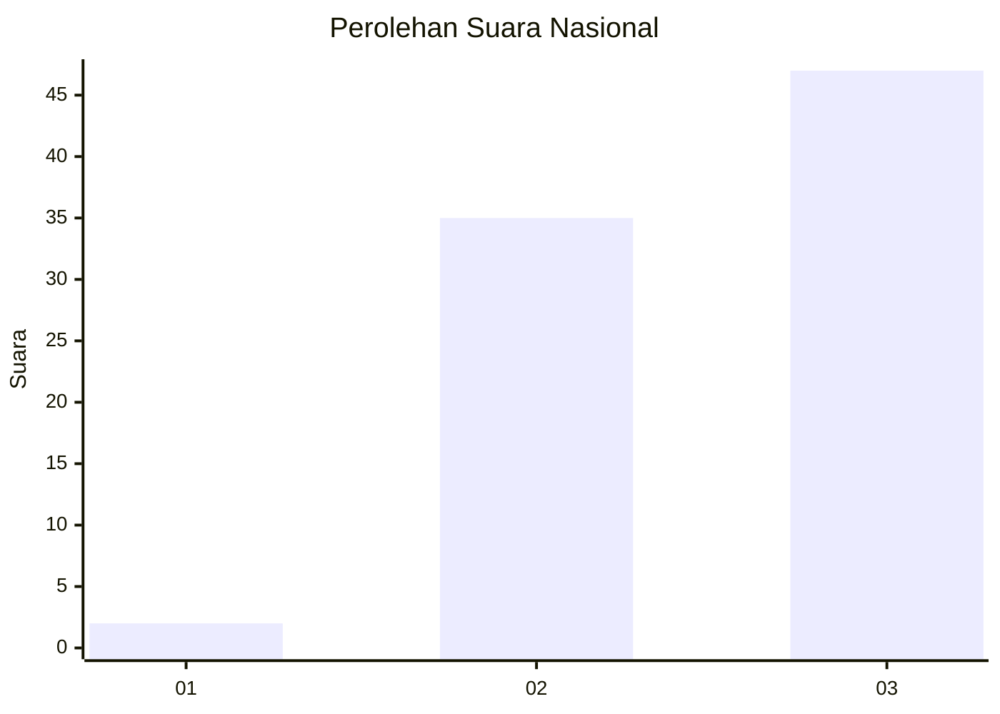
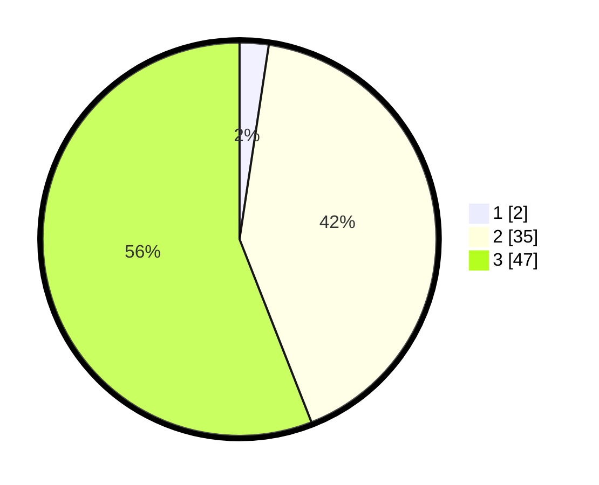

# Hasil

## Grafik

## Tabel

| No.    | Nama Paslon    | Suara | Suara (raw) | Persentase |
|:------ |:-------------- | -----:| -----------:| ----------:|
| 100025 | ANIES MUHAIMIN | 2     | [2][p-1]    | 2,38       |
| 100026 | PRABOWO GIBRAN | 35    | [35][p-2]   | 41,67      |
| 100027 | GANJAR MAHFUD  | 47    | [47][p-3]   | 55,95      |

[p-1]: https://github.com/gigit-pemilu/pemilu-2024/blob/main/pilpres/hitung-suara/sub/31-dki-jakarta/sub/72-jakarta-utara/sub/06-kelapa-gading/sub/1003-kelapa-gading-barat/sub/082-tps/sub/paslon-1.txt
[p-2]: https://github.com/gigit-pemilu/pemilu-2024/blob/main/pilpres/hitung-suara/sub/31-dki-jakarta/sub/72-jakarta-utara/sub/06-kelapa-gading/sub/1003-kelapa-gading-barat/sub/082-tps/sub/paslon-2.txt
[p-3]: https://github.com/gigit-pemilu/pemilu-2024/blob/main/pilpres/hitung-suara/sub/31-dki-jakarta/sub/72-jakarta-utara/sub/06-kelapa-gading/sub/1003-kelapa-gading-barat/sub/082-tps/sub/paslon-3.txt

## Foto C Plano

https://sirekap-obj-formc.kpu.go.id/6507/pemilu/ppwp/31/72/06/10/03/3172061003082-20240224-161056--9d294ec6-c357-4b4d-ab10-1a5eab4b18dd.jpg

https://sirekap-obj-formc.kpu.go.id/6507/pemilu/ppwp/31/72/06/10/03/3172061003082-20240224-161145--ae3ee9c2-dad7-49b6-a11a-5d3ad8f8074f.jpg

https://sirekap-obj-formc.kpu.go.id/6507/pemilu/ppwp/31/72/06/10/03/3172061003082-20240224-161320--cbd64412-313b-44ef-ac81-d57f5307d041.jpg

## Metadata

| Key        | Value               |
| ---------- | ------------------- |
| Time Stamp | 2024-02-25 03:00:00 |

