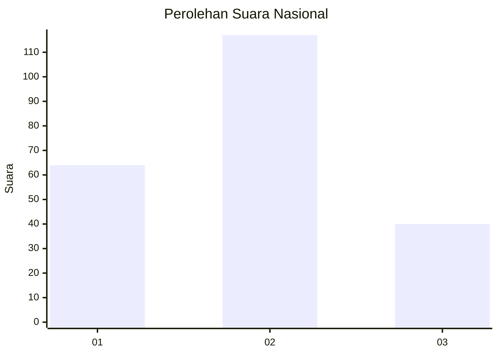
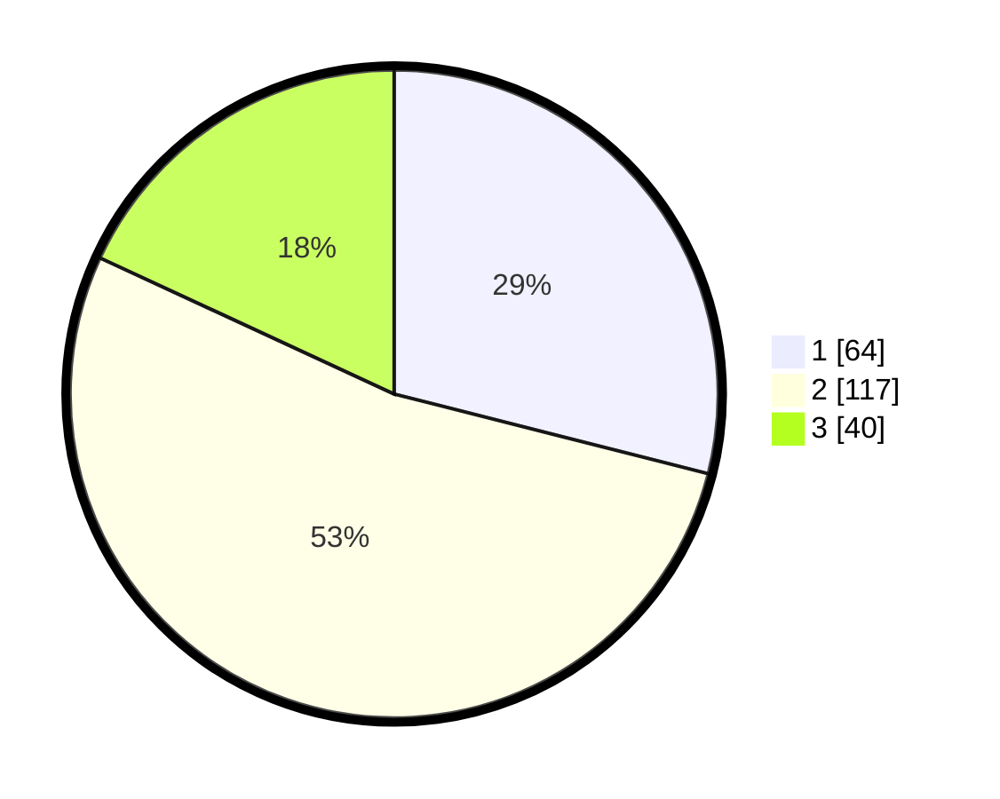

# Hasil

## Grafik

## Tabel

| No.    | Nama Paslon    | Suara | Suara (raw) | Persentase |
|:------ |:-------------- | -----:| -----------:| ----------:|
| 100025 | ANIES MUHAIMIN | 64    | [64][p-1]   | 28,96      |
| 100026 | PRABOWO GIBRAN | 117   | [117][p-2]  | 52,94      |
| 100027 | GANJAR MAHFUD  | 40    | [40][p-3]   | 18,10      |

[p-1]: https://github.com/gigit-pemilu/pemilu-2024/blob/main/pilpres/hitung-suara/sub/31-dki-jakarta/sub/72-jakarta-utara/sub/06-kelapa-gading/sub/1003-kelapa-gading-barat/sub/109-tps/sub/paslon-1.txt
[p-2]: https://github.com/gigit-pemilu/pemilu-2024/blob/main/pilpres/hitung-suara/sub/31-dki-jakarta/sub/72-jakarta-utara/sub/06-kelapa-gading/sub/1003-kelapa-gading-barat/sub/109-tps/sub/paslon-2.txt
[p-3]: https://github.com/gigit-pemilu/pemilu-2024/blob/main/pilpres/hitung-suara/sub/31-dki-jakarta/sub/72-jakarta-utara/sub/06-kelapa-gading/sub/1003-kelapa-gading-barat/sub/109-tps/sub/paslon-3.txt

## Foto C Plano

https://sirekap-obj-formc.kpu.go.id/f0c8/pemilu/ppwp/31/72/06/10/03/3172061003109-20240226-121853--f9962d64-51ed-401c-b722-52cc9310bb75.jpg

https://sirekap-obj-formc.kpu.go.id/f0c8/pemilu/ppwp/31/72/06/10/03/3172061003109-20240226-122032--1fa0b546-3a70-4f18-9139-377aef4b4084.jpg

https://sirekap-obj-formc.kpu.go.id/f0c8/pemilu/ppwp/31/72/06/10/03/3172061003109-20240226-122748--3d27e1af-e7f3-47ed-939e-3d66d67a050f.jpg

## Metadata

| Key        | Value               |
| ---------- | ------------------- |
| Time Stamp | 2024-02-26 13:00:00 |

