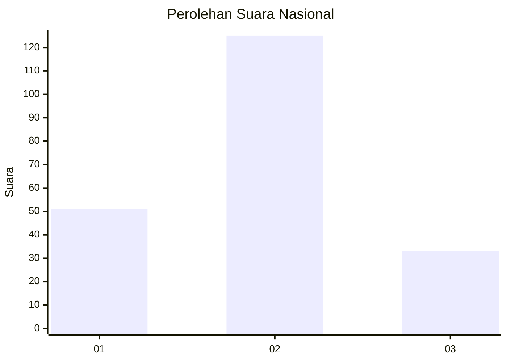

# Hasil

## Grafik

## Tabel

| No.    | Nama Paslon    | Suara | Suara (raw) | Persentase |
|:------ |:-------------- | -----:| -----------:| ----------:|
| 100025 | ANIES MUHAIMIN | 51    | [51][p-1]   | 24,40      |
| 100026 | PRABOWO GIBRAN | 125   | [125][p-2]  | 59,81      |
| 100027 | GANJAR MAHFUD  | 33    | [33][p-3]   | 15,79      |

[p-1]: https://github.com/gigit-pemilu/pemilu-2024/blob/main/pilpres/hitung-suara/sub/31-dki-jakarta/sub/72-jakarta-utara/sub/06-kelapa-gading/sub/1003-kelapa-gading-barat/sub/110-tps/sub/paslon-1.txt
[p-2]: https://github.com/gigit-pemilu/pemilu-2024/blob/main/pilpres/hitung-suara/sub/31-dki-jakarta/sub/72-jakarta-utara/sub/06-kelapa-gading/sub/1003-kelapa-gading-barat/sub/110-tps/sub/paslon-2.txt
[p-3]: https://github.com/gigit-pemilu/pemilu-2024/blob/main/pilpres/hitung-suara/sub/31-dki-jakarta/sub/72-jakarta-utara/sub/06-kelapa-gading/sub/1003-kelapa-gading-barat/sub/110-tps/sub/paslon-3.txt

## Foto C Plano

https://sirekap-obj-formc.kpu.go.id/d204/pemilu/ppwp/31/72/06/10/03/3172061003110-20240226-141202--12392d33-e863-4bd4-841f-0b3aeaddb14b.jpg

https://sirekap-obj-formc.kpu.go.id/d204/pemilu/ppwp/31/72/06/10/03/3172061003110-20240226-141318--9f9cf288-8a39-4409-9a0b-9ab05c4110ea.jpg

https://sirekap-obj-formc.kpu.go.id/d204/pemilu/ppwp/31/72/06/10/03/3172061003110-20240226-141419--723d1f92-3f29-4028-982d-702fd026aeaa.jpg

## Metadata

| Key        | Value               |
| ---------- | ------------------- |
| Time Stamp | 2024-02-26 15:00:00 |

