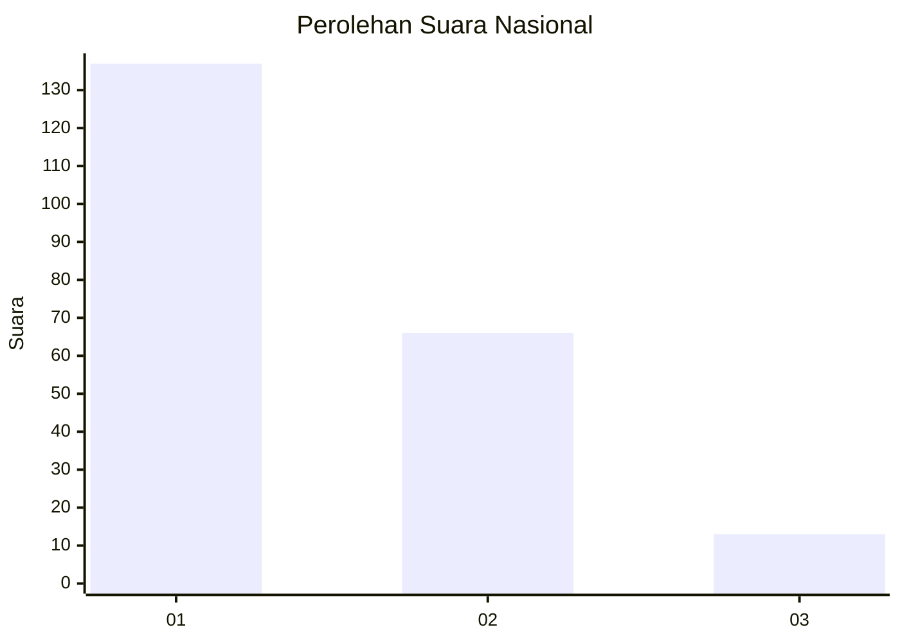
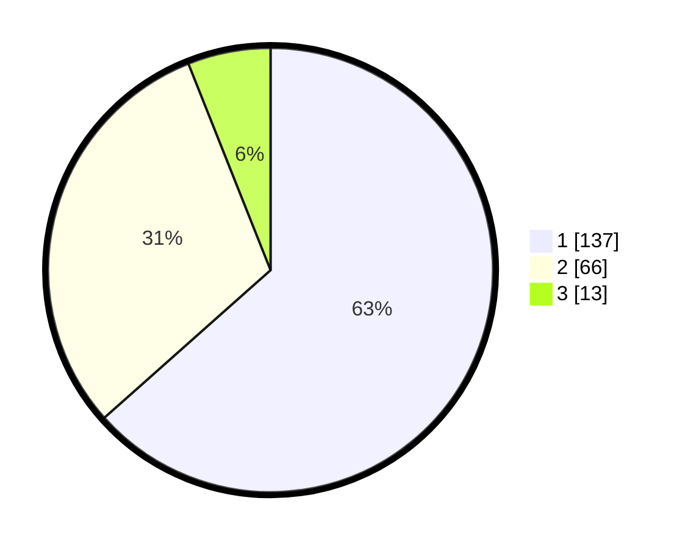

# Hasil

## Grafik

## Tabel

| No.    | Nama Paslon    | Suara | Suara (raw) | Persentase |
|:------ |:-------------- | -----:| -----------:| ----------:|
| 100025 | ANIES MUHAIMIN | 137   | [137][p-1]  | 63,43      |
| 100026 | PRABOWO GIBRAN | 66    | [66][p-2]   | 30,56      |
| 100027 | GANJAR MAHFUD  | 13    | [13][p-3]   | 6,02       |

[p-1]: https://github.com/gigit-pemilu/pemilu-2024/blob/main/pilpres/hitung-suara/sub/31-dki-jakarta/sub/72-jakarta-utara/sub/06-kelapa-gading/sub/1003-kelapa-gading-barat/sub/113-tps/sub/paslon-1.txt
[p-2]: https://github.com/gigit-pemilu/pemilu-2024/blob/main/pilpres/hitung-suara/sub/31-dki-jakarta/sub/72-jakarta-utara/sub/06-kelapa-gading/sub/1003-kelapa-gading-barat/sub/113-tps/sub/paslon-2.txt
[p-3]: https://github.com/gigit-pemilu/pemilu-2024/blob/main/pilpres/hitung-suara/sub/31-dki-jakarta/sub/72-jakarta-utara/sub/06-kelapa-gading/sub/1003-kelapa-gading-barat/sub/113-tps/sub/paslon-3.txt

## Foto C Plano

https://sirekap-obj-formc.kpu.go.id/41f4/pemilu/ppwp/31/72/06/10/03/3172061003113-20240214-214425--66fd1b6f-c072-46d8-aa31-d559ef961d2a.jpg

https://sirekap-obj-formc.kpu.go.id/41f4/pemilu/ppwp/31/72/06/10/03/3172061003113-20240214-214718--16a1bd05-2b4e-4525-9fec-7035e6d9755b.jpg

https://sirekap-obj-formc.kpu.go.id/41f4/pemilu/ppwp/31/72/06/10/03/3172061003113-20240214-214918--84e4909d-7eb4-419c-afb4-ad995403957f.jpg

## Metadata

| Key        | Value               |
| ---------- | ------------------- |
| Time Stamp | 2024-02-20 16:00:00 |

