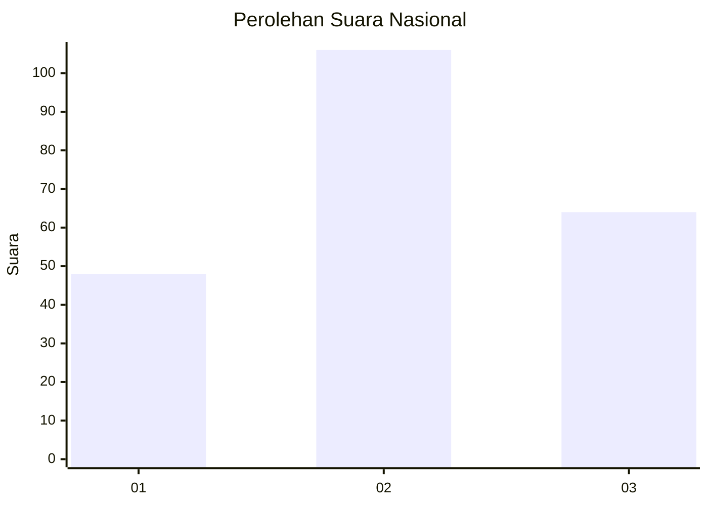
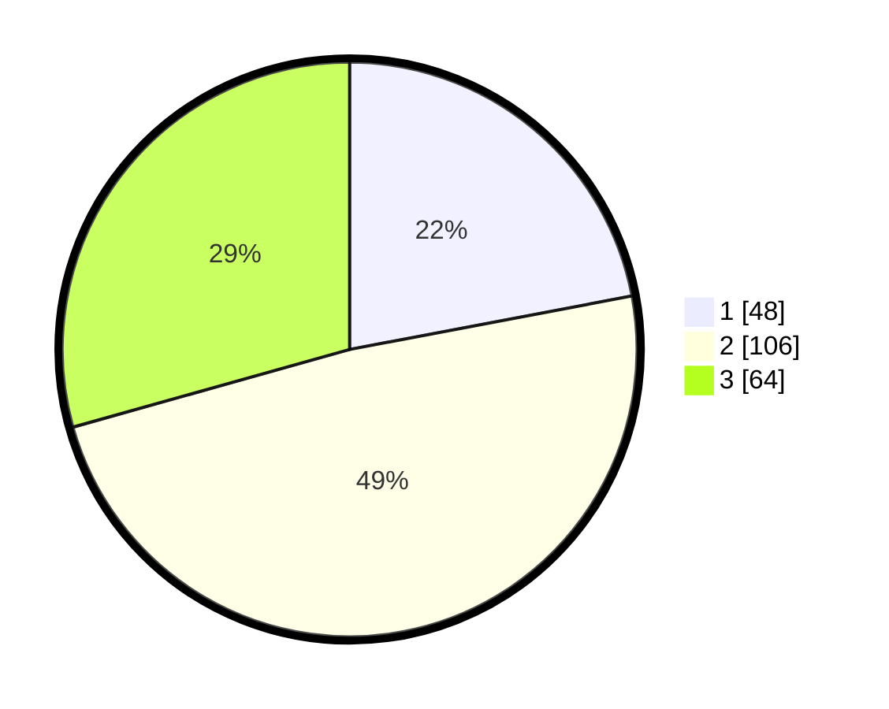

# Hasil

## Grafik

## Tabel

| No. | Nama Paslon    | Suara | Suara (raw) | Persentase |
|:--- |:-------------- | -----:| -----------:| ----------:|
| 1   | ANIES MUHAIMIN | 48    | [48][p-1]   | 22,02      |
| 2   | PRABOWO GIBRAN | 106   | [106][p-2]  | 48,62      |
| 3   | GANJAR MAHFUD  | 64    | [64][p-3]   | 29,36      |

[p-1]: https://github.com/gigit-pemilu/pemilu-2024/blob/main/pilpres/hitung-suara/sub/31-dki-jakarta/sub/73-jakarta-barat/sub/01-cengkareng/sub/1001-cengkareng-barat/sub/001-tps/sub/paslon-1.txt
[p-2]: https://github.com/gigit-pemilu/pemilu-2024/blob/main/pilpres/hitung-suara/sub/31-dki-jakarta/sub/73-jakarta-barat/sub/01-cengkareng/sub/1001-cengkareng-barat/sub/001-tps/sub/paslon-2.txt
[p-3]: https://github.com/gigit-pemilu/pemilu-2024/blob/main/pilpres/hitung-suara/sub/31-dki-jakarta/sub/73-jakarta-barat/sub/01-cengkareng/sub/1001-cengkareng-barat/sub/001-tps/sub/paslon-3.txt

## Foto C Plano

https://sirekap-obj-formc.kpu.go.id/e5ae/pemilu/ppwp/31/73/01/10/01/3173011001001-20240215-001040--fecac233-4a9e-4e69-b94a-8810ca268d38.jpg

https://sirekap-obj-formc.kpu.go.id/e5ae/pemilu/ppwp/31/73/01/10/01/3173011001001-20240214-184512--7a93927e-59b0-4a3d-a009-96854acdd6c9.jpg

https://sirekap-obj-formc.kpu.go.id/e5ae/pemilu/ppwp/31/73/01/10/01/3173011001001-20240214-160100--b7189aed-ee62-48bc-94ff-147818832ef3.jpg

## Metadata

| Key        | Value               |
| ---------- | ------------------- |
| Time Stamp | 2024-02-24 22:31:28 |

