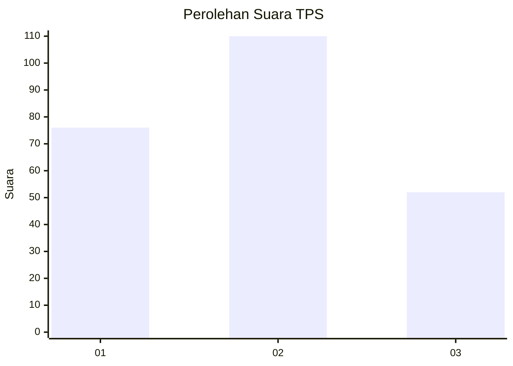
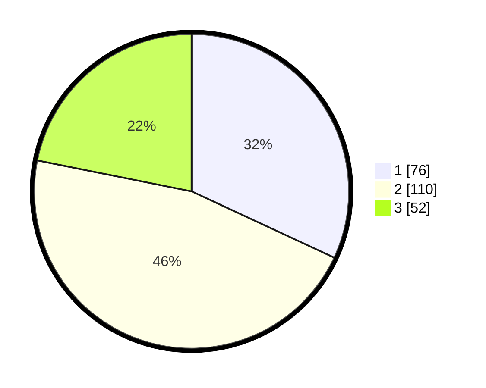

# Hasil

## Grafik

## Tabel

| No. | Nama Paslon    | Suara | Suara (raw) | Persentase |
|:--- |:-------------- | -----:| -----------:| ----------:|
| 1   | ANIES MUHAIMIN | 76    | [76][p-1]   | 31,93      |
| 2   | PRABOWO GIBRAN | 110   | [110][p-2]  | 46,22      |
| 3   | GANJAR MAHFUD  | 52    | [52][p-3]   | 21,85      |

[p-1]: https://github.com/gigit-pemilu/pemilu-2024-31-dki-jakarta/blob/main/pilpres/hitung-suara/sub/31-dki-jakarta/sub/73-jakarta-barat/sub/01-cengkareng/sub/1001-cengkareng-barat/sub/002-tps/sub/paslon-1.txt
[p-2]: https://github.com/gigit-pemilu/pemilu-2024-31-dki-jakarta/blob/main/pilpres/hitung-suara/sub/31-dki-jakarta/sub/73-jakarta-barat/sub/01-cengkareng/sub/1001-cengkareng-barat/sub/002-tps/sub/paslon-2.txt
[p-3]: https://github.com/gigit-pemilu/pemilu-2024-31-dki-jakarta/blob/main/pilpres/hitung-suara/sub/31-dki-jakarta/sub/73-jakarta-barat/sub/01-cengkareng/sub/1001-cengkareng-barat/sub/002-tps/sub/paslon-3.txt

## Foto C Plano

https://sirekap-obj-formc.kpu.go.id/1763/pemilu/ppwp/31/73/01/10/01/3173011001002-20240215-013227--daa1bfd8-ebb8-41f6-bb59-67dff9335989.jpg

https://sirekap-obj-formc.kpu.go.id/1763/pemilu/ppwp/31/73/01/10/01/3173011001002-20240215-013401--28b4b139-cdae-4bb9-b2bd-d39309ecc0c5.jpg

https://sirekap-obj-formc.kpu.go.id/1763/pemilu/ppwp/31/73/01/10/01/3173011001002-20240215-013441--beb8b23a-a390-47b4-8180-41569db6b422.jpg

## Metadata

| Key        | Value               |
| ---------- | ------------------- |
| Time Stamp | 2024-02-16 00:00:26 |

