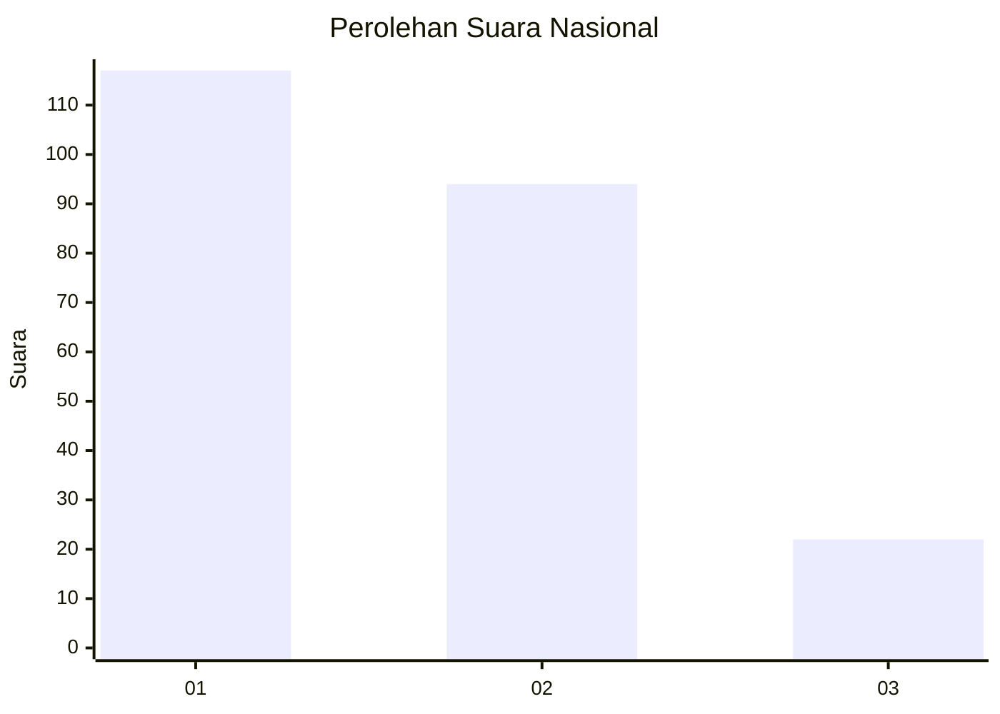
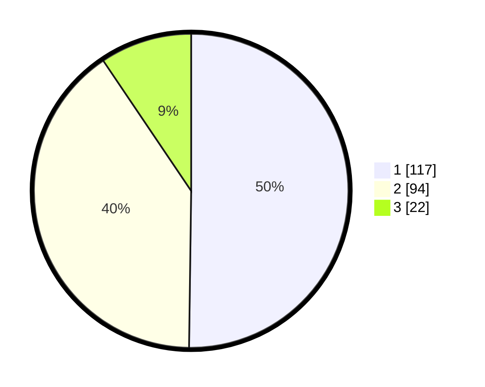

# Hasil

## Grafik

## Tabel

| No.    | Nama Paslon    | Suara | Suara (raw) | Persentase |
|:------ |:-------------- | -----:| -----------:| ----------:|
| 100025 | ANIES MUHAIMIN | 117   | [117][p-1]  | 50,21      |
| 100026 | PRABOWO GIBRAN | 94    | [94][p-2]   | 40,34      |
| 100027 | GANJAR MAHFUD  | 22    | [22][p-3]   | 9,44       |

[p-1]: https://github.com/gigit-pemilu/pemilu-2024/blob/main/pilpres/hitung-suara/sub/31-dki-jakarta/sub/73-jakarta-barat/sub/01-cengkareng/sub/1001-cengkareng-barat/sub/021-tps/sub/paslon-1.txt
[p-2]: https://github.com/gigit-pemilu/pemilu-2024/blob/main/pilpres/hitung-suara/sub/31-dki-jakarta/sub/73-jakarta-barat/sub/01-cengkareng/sub/1001-cengkareng-barat/sub/021-tps/sub/paslon-2.txt
[p-3]: https://github.com/gigit-pemilu/pemilu-2024/blob/main/pilpres/hitung-suara/sub/31-dki-jakarta/sub/73-jakarta-barat/sub/01-cengkareng/sub/1001-cengkareng-barat/sub/021-tps/sub/paslon-3.txt

## Foto C Plano

https://sirekap-obj-formc.kpu.go.id/924d/pemilu/ppwp/31/73/01/10/01/3173011001021-20240214-210435--282a37a4-298a-465d-b830-fb2ddd65b08a.jpg

https://sirekap-obj-formc.kpu.go.id/924d/pemilu/ppwp/31/73/01/10/01/3173011001021-20240214-215206--fa1c3a6d-3035-4030-aed7-b75550247431.jpg

https://sirekap-obj-formc.kpu.go.id/924d/pemilu/ppwp/31/73/01/10/01/3173011001021-20240214-221235--21a4b83e-f04c-4cba-b635-5f55552c4c3d.jpg

## Metadata

| Key        | Value               |
| ---------- | ------------------- |
| Time Stamp | 2024-02-17 16:00:02 |

