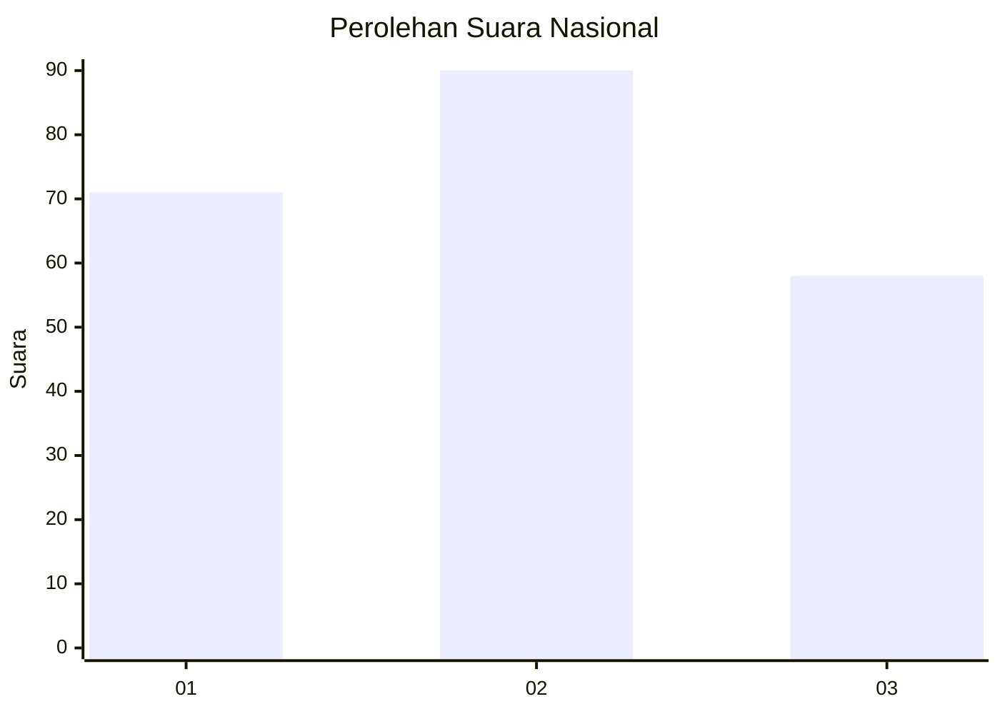
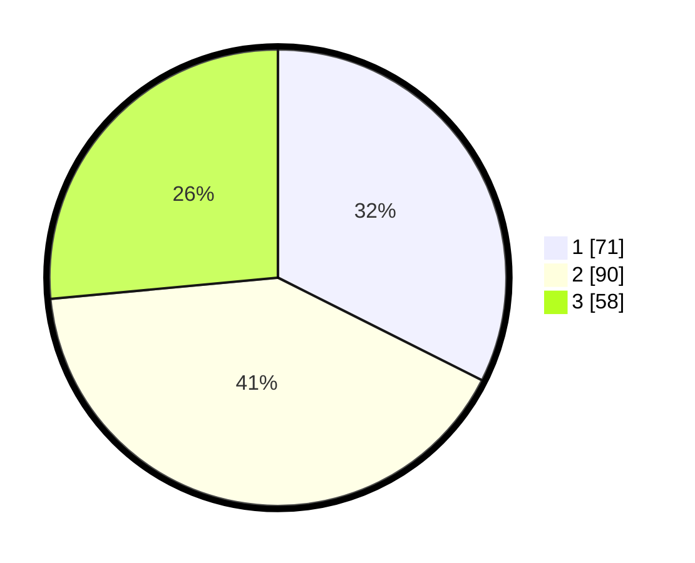

# Hasil

## Grafik

## Tabel

| No.    | Nama Paslon    | Suara | Suara (raw) | Persentase |
|:------ |:-------------- | -----:| -----------:| ----------:|
| 100025 | ANIES MUHAIMIN | 71    | [71][p-1]   | 32,42      |
| 100026 | PRABOWO GIBRAN | 90    | [90][p-2]   | 41,10      |
| 100027 | GANJAR MAHFUD  | 58    | [58][p-3]   | 26,48      |

[p-1]: https://github.com/gigit-pemilu/pemilu-2024/blob/main/pilpres/hitung-suara/sub/31-dki-jakarta/sub/73-jakarta-barat/sub/01-cengkareng/sub/1001-cengkareng-barat/sub/033-tps/sub/paslon-1.txt
[p-2]: https://github.com/gigit-pemilu/pemilu-2024/blob/main/pilpres/hitung-suara/sub/31-dki-jakarta/sub/73-jakarta-barat/sub/01-cengkareng/sub/1001-cengkareng-barat/sub/033-tps/sub/paslon-2.txt
[p-3]: https://github.com/gigit-pemilu/pemilu-2024/blob/main/pilpres/hitung-suara/sub/31-dki-jakarta/sub/73-jakarta-barat/sub/01-cengkareng/sub/1001-cengkareng-barat/sub/033-tps/sub/paslon-3.txt

## Foto C Plano

https://sirekap-obj-formc.kpu.go.id/ef87/pemilu/ppwp/31/73/01/10/01/3173011001033-20240214-222026--ca03926f-6a08-42b8-88be-8f8d936b8e27.jpg

https://sirekap-obj-formc.kpu.go.id/ef87/pemilu/ppwp/31/73/01/10/01/3173011001033-20240214-222200--6e39064c-1625-4b2b-a48e-8731f992a92e.jpg

https://sirekap-obj-formc.kpu.go.id/ef87/pemilu/ppwp/31/73/01/10/01/3173011001033-20240214-222335--e4d29707-ed2f-4376-ab3f-05d628860be2.jpg

## Metadata

| Key        | Value               |
| ---------- | ------------------- |
| Time Stamp | 2024-02-16 00:00:26 |

