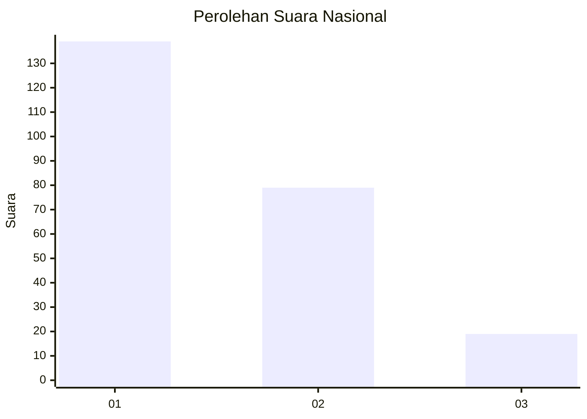
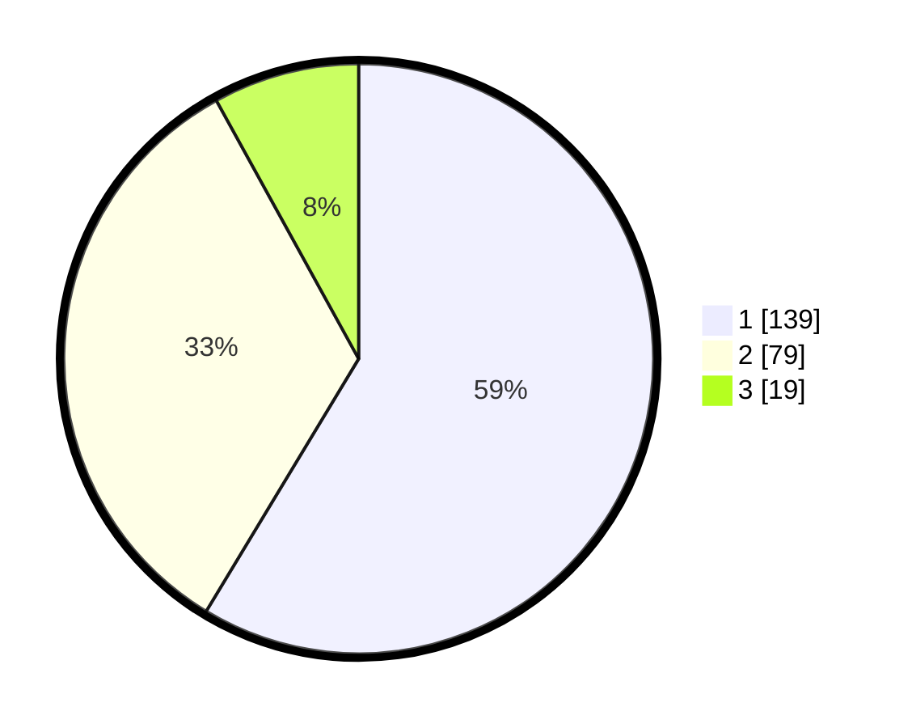

# Hasil

## Grafik

## Tabel

| No.    | Nama Paslon    | Suara | Suara (raw) | Persentase |
|:------ |:-------------- | -----:| -----------:| ----------:|
| 100025 | ANIES MUHAIMIN | 139   | [139][p-1]  | 58,65      |
| 100026 | PRABOWO GIBRAN | 79    | [79][p-2]   | 33,33      |
| 100027 | GANJAR MAHFUD  | 19    | [19][p-3]   | 8,02       |

[p-1]: https://github.com/gigit-pemilu/pemilu-2024/blob/main/pilpres/hitung-suara/sub/31-dki-jakarta/sub/73-jakarta-barat/sub/01-cengkareng/sub/1001-cengkareng-barat/sub/051-tps/sub/paslon-1.txt
[p-2]: https://github.com/gigit-pemilu/pemilu-2024/blob/main/pilpres/hitung-suara/sub/31-dki-jakarta/sub/73-jakarta-barat/sub/01-cengkareng/sub/1001-cengkareng-barat/sub/051-tps/sub/paslon-2.txt
[p-3]: https://github.com/gigit-pemilu/pemilu-2024/blob/main/pilpres/hitung-suara/sub/31-dki-jakarta/sub/73-jakarta-barat/sub/01-cengkareng/sub/1001-cengkareng-barat/sub/051-tps/sub/paslon-3.txt

## Foto C Plano

https://sirekap-obj-formc.kpu.go.id/8885/pemilu/ppwp/31/73/01/10/01/3173011001051-20240215-021622--fe4be9e0-8b8b-4039-8848-31ddfe77b414.jpg

https://sirekap-obj-formc.kpu.go.id/8885/pemilu/ppwp/31/73/01/10/01/3173011001051-20240215-021708--07375d10-f18e-4c16-a51c-a8ad7db8935a.jpg

https://sirekap-obj-formc.kpu.go.id/8885/pemilu/ppwp/31/73/01/10/01/3173011001051-20240214-190050--b754ab6b-5c10-41e4-8215-5dfe18d18fa6.jpg

## Metadata

| Key        | Value               |
| ---------- | ------------------- |
| Time Stamp | 2024-02-16 00:30:27 |

