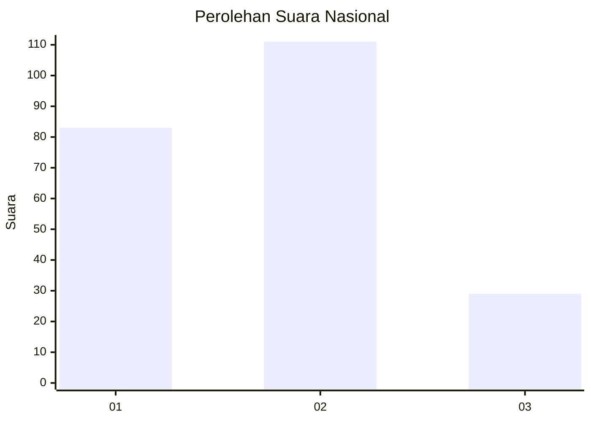
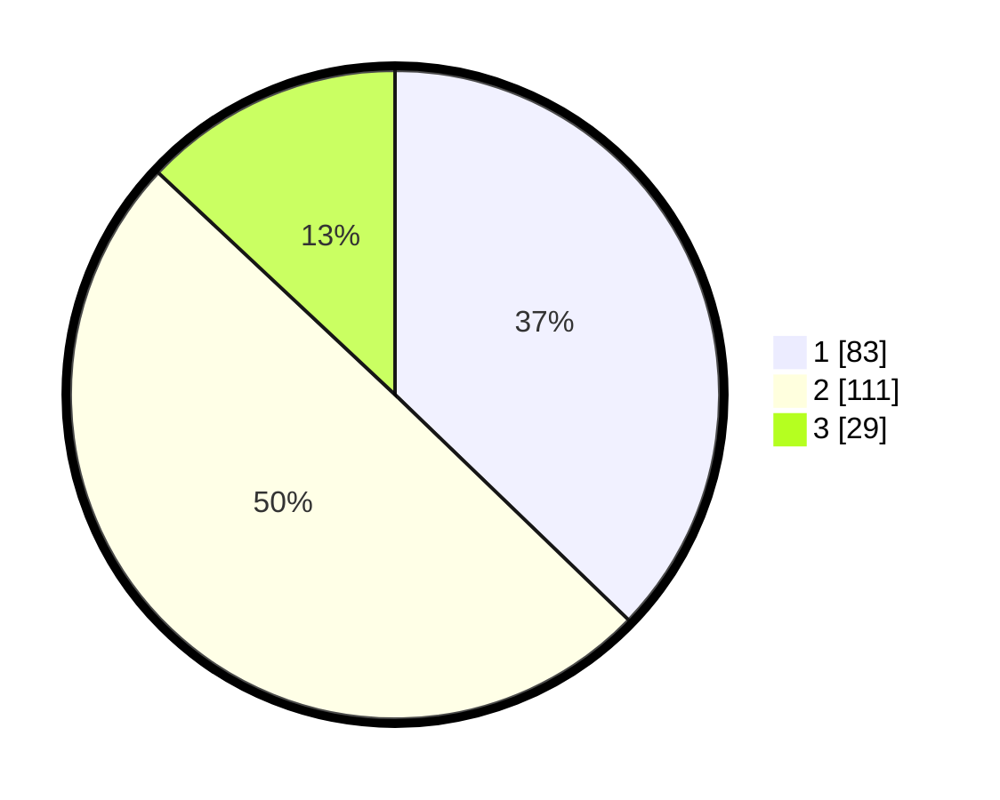

# Hasil

## Grafik

## Tabel

| No.    | Nama Paslon    | Suara | Suara (raw) | Persentase |
|:------ |:-------------- | -----:| -----------:| ----------:|
| 100025 | ANIES MUHAIMIN | 83    | [83][p-1]   | 37,22      |
| 100026 | PRABOWO GIBRAN | 111   | [111][p-2]  | 49,78      |
| 100027 | GANJAR MAHFUD  | 29    | [29][p-3]   | 13,00      |

[p-1]: https://github.com/gigit-pemilu/pemilu-2024/blob/main/pilpres/hitung-suara/sub/31-dki-jakarta/sub/73-jakarta-barat/sub/01-cengkareng/sub/1001-cengkareng-barat/sub/059-tps/sub/paslon-1.txt
[p-2]: https://github.com/gigit-pemilu/pemilu-2024/blob/main/pilpres/hitung-suara/sub/31-dki-jakarta/sub/73-jakarta-barat/sub/01-cengkareng/sub/1001-cengkareng-barat/sub/059-tps/sub/paslon-2.txt
[p-3]: https://github.com/gigit-pemilu/pemilu-2024/blob/main/pilpres/hitung-suara/sub/31-dki-jakarta/sub/73-jakarta-barat/sub/01-cengkareng/sub/1001-cengkareng-barat/sub/059-tps/sub/paslon-3.txt

## Foto C Plano

https://sirekap-obj-formc.kpu.go.id/90d6/pemilu/ppwp/31/73/01/10/01/3173011001059-20240215-013550--c4b3eca1-5546-4ef3-a8ec-f6456b3eca3a.jpg

https://sirekap-obj-formc.kpu.go.id/90d6/pemilu/ppwp/31/73/01/10/01/3173011001059-20240214-225316--abfe5602-ac0d-49c3-a17c-e1f76e4bdabf.jpg

https://sirekap-obj-formc.kpu.go.id/90d6/pemilu/ppwp/31/73/01/10/01/3173011001059-20240214-225420--75dec6d3-6991-4c75-94e2-2aeef723b46b.jpg

## Metadata

| Key        | Value               |
| ---------- | ------------------- |
| Time Stamp | 2024-02-16 00:30:27 |

