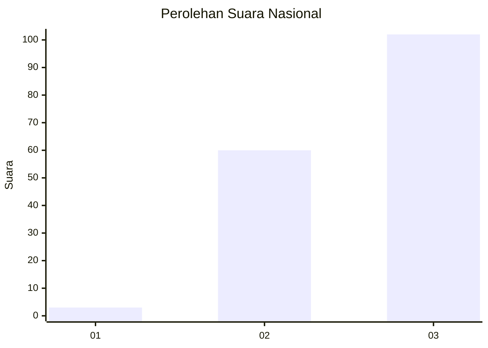
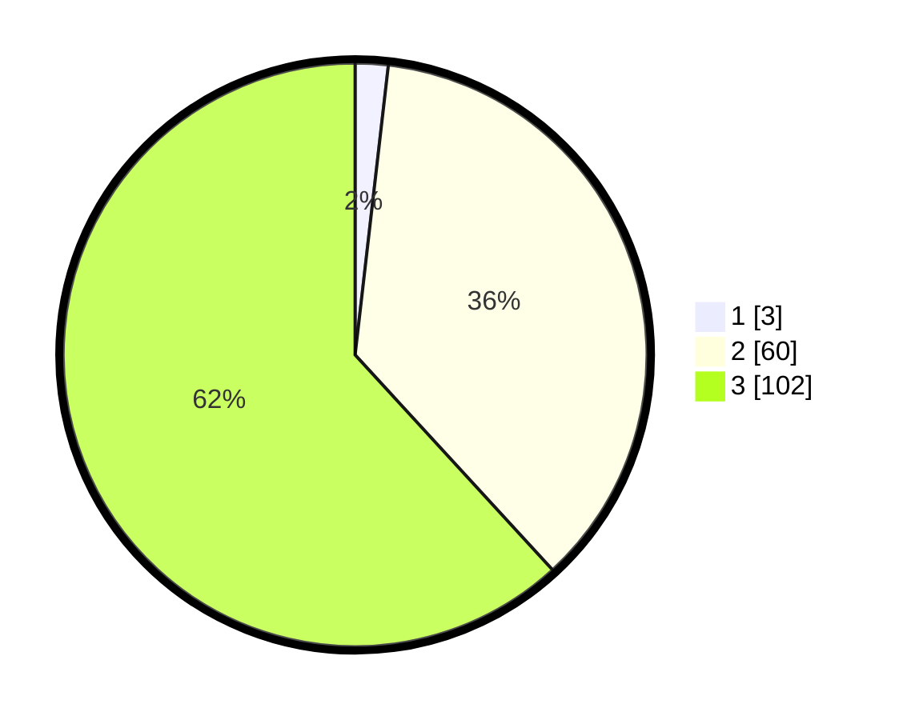

# Hasil

## Grafik

## Tabel

| No.    | Nama Paslon    | Suara | Suara (raw) | Persentase |
|:------ |:-------------- | -----:| -----------:| ----------:|
| 100025 | ANIES MUHAIMIN | 3     | [3][p-1]    | 1,82       |
| 100026 | PRABOWO GIBRAN | 60    | [60][p-2]   | 36,36      |
| 100027 | GANJAR MAHFUD  | 102   | [102][p-3]  | 61,82      |

[p-1]: https://github.com/gigit-pemilu/pemilu-2024/blob/main/pilpres/hitung-suara/sub/31-dki-jakarta/sub/73-jakarta-barat/sub/01-cengkareng/sub/1001-cengkareng-barat/sub/073-tps/sub/paslon-1.txt
[p-2]: https://github.com/gigit-pemilu/pemilu-2024/blob/main/pilpres/hitung-suara/sub/31-dki-jakarta/sub/73-jakarta-barat/sub/01-cengkareng/sub/1001-cengkareng-barat/sub/073-tps/sub/paslon-2.txt
[p-3]: https://github.com/gigit-pemilu/pemilu-2024/blob/main/pilpres/hitung-suara/sub/31-dki-jakarta/sub/73-jakarta-barat/sub/01-cengkareng/sub/1001-cengkareng-barat/sub/073-tps/sub/paslon-3.txt

## Foto C Plano

https://sirekap-obj-formc.kpu.go.id/5fba/pemilu/ppwp/31/73/01/10/01/3173011001073-20240214-203714--e79c1f5d-a8ad-4a96-b9b9-1f1c7f20840d.jpg

https://sirekap-obj-formc.kpu.go.id/5fba/pemilu/ppwp/31/73/01/10/01/3173011001073-20240214-195219--05a28549-4746-4874-aea5-74e4e872914a.jpg

https://sirekap-obj-formc.kpu.go.id/5fba/pemilu/ppwp/31/73/01/10/01/3173011001073-20240214-195033--b8c9c205-03f9-4264-a82b-f1da9ce9c070.jpg

## Metadata

| Key        | Value               |
| ---------- | ------------------- |
| Time Stamp | 2024-02-21 16:00:00 |

