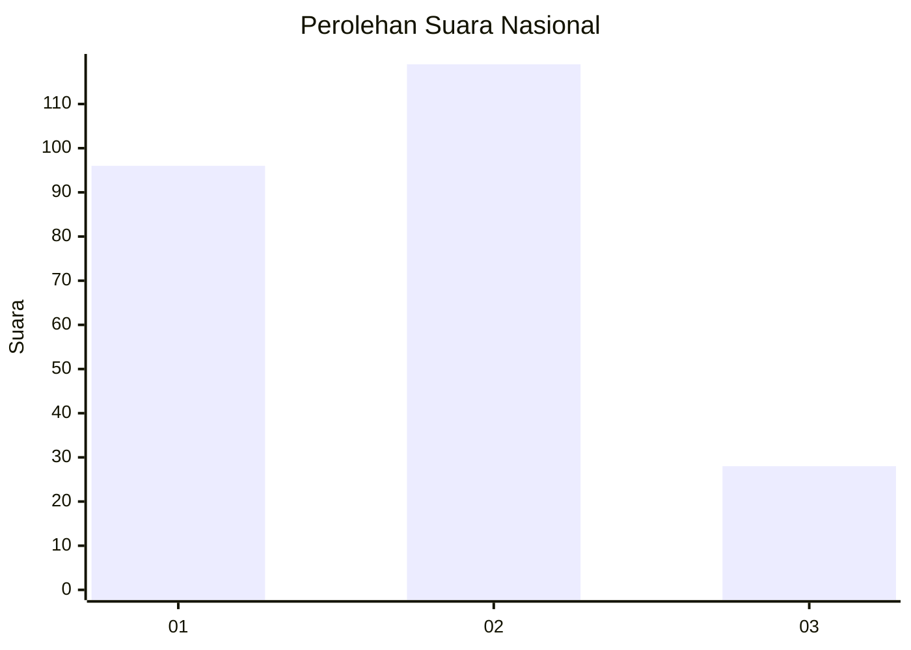
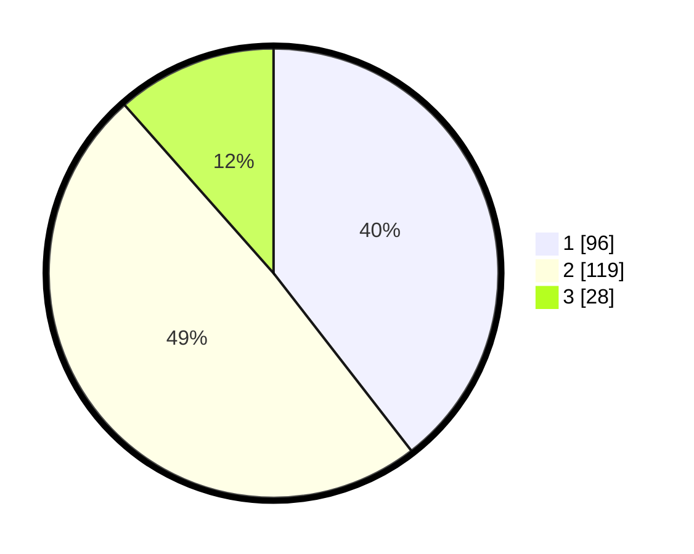

# Hasil

## Grafik

## Tabel

| No.    | Nama Paslon    | Suara | Suara (raw) | Persentase |
|:------ |:-------------- | -----:| -----------:| ----------:|
| 100025 | ANIES MUHAIMIN | 96    | [96][p-1]   | 39,51      |
| 100026 | PRABOWO GIBRAN | 119   | [119][p-2]  | 48,97      |
| 100027 | GANJAR MAHFUD  | 28    | [28][p-3]   | 11,52      |

[p-1]: https://github.com/gigit-pemilu/pemilu-2024/blob/main/pilpres/hitung-suara/sub/31-dki-jakarta/sub/73-jakarta-barat/sub/01-cengkareng/sub/1001-cengkareng-barat/sub/140-tps/sub/paslon-1.txt
[p-2]: https://github.com/gigit-pemilu/pemilu-2024/blob/main/pilpres/hitung-suara/sub/31-dki-jakarta/sub/73-jakarta-barat/sub/01-cengkareng/sub/1001-cengkareng-barat/sub/140-tps/sub/paslon-2.txt
[p-3]: https://github.com/gigit-pemilu/pemilu-2024/blob/main/pilpres/hitung-suara/sub/31-dki-jakarta/sub/73-jakarta-barat/sub/01-cengkareng/sub/1001-cengkareng-barat/sub/140-tps/sub/paslon-3.txt

## Foto C Plano

https://sirekap-obj-formc.kpu.go.id/2d85/pemilu/ppwp/31/73/01/10/01/3173011001140-20240215-012436--86f337df-009e-4884-9191-07cf6c153afb.jpg

https://sirekap-obj-formc.kpu.go.id/2d85/pemilu/ppwp/31/73/01/10/01/3173011001140-20240215-012815--c290949b-b11d-4d1c-b9fb-bdfefe9598fc.jpg

https://sirekap-obj-formc.kpu.go.id/2d85/pemilu/ppwp/31/73/01/10/01/3173011001140-20240215-012909--ca6fefe0-8574-4456-bb84-1250bcf77720.jpg

## Metadata

| Key        | Value               |
| ---------- | ------------------- |
| Time Stamp | 2024-02-16 01:00:27 |

