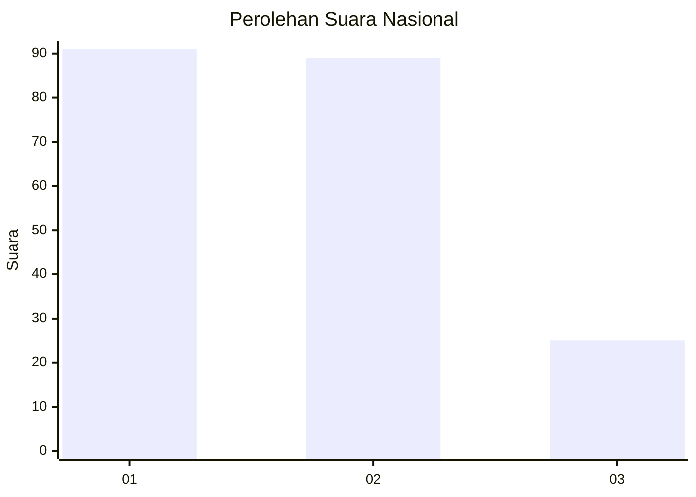
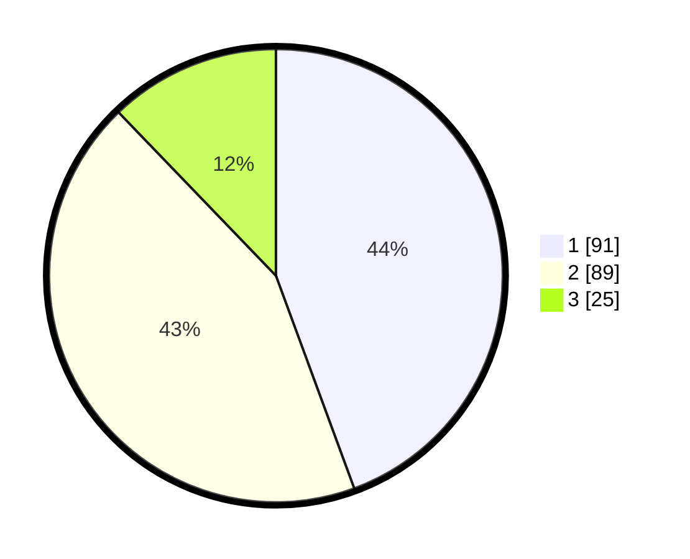

# Hasil

## Grafik

## Tabel

| No.    | Nama Paslon    | Suara | Suara (raw) | Persentase |
|:------ |:-------------- | -----:| -----------:| ----------:|
| 100025 | ANIES MUHAIMIN | 91    | [91][p-1]   | 44,39      |
| 100026 | PRABOWO GIBRAN | 89    | [89][p-2]   | 43,41      |
| 100027 | GANJAR MAHFUD  | 25    | [25][p-3]   | 12,20      |

[p-1]: https://github.com/gigit-pemilu/pemilu-2024/blob/main/pilpres/hitung-suara/sub/31-dki-jakarta/sub/73-jakarta-barat/sub/01-cengkareng/sub/1001-cengkareng-barat/sub/163-tps/sub/paslon-1.txt
[p-2]: https://github.com/gigit-pemilu/pemilu-2024/blob/main/pilpres/hitung-suara/sub/31-dki-jakarta/sub/73-jakarta-barat/sub/01-cengkareng/sub/1001-cengkareng-barat/sub/163-tps/sub/paslon-2.txt
[p-3]: https://github.com/gigit-pemilu/pemilu-2024/blob/main/pilpres/hitung-suara/sub/31-dki-jakarta/sub/73-jakarta-barat/sub/01-cengkareng/sub/1001-cengkareng-barat/sub/163-tps/sub/paslon-3.txt

## Foto C Plano

https://sirekap-obj-formc.kpu.go.id/82f3/pemilu/ppwp/31/73/01/10/01/3173011001163-20240214-222708--dd966c05-152b-478a-a66d-65c3c17d8a49.jpg

https://sirekap-obj-formc.kpu.go.id/82f3/pemilu/ppwp/31/73/01/10/01/3173011001163-20240214-222745--1860c44e-e7a5-4103-ad62-9a31171d8d20.jpg

https://sirekap-obj-formc.kpu.go.id/82f3/pemilu/ppwp/31/73/01/10/01/3173011001163-20240214-222826--503dac06-3c9a-4e31-9e7a-793eab02de24.jpg

## Metadata

| Key        | Value               |
| ---------- | ------------------- |
| Time Stamp | 2024-02-17 18:00:00 |

