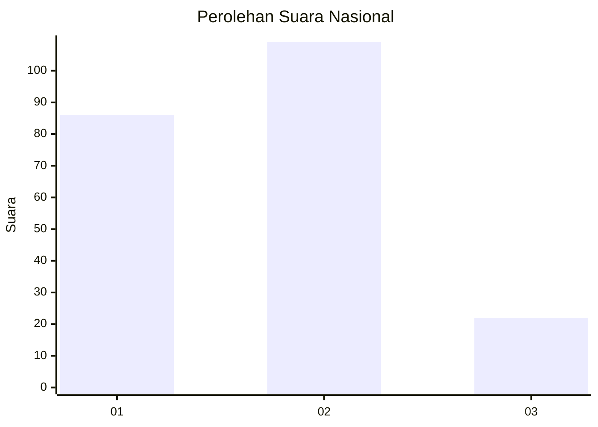
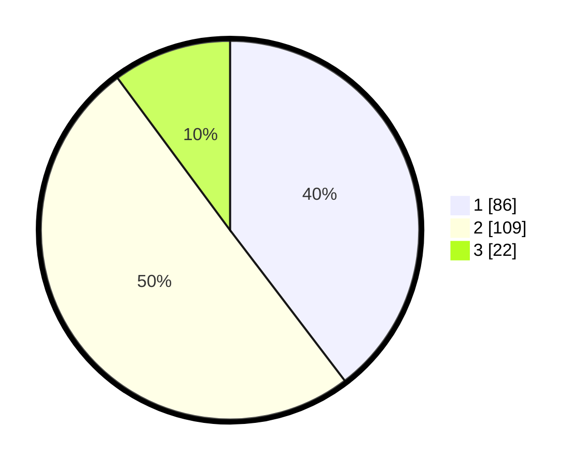

# Hasil

## Grafik

## Tabel

| No.    | Nama Paslon    | Suara | Suara (raw) | Persentase |
|:------ |:-------------- | -----:| -----------:| ----------:|
| 100025 | ANIES MUHAIMIN | 86    | [86][p-1]   | 39,63      |
| 100026 | PRABOWO GIBRAN | 109   | [109][p-2]  | 50,23      |
| 100027 | GANJAR MAHFUD  | 22    | [22][p-3]   | 10,14      |

[p-1]: https://github.com/gigit-pemilu/pemilu-2024/blob/main/pilpres/hitung-suara/sub/31-dki-jakarta/sub/73-jakarta-barat/sub/01-cengkareng/sub/1001-cengkareng-barat/sub/181-tps/sub/paslon-1.txt
[p-2]: https://github.com/gigit-pemilu/pemilu-2024/blob/main/pilpres/hitung-suara/sub/31-dki-jakarta/sub/73-jakarta-barat/sub/01-cengkareng/sub/1001-cengkareng-barat/sub/181-tps/sub/paslon-2.txt
[p-3]: https://github.com/gigit-pemilu/pemilu-2024/blob/main/pilpres/hitung-suara/sub/31-dki-jakarta/sub/73-jakarta-barat/sub/01-cengkareng/sub/1001-cengkareng-barat/sub/181-tps/sub/paslon-3.txt

## Foto C Plano

https://sirekap-obj-formc.kpu.go.id/c91d/pemilu/ppwp/31/73/01/10/01/3173011001181-20240215-064135--9e60a7c3-63e8-4fa3-84bb-dd9984f8ab2c.jpg

https://sirekap-obj-formc.kpu.go.id/c91d/pemilu/ppwp/31/73/01/10/01/3173011001181-20240215-001812--3ff9a0a7-f90d-4dd7-9c64-5b9c3f8f7c80.jpg

https://sirekap-obj-formc.kpu.go.id/c91d/pemilu/ppwp/31/73/01/10/01/3173011001181-20240215-001918--720a0718-ad5b-4e6a-bb34-4d1c73aecd24.jpg

## Metadata

| Key        | Value               |
| ---------- | ------------------- |
| Time Stamp | 2024-02-16 01:00:27 |

