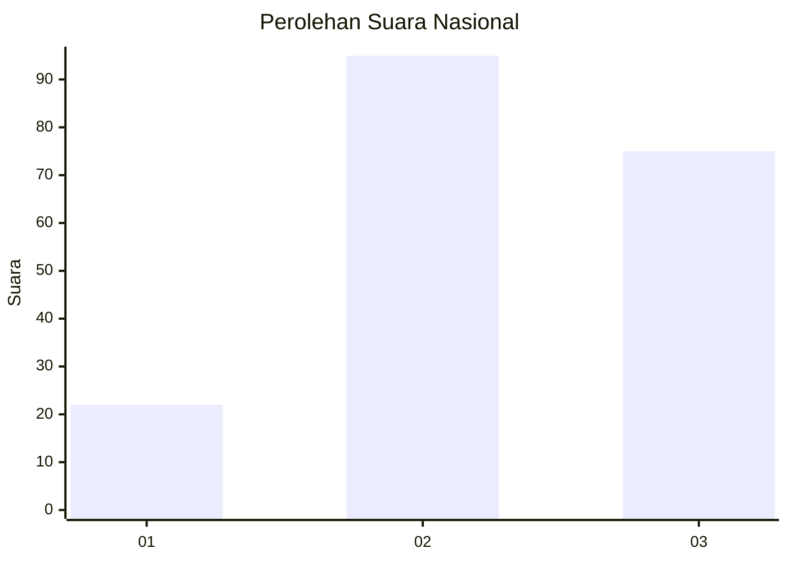
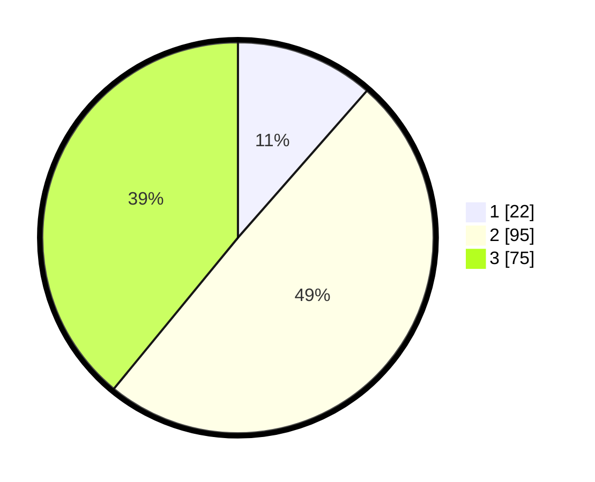

# Hasil

## Grafik

## Tabel

| No.    | Nama Paslon    | Suara | Suara (raw) | Persentase |
|:------ |:-------------- | -----:| -----------:| ----------:|
| 100025 | ANIES MUHAIMIN | 22    | [22][p-1]   | 11,46      |
| 100026 | PRABOWO GIBRAN | 95    | [95][p-2]   | 49,48      |
| 100027 | GANJAR MAHFUD  | 75    | [75][p-3]   | 39,06      |

[p-1]: https://github.com/gigit-pemilu/pemilu-2024/blob/main/pilpres/hitung-suara/sub/31-dki-jakarta/sub/73-jakarta-barat/sub/01-cengkareng/sub/1001-cengkareng-barat/sub/188-tps/sub/paslon-1.txt
[p-2]: https://github.com/gigit-pemilu/pemilu-2024/blob/main/pilpres/hitung-suara/sub/31-dki-jakarta/sub/73-jakarta-barat/sub/01-cengkareng/sub/1001-cengkareng-barat/sub/188-tps/sub/paslon-2.txt
[p-3]: https://github.com/gigit-pemilu/pemilu-2024/blob/main/pilpres/hitung-suara/sub/31-dki-jakarta/sub/73-jakarta-barat/sub/01-cengkareng/sub/1001-cengkareng-barat/sub/188-tps/sub/paslon-3.txt

## Foto C Plano

https://sirekap-obj-formc.kpu.go.id/bb96/pemilu/ppwp/31/73/01/10/01/3173011001188-20240214-192156--a08a3451-debd-4b2c-a8bc-5b440c5120c5.jpg

https://sirekap-obj-formc.kpu.go.id/bb96/pemilu/ppwp/31/73/01/10/01/3173011001188-20240214-192430--cd9eb1a4-52ff-4150-b907-6367d049ffa5.jpg

https://sirekap-obj-formc.kpu.go.id/bb96/pemilu/ppwp/31/73/01/10/01/3173011001188-20240214-192058--15a97efc-0673-449c-9c7e-cc5011b45c1a.jpg

## Metadata

| Key        | Value               |
| ---------- | ------------------- |
| Time Stamp | 2024-02-16 01:00:27 |

