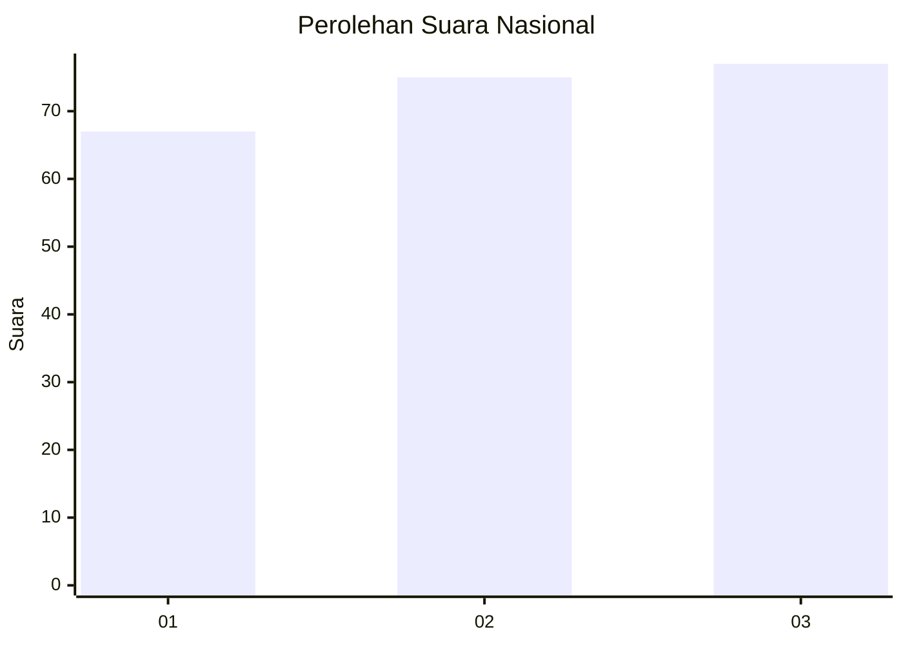
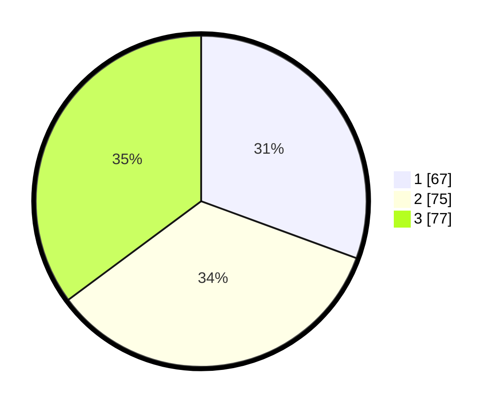

# Hasil

## Grafik

## Tabel

| No.    | Nama Paslon    | Suara | Suara (raw) | Persentase |
|:------ |:-------------- | -----:| -----------:| ----------:|
| 100025 | ANIES MUHAIMIN | 67    | [67][p-1]   | 30,59      |
| 100026 | PRABOWO GIBRAN | 75    | [75][p-2]   | 34,25      |
| 100027 | GANJAR MAHFUD  | 77    | [77][p-3]   | 35,16      |

[p-1]: https://github.com/gigit-pemilu/pemilu-2024/blob/main/pilpres/hitung-suara/sub/31-dki-jakarta/sub/73-jakarta-barat/sub/01-cengkareng/sub/1001-cengkareng-barat/sub/193-tps/sub/paslon-1.txt
[p-2]: https://github.com/gigit-pemilu/pemilu-2024/blob/main/pilpres/hitung-suara/sub/31-dki-jakarta/sub/73-jakarta-barat/sub/01-cengkareng/sub/1001-cengkareng-barat/sub/193-tps/sub/paslon-2.txt
[p-3]: https://github.com/gigit-pemilu/pemilu-2024/blob/main/pilpres/hitung-suara/sub/31-dki-jakarta/sub/73-jakarta-barat/sub/01-cengkareng/sub/1001-cengkareng-barat/sub/193-tps/sub/paslon-3.txt

## Foto C Plano

https://sirekap-obj-formc.kpu.go.id/7e36/pemilu/ppwp/31/73/01/10/01/3173011001193-20240215-004020--e00fecd5-9a7e-44d6-9e85-2a1f6aa7cf18.jpg

https://sirekap-obj-formc.kpu.go.id/7e36/pemilu/ppwp/31/73/01/10/01/3173011001193-20240215-003527--73949ec4-a2e1-4222-84e5-6bc253c129c3.jpg

https://sirekap-obj-formc.kpu.go.id/7e36/pemilu/ppwp/31/73/01/10/01/3173011001193-20240215-003648--46076e06-3937-423b-be3b-c1180d33aead.jpg

## Metadata

| Key        | Value               |
| ---------- | ------------------- |
| Time Stamp | 2024-02-17 18:00:00 |

