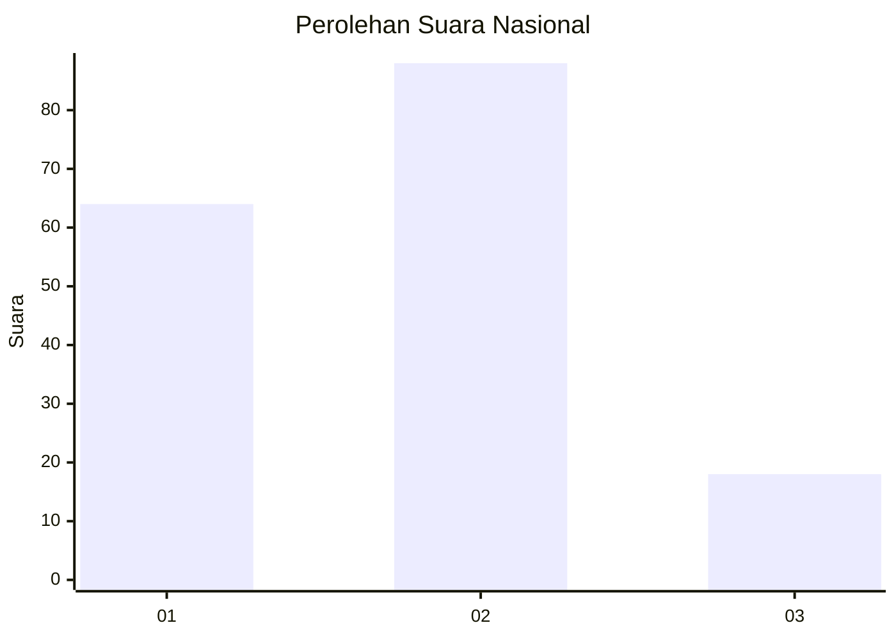
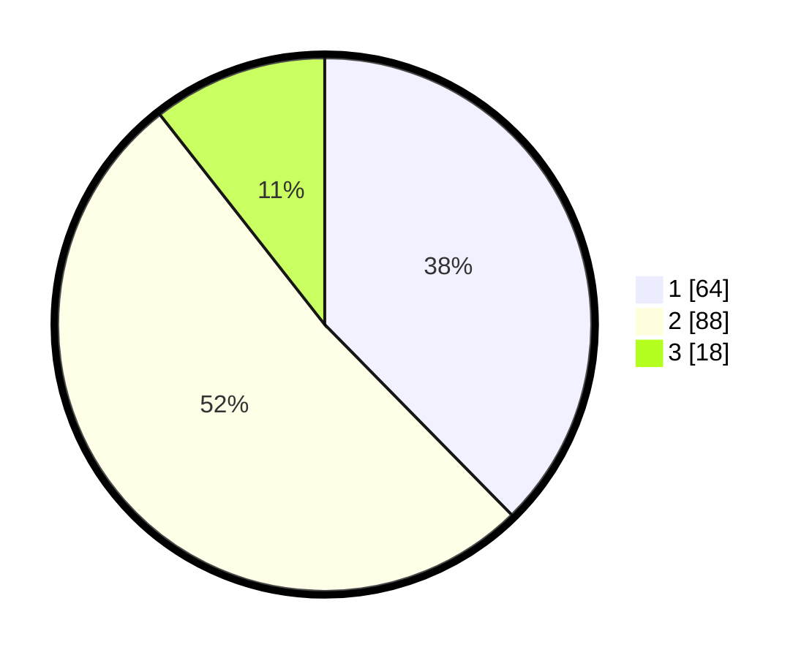

# Hasil

## Grafik

## Tabel

| No.    | Nama Paslon    | Suara | Suara (raw) | Persentase |
|:------ |:-------------- | -----:| -----------:| ----------:|
| 100025 | ANIES MUHAIMIN | 64    | [64][p-1]   | 37,65      |
| 100026 | PRABOWO GIBRAN | 88    | [88][p-2]   | 51,76      |
| 100027 | GANJAR MAHFUD  | 18    | [18][p-3]   | 10,59      |

[p-1]: https://github.com/gigit-pemilu/pemilu-2024/blob/main/pilpres/hitung-suara/sub/31-dki-jakarta/sub/73-jakarta-barat/sub/01-cengkareng/sub/1001-cengkareng-barat/sub/208-tps/sub/paslon-1.txt
[p-2]: https://github.com/gigit-pemilu/pemilu-2024/blob/main/pilpres/hitung-suara/sub/31-dki-jakarta/sub/73-jakarta-barat/sub/01-cengkareng/sub/1001-cengkareng-barat/sub/208-tps/sub/paslon-2.txt
[p-3]: https://github.com/gigit-pemilu/pemilu-2024/blob/main/pilpres/hitung-suara/sub/31-dki-jakarta/sub/73-jakarta-barat/sub/01-cengkareng/sub/1001-cengkareng-barat/sub/208-tps/sub/paslon-3.txt

## Foto C Plano

https://sirekap-obj-formc.kpu.go.id/4266/pemilu/ppwp/31/73/01/10/01/3173011001208-20240214-191603--2fd0ef74-3cf3-4b32-b6a8-9d0c02ff361f.jpg

https://sirekap-obj-formc.kpu.go.id/4266/pemilu/ppwp/31/73/01/10/01/3173011001208-20240214-191620--a753cd93-9c0b-4558-b1c7-39b7ab0beba3.jpg

https://sirekap-obj-formc.kpu.go.id/4266/pemilu/ppwp/31/73/01/10/01/3173011001208-20240214-191638--02a09cd5-a864-49e3-8330-84cecddefc65.jpg

## Metadata

| Key        | Value               |
| ---------- | ------------------- |
| Time Stamp | 2024-02-17 18:00:00 |

