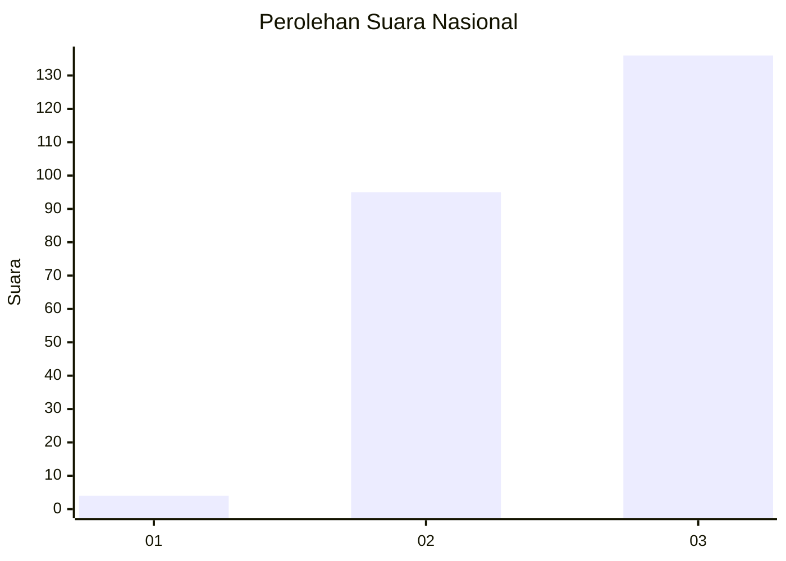
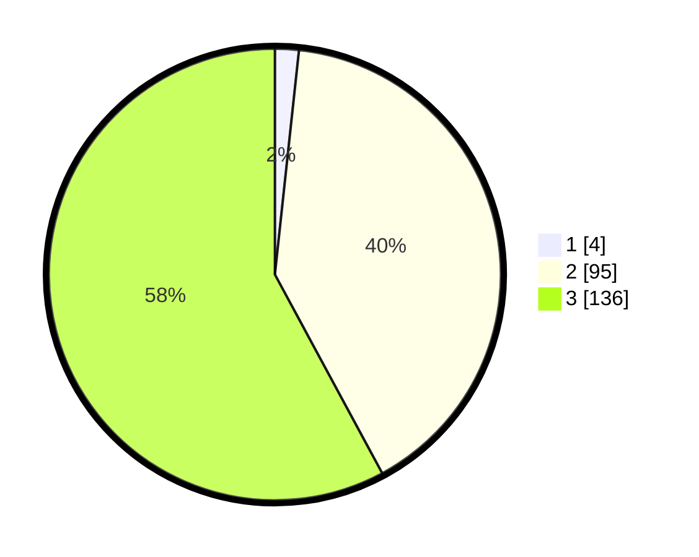

# Hasil

## Grafik

## Tabel

| No.    | Nama Paslon    | Suara | Suara (raw) | Persentase |
|:------ |:-------------- | -----:| -----------:| ----------:|
| 100025 | ANIES MUHAIMIN | 4     | [4][p-1]    | 1,70       |
| 100026 | PRABOWO GIBRAN | 95    | [95][p-2]   | 40,43      |
| 100027 | GANJAR MAHFUD  | 136   | [136][p-3]  | 57,87      |

[p-1]: https://github.com/gigit-pemilu/pemilu-2024/blob/main/pilpres/hitung-suara/sub/31-dki-jakarta/sub/73-jakarta-barat/sub/01-cengkareng/sub/1001-cengkareng-barat/sub/217-tps/sub/paslon-1.txt
[p-2]: https://github.com/gigit-pemilu/pemilu-2024/blob/main/pilpres/hitung-suara/sub/31-dki-jakarta/sub/73-jakarta-barat/sub/01-cengkareng/sub/1001-cengkareng-barat/sub/217-tps/sub/paslon-2.txt
[p-3]: https://github.com/gigit-pemilu/pemilu-2024/blob/main/pilpres/hitung-suara/sub/31-dki-jakarta/sub/73-jakarta-barat/sub/01-cengkareng/sub/1001-cengkareng-barat/sub/217-tps/sub/paslon-3.txt

## Foto C Plano

https://sirekap-obj-formc.kpu.go.id/5ec7/pemilu/ppwp/31/73/01/10/01/3173011001217-20240214-231403--114d8ab6-5aa9-4ebb-b280-d211d3e56f99.jpg

https://sirekap-obj-formc.kpu.go.id/5ec7/pemilu/ppwp/31/73/01/10/01/3173011001217-20240214-231427--6323d8d1-9f0d-4cf3-8c4b-d36061f285f5.jpg

https://sirekap-obj-formc.kpu.go.id/5ec7/pemilu/ppwp/31/73/01/10/01/3173011001217-20240214-210324--f5b0926f-ec9b-4a83-9f06-95136d1d2b37.jpg

## Metadata

| Key        | Value               |
| ---------- | ------------------- |
| Time Stamp | 2024-02-17 18:00:00 |

