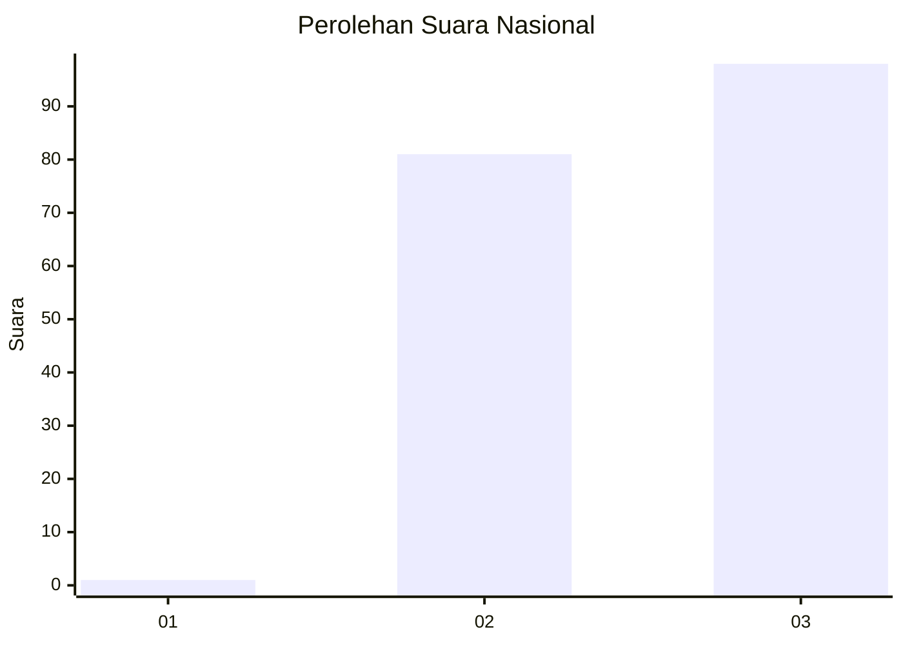
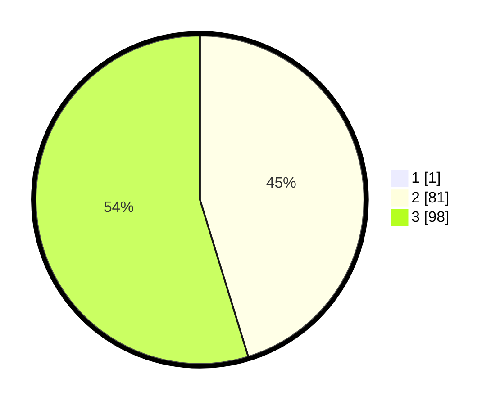

# Hasil

## Grafik

## Tabel

| No.    | Nama Paslon    | Suara | Suara (raw) | Persentase |
|:------ |:-------------- | -----:| -----------:| ----------:|
| 100025 | ANIES MUHAIMIN | 1     | [1][p-1]    | 0,56       |
| 100026 | PRABOWO GIBRAN | 81    | [81][p-2]   | 45,00      |
| 100027 | GANJAR MAHFUD  | 98    | [98][p-3]   | 54,44      |

[p-1]: https://github.com/gigit-pemilu/pemilu-2024/blob/main/pilpres/hitung-suara/sub/31-dki-jakarta/sub/73-jakarta-barat/sub/01-cengkareng/sub/1001-cengkareng-barat/sub/220-tps/sub/paslon-1.txt
[p-2]: https://github.com/gigit-pemilu/pemilu-2024/blob/main/pilpres/hitung-suara/sub/31-dki-jakarta/sub/73-jakarta-barat/sub/01-cengkareng/sub/1001-cengkareng-barat/sub/220-tps/sub/paslon-2.txt
[p-3]: https://github.com/gigit-pemilu/pemilu-2024/blob/main/pilpres/hitung-suara/sub/31-dki-jakarta/sub/73-jakarta-barat/sub/01-cengkareng/sub/1001-cengkareng-barat/sub/220-tps/sub/paslon-3.txt

## Foto C Plano

https://sirekap-obj-formc.kpu.go.id/3e74/pemilu/ppwp/31/73/01/10/01/3173011001220-20240214-212143--2f31db59-45dd-4c9b-9f21-0ba5d9f9c9bd.jpg

https://sirekap-obj-formc.kpu.go.id/3e74/pemilu/ppwp/31/73/01/10/01/3173011001220-20240214-212210--04ef2d42-ad37-46a5-b47b-35c1e46fae66.jpg

https://sirekap-obj-formc.kpu.go.id/3e74/pemilu/ppwp/31/73/01/10/01/3173011001220-20240214-213058--1bb677c9-951a-4f4a-b9c2-bffcea3cc760.jpg

## Metadata

| Key        | Value               |
| ---------- | ------------------- |
| Time Stamp | 2024-02-16 01:30:27 |

