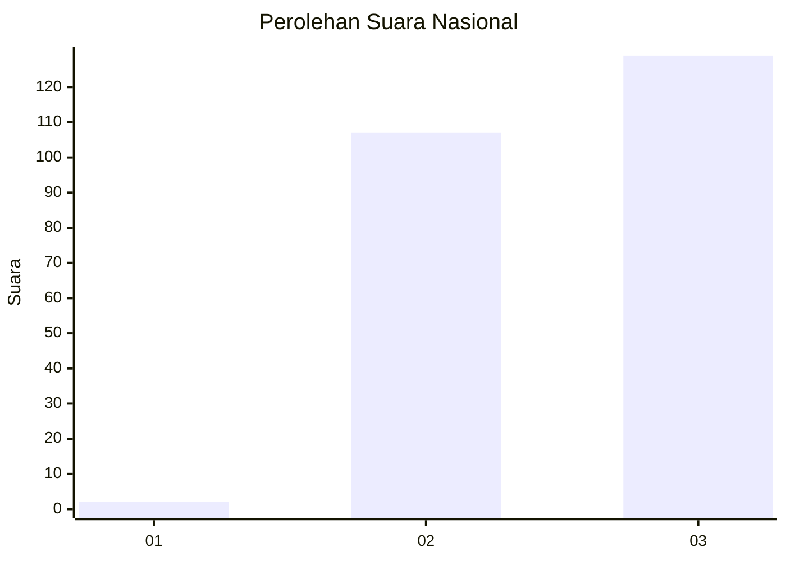
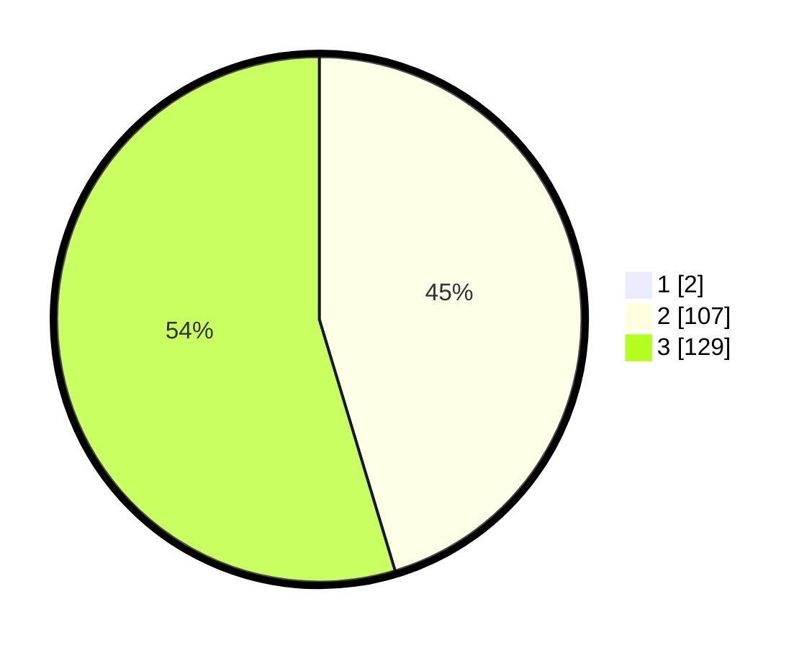

# Hasil

## Grafik

## Tabel

| No.    | Nama Paslon    | Suara | Suara (raw) | Persentase |
|:------ |:-------------- | -----:| -----------:| ----------:|
| 100025 | ANIES MUHAIMIN | 2     | [2][p-1]    | 0,84       |
| 100026 | PRABOWO GIBRAN | 107   | [107][p-2]  | 44,96      |
| 100027 | GANJAR MAHFUD  | 129   | [129][p-3]  | 54,20      |

[p-1]: https://github.com/gigit-pemilu/pemilu-2024/blob/main/pilpres/hitung-suara/sub/31-dki-jakarta/sub/73-jakarta-barat/sub/01-cengkareng/sub/1001-cengkareng-barat/sub/225-tps/sub/paslon-1.txt
[p-2]: https://github.com/gigit-pemilu/pemilu-2024/blob/main/pilpres/hitung-suara/sub/31-dki-jakarta/sub/73-jakarta-barat/sub/01-cengkareng/sub/1001-cengkareng-barat/sub/225-tps/sub/paslon-2.txt
[p-3]: https://github.com/gigit-pemilu/pemilu-2024/blob/main/pilpres/hitung-suara/sub/31-dki-jakarta/sub/73-jakarta-barat/sub/01-cengkareng/sub/1001-cengkareng-barat/sub/225-tps/sub/paslon-3.txt

## Foto C Plano

https://sirekap-obj-formc.kpu.go.id/e72d/pemilu/ppwp/31/73/01/10/01/3173011001225-20240214-222348--64af13f1-b612-474f-b290-d0cc6df526dd.jpg

https://sirekap-obj-formc.kpu.go.id/e72d/pemilu/ppwp/31/73/01/10/01/3173011001225-20240214-222716--de157c31-9b51-4693-b37d-aa5aa3025549.jpg

https://sirekap-obj-formc.kpu.go.id/e72d/pemilu/ppwp/31/73/01/10/01/3173011001225-20240214-224925--bbc792a3-c285-451d-84c0-438e730037c8.jpg

## Metadata

| Key        | Value               |
| ---------- | ------------------- |
| Time Stamp | 2024-02-17 18:00:00 |

