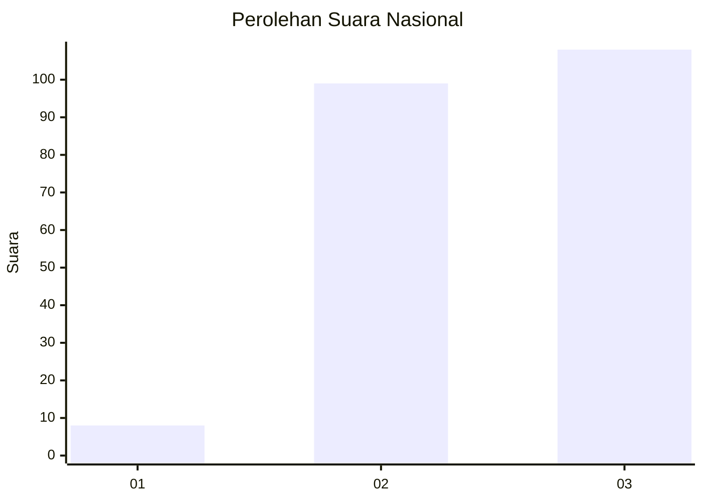
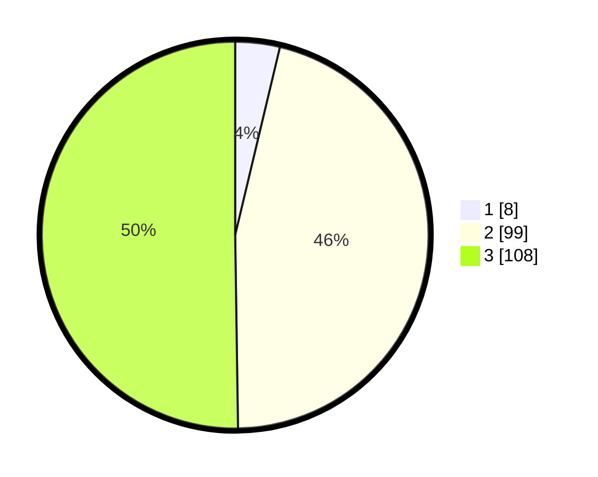

# Hasil

## Grafik

## Tabel

| No.    | Nama Paslon    | Suara | Suara (raw) | Persentase |
|:------ |:-------------- | -----:| -----------:| ----------:|
| 100025 | ANIES MUHAIMIN | 8     | [8][p-1]    | 3,72       |
| 100026 | PRABOWO GIBRAN | 99    | [99][p-2]   | 46,05      |
| 100027 | GANJAR MAHFUD  | 108   | [108][p-3]  | 50,23      |

[p-1]: https://github.com/gigit-pemilu/pemilu-2024/blob/main/pilpres/hitung-suara/sub/31-dki-jakarta/sub/73-jakarta-barat/sub/01-cengkareng/sub/1001-cengkareng-barat/sub/226-tps/sub/paslon-1.txt
[p-2]: https://github.com/gigit-pemilu/pemilu-2024/blob/main/pilpres/hitung-suara/sub/31-dki-jakarta/sub/73-jakarta-barat/sub/01-cengkareng/sub/1001-cengkareng-barat/sub/226-tps/sub/paslon-2.txt
[p-3]: https://github.com/gigit-pemilu/pemilu-2024/blob/main/pilpres/hitung-suara/sub/31-dki-jakarta/sub/73-jakarta-barat/sub/01-cengkareng/sub/1001-cengkareng-barat/sub/226-tps/sub/paslon-3.txt

## Foto C Plano

https://sirekap-obj-formc.kpu.go.id/e7a6/pemilu/ppwp/31/73/01/10/01/3173011001226-20240214-222031--501758e3-4ec6-449d-8dec-40bb7b9b5d9b.jpg

https://sirekap-obj-formc.kpu.go.id/e7a6/pemilu/ppwp/31/73/01/10/01/3173011001226-20240214-222148--8ff68300-98f6-4c09-b257-de66e334b16d.jpg

https://sirekap-obj-formc.kpu.go.id/e7a6/pemilu/ppwp/31/73/01/10/01/3173011001226-20240214-222210--b13160bf-387f-498f-b2f5-939d3d0dfc73.jpg

## Metadata

| Key        | Value               |
| ---------- | ------------------- |
| Time Stamp | 2024-02-16 01:30:27 |

