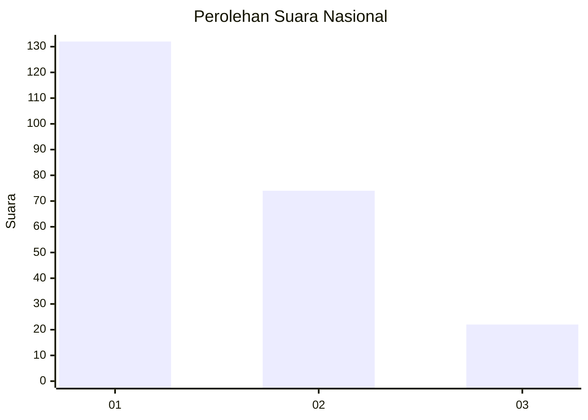
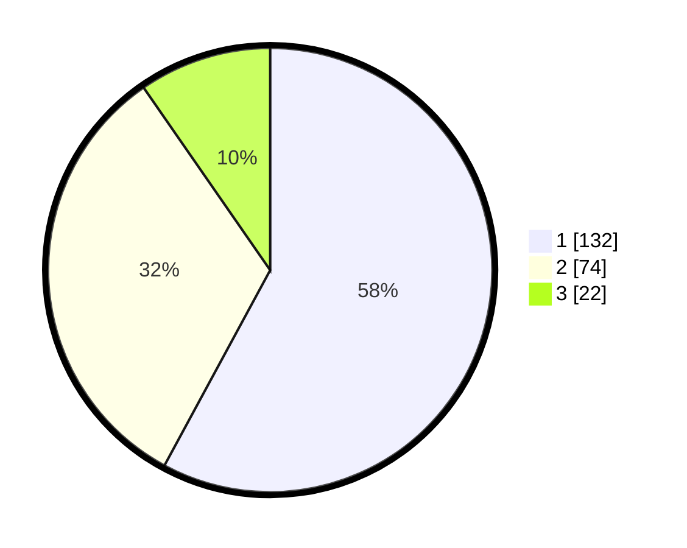

# Hasil

## Grafik

## Tabel

| No.    | Nama Paslon    | Suara | Suara (raw) | Persentase |
|:------ |:-------------- | -----:| -----------:| ----------:|
| 100025 | ANIES MUHAIMIN | 132   | [132][p-1]  | 57,89      |
| 100026 | PRABOWO GIBRAN | 74    | [74][p-2]   | 32,46      |
| 100027 | GANJAR MAHFUD  | 22    | [22][p-3]   | 9,65       |

[p-1]: https://github.com/gigit-pemilu/pemilu-2024/blob/main/pilpres/hitung-suara/sub/31-dki-jakarta/sub/73-jakarta-barat/sub/01-cengkareng/sub/1002-duri-kosambi/sub/002-tps/sub/paslon-1.txt
[p-2]: https://github.com/gigit-pemilu/pemilu-2024/blob/main/pilpres/hitung-suara/sub/31-dki-jakarta/sub/73-jakarta-barat/sub/01-cengkareng/sub/1002-duri-kosambi/sub/002-tps/sub/paslon-2.txt
[p-3]: https://github.com/gigit-pemilu/pemilu-2024/blob/main/pilpres/hitung-suara/sub/31-dki-jakarta/sub/73-jakarta-barat/sub/01-cengkareng/sub/1002-duri-kosambi/sub/002-tps/sub/paslon-3.txt

## Foto C Plano

https://sirekap-obj-formc.kpu.go.id/8123/pemilu/ppwp/31/73/01/10/02/3173011002002-20240215-005947--ad4128fb-95c2-4fbb-8b9e-3fc898ed5b2a.jpg

https://sirekap-obj-formc.kpu.go.id/8123/pemilu/ppwp/31/73/01/10/02/3173011002002-20240215-010121--507df348-4df0-4aa4-b3c9-010a4d3085b3.jpg

https://sirekap-obj-formc.kpu.go.id/8123/pemilu/ppwp/31/73/01/10/02/3173011002002-20240215-010242--b1b39c95-021f-4cac-9c0e-dd1ab54c1ddd.jpg

## Metadata

| Key        | Value               |
| ---------- | ------------------- |
| Time Stamp | 2024-02-17 18:00:00 |

