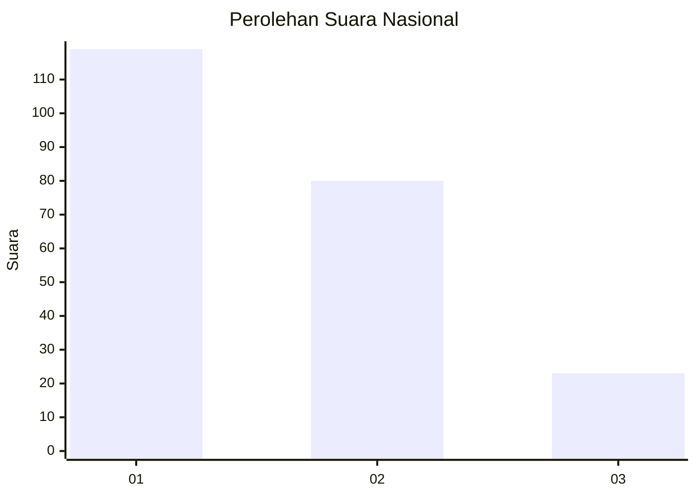
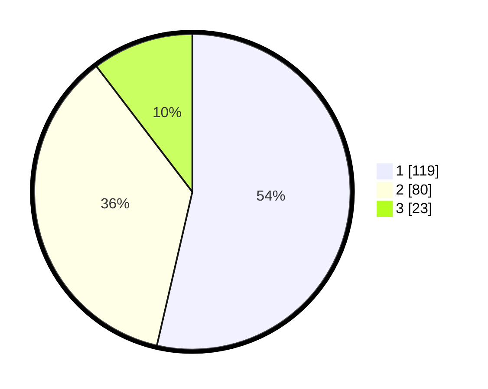

# Hasil

## Grafik

## Tabel

| No.    | Nama Paslon    | Suara | Suara (raw) | Persentase |
|:------ |:-------------- | -----:| -----------:| ----------:|
| 100025 | ANIES MUHAIMIN | 119   | [119][p-1]  | 53,60      |
| 100026 | PRABOWO GIBRAN | 80    | [80][p-2]   | 36,04      |
| 100027 | GANJAR MAHFUD  | 23    | [23][p-3]   | 10,36      |

[p-1]: https://github.com/gigit-pemilu/pemilu-2024/blob/main/pilpres/hitung-suara/sub/31-dki-jakarta/sub/73-jakarta-barat/sub/01-cengkareng/sub/1002-duri-kosambi/sub/020-tps/sub/paslon-1.txt
[p-2]: https://github.com/gigit-pemilu/pemilu-2024/blob/main/pilpres/hitung-suara/sub/31-dki-jakarta/sub/73-jakarta-barat/sub/01-cengkareng/sub/1002-duri-kosambi/sub/020-tps/sub/paslon-2.txt
[p-3]: https://github.com/gigit-pemilu/pemilu-2024/blob/main/pilpres/hitung-suara/sub/31-dki-jakarta/sub/73-jakarta-barat/sub/01-cengkareng/sub/1002-duri-kosambi/sub/020-tps/sub/paslon-3.txt

## Foto C Plano

https://sirekap-obj-formc.kpu.go.id/e9cf/pemilu/ppwp/31/73/01/10/02/3173011002020-20240215-065449--44deaad2-9ca9-4b0a-aac2-596a3c3fc46a.jpg

https://sirekap-obj-formc.kpu.go.id/e9cf/pemilu/ppwp/31/73/01/10/02/3173011002020-20240215-065543--3a497361-3ad6-4a82-aaad-7fecf3e323de.jpg

https://sirekap-obj-formc.kpu.go.id/e9cf/pemilu/ppwp/31/73/01/10/02/3173011002020-20240215-071041--4bb1a762-2333-483c-b562-5a4b5577acec.jpg

## Metadata

| Key        | Value               |
| ---------- | ------------------- |
| Time Stamp | 2024-02-17 18:30:00 |

