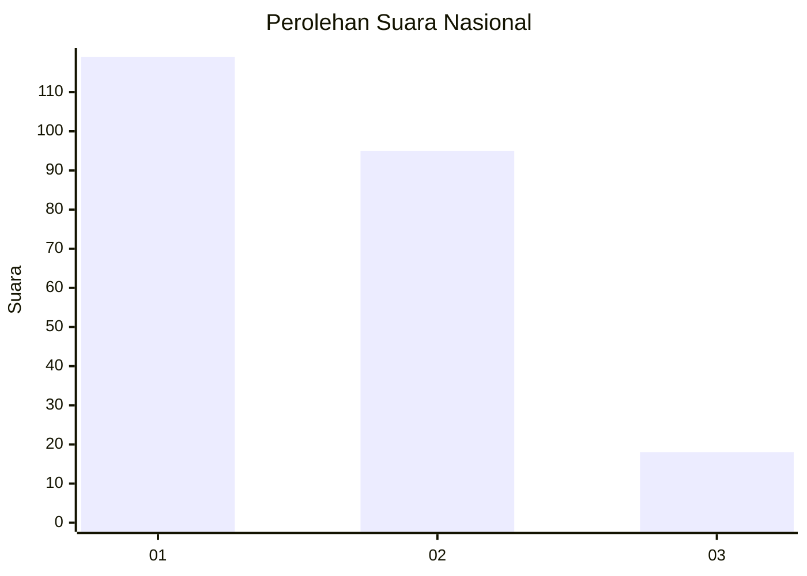
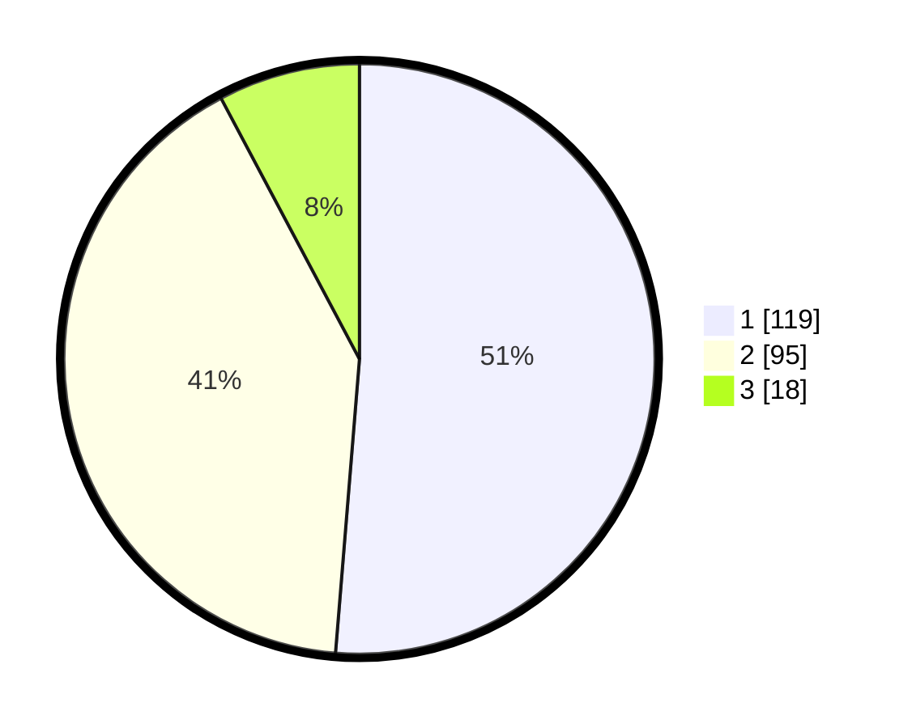

# Hasil

## Grafik

## Tabel

| No.    | Nama Paslon    | Suara | Suara (raw) | Persentase |
|:------ |:-------------- | -----:| -----------:| ----------:|
| 100025 | ANIES MUHAIMIN | 119   | [119][p-1]  | 51,29      |
| 100026 | PRABOWO GIBRAN | 95    | [95][p-2]   | 40,95      |
| 100027 | GANJAR MAHFUD  | 18    | [18][p-3]   | 7,76       |

[p-1]: https://github.com/gigit-pemilu/pemilu-2024/blob/main/pilpres/hitung-suara/sub/31-dki-jakarta/sub/73-jakarta-barat/sub/01-cengkareng/sub/1002-duri-kosambi/sub/036-tps/sub/paslon-1.txt
[p-2]: https://github.com/gigit-pemilu/pemilu-2024/blob/main/pilpres/hitung-suara/sub/31-dki-jakarta/sub/73-jakarta-barat/sub/01-cengkareng/sub/1002-duri-kosambi/sub/036-tps/sub/paslon-2.txt
[p-3]: https://github.com/gigit-pemilu/pemilu-2024/blob/main/pilpres/hitung-suara/sub/31-dki-jakarta/sub/73-jakarta-barat/sub/01-cengkareng/sub/1002-duri-kosambi/sub/036-tps/sub/paslon-3.txt

## Foto C Plano

https://sirekap-obj-formc.kpu.go.id/c9f5/pemilu/ppwp/31/73/01/10/02/3173011002036-20240214-233711--4e387c54-bab4-46f5-800c-36614accda05.jpg

https://sirekap-obj-formc.kpu.go.id/c9f5/pemilu/ppwp/31/73/01/10/02/3173011002036-20240214-233946--b812ad14-82f6-453d-8459-8fd266d4201b.jpg

https://sirekap-obj-formc.kpu.go.id/c9f5/pemilu/ppwp/31/73/01/10/02/3173011002036-20240214-234058--a920a534-dc52-4e70-b5c7-5eaf78a0be3e.jpg

## Metadata

| Key        | Value               |
| ---------- | ------------------- |
| Time Stamp | 2024-02-17 18:30:00 |

