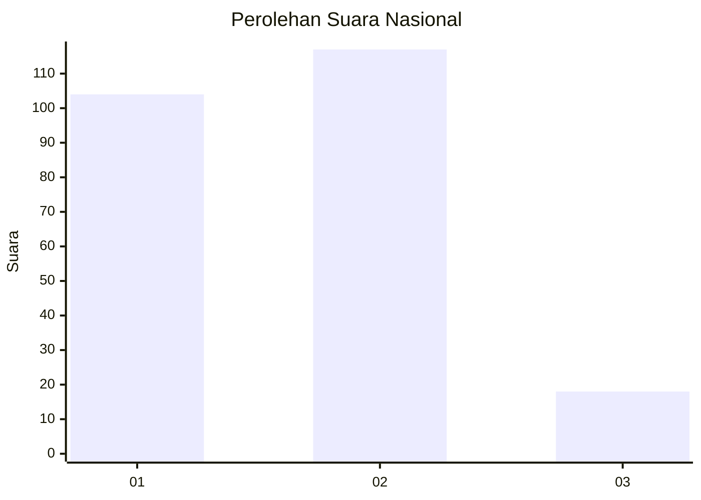
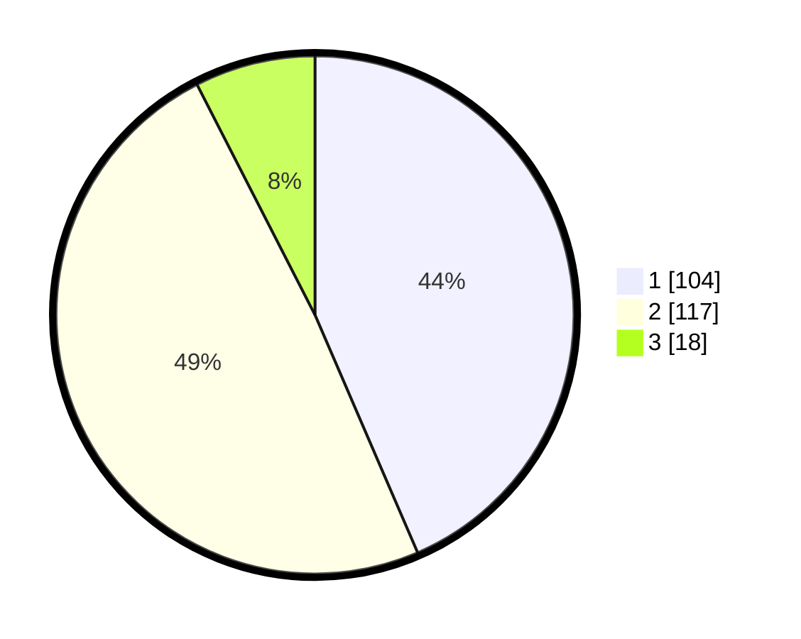

# Hasil

## Grafik

## Tabel

| No.    | Nama Paslon    | Suara | Suara (raw) | Persentase |
|:------ |:-------------- | -----:| -----------:| ----------:|
| 100025 | ANIES MUHAIMIN | 104   | [104][p-1]  | 43,51      |
| 100026 | PRABOWO GIBRAN | 117   | [117][p-2]  | 48,95      |
| 100027 | GANJAR MAHFUD  | 18    | [18][p-3]   | 7,53       |

[p-1]: https://github.com/gigit-pemilu/pemilu-2024/blob/main/pilpres/hitung-suara/sub/31-dki-jakarta/sub/73-jakarta-barat/sub/01-cengkareng/sub/1002-duri-kosambi/sub/038-tps/sub/paslon-1.txt
[p-2]: https://github.com/gigit-pemilu/pemilu-2024/blob/main/pilpres/hitung-suara/sub/31-dki-jakarta/sub/73-jakarta-barat/sub/01-cengkareng/sub/1002-duri-kosambi/sub/038-tps/sub/paslon-2.txt
[p-3]: https://github.com/gigit-pemilu/pemilu-2024/blob/main/pilpres/hitung-suara/sub/31-dki-jakarta/sub/73-jakarta-barat/sub/01-cengkareng/sub/1002-duri-kosambi/sub/038-tps/sub/paslon-3.txt

## Foto C Plano

https://sirekap-obj-formc.kpu.go.id/ca91/pemilu/ppwp/31/73/01/10/02/3173011002038-20240214-223933--d0adc4d2-1e8c-45d2-977c-38a861ad5cbc.jpg

https://sirekap-obj-formc.kpu.go.id/ca91/pemilu/ppwp/31/73/01/10/02/3173011002038-20240214-223146--dadf2948-6253-4fef-8c0b-2658cff0985c.jpg

https://sirekap-obj-formc.kpu.go.id/ca91/pemilu/ppwp/31/73/01/10/02/3173011002038-20240214-223302--ee930096-a1fb-4954-a95a-9c41355865e9.jpg

## Metadata

| Key        | Value               |
| ---------- | ------------------- |
| Time Stamp | 2024-02-17 18:30:00 |

