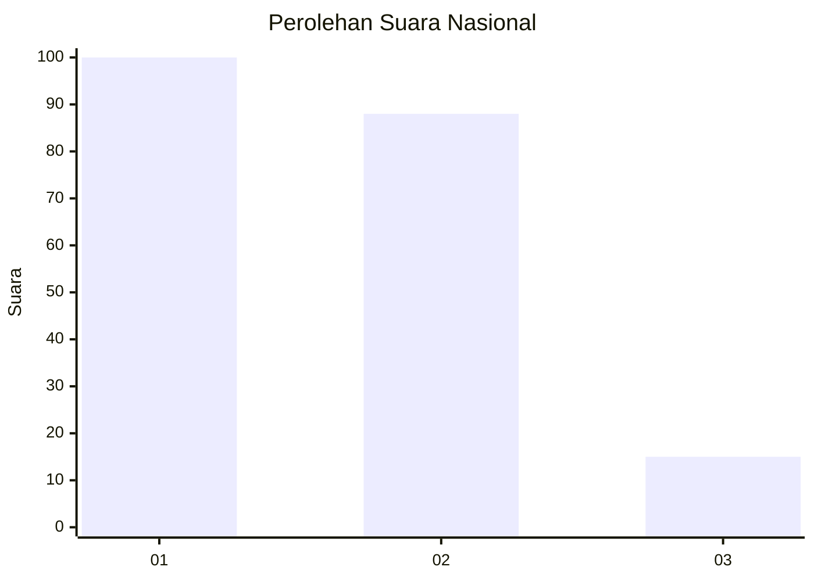
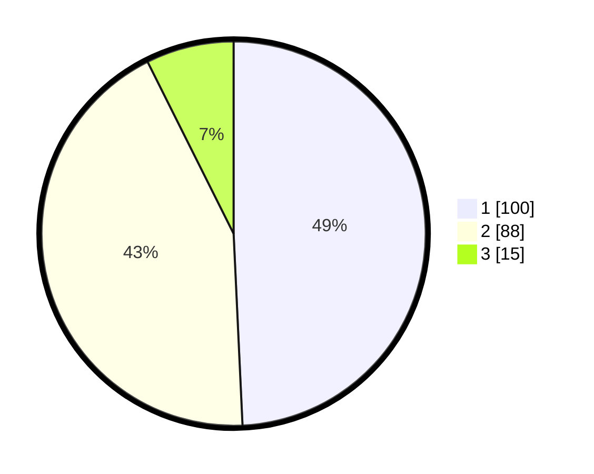

# Hasil

## Grafik

## Tabel

| No.    | Nama Paslon    | Suara | Suara (raw) | Persentase |
|:------ |:-------------- | -----:| -----------:| ----------:|
| 100025 | ANIES MUHAIMIN | 100   | [100][p-1]  | 49,26      |
| 100026 | PRABOWO GIBRAN | 88    | [88][p-2]   | 43,35      |
| 100027 | GANJAR MAHFUD  | 15    | [15][p-3]   | 7,39       |

[p-1]: https://github.com/gigit-pemilu/pemilu-2024/blob/main/pilpres/hitung-suara/sub/31-dki-jakarta/sub/73-jakarta-barat/sub/01-cengkareng/sub/1002-duri-kosambi/sub/056-tps/sub/paslon-1.txt
[p-2]: https://github.com/gigit-pemilu/pemilu-2024/blob/main/pilpres/hitung-suara/sub/31-dki-jakarta/sub/73-jakarta-barat/sub/01-cengkareng/sub/1002-duri-kosambi/sub/056-tps/sub/paslon-2.txt
[p-3]: https://github.com/gigit-pemilu/pemilu-2024/blob/main/pilpres/hitung-suara/sub/31-dki-jakarta/sub/73-jakarta-barat/sub/01-cengkareng/sub/1002-duri-kosambi/sub/056-tps/sub/paslon-3.txt

## Foto C Plano

https://sirekap-obj-formc.kpu.go.id/c7f9/pemilu/ppwp/31/73/01/10/02/3173011002056-20240215-015024--88f0a49a-ff41-4783-b92e-76fa6c7e95f2.jpg

https://sirekap-obj-formc.kpu.go.id/c7f9/pemilu/ppwp/31/73/01/10/02/3173011002056-20240215-015754--70e3c387-c885-42b3-a387-015df91bdb30.jpg

https://sirekap-obj-formc.kpu.go.id/c7f9/pemilu/ppwp/31/73/01/10/02/3173011002056-20240215-015950--7e1d3f94-c3f7-4fb1-9d1c-78b2fdbb11f2.jpg

## Metadata

| Key        | Value               |
| ---------- | ------------------- |
| Time Stamp | 2024-02-16 01:30:27 |

