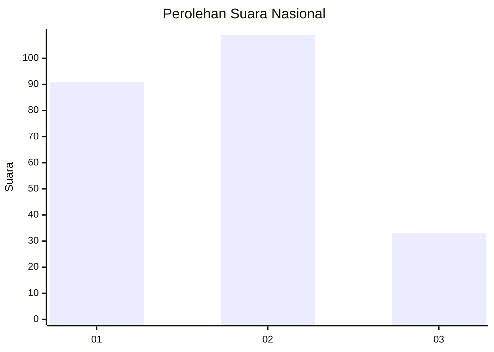
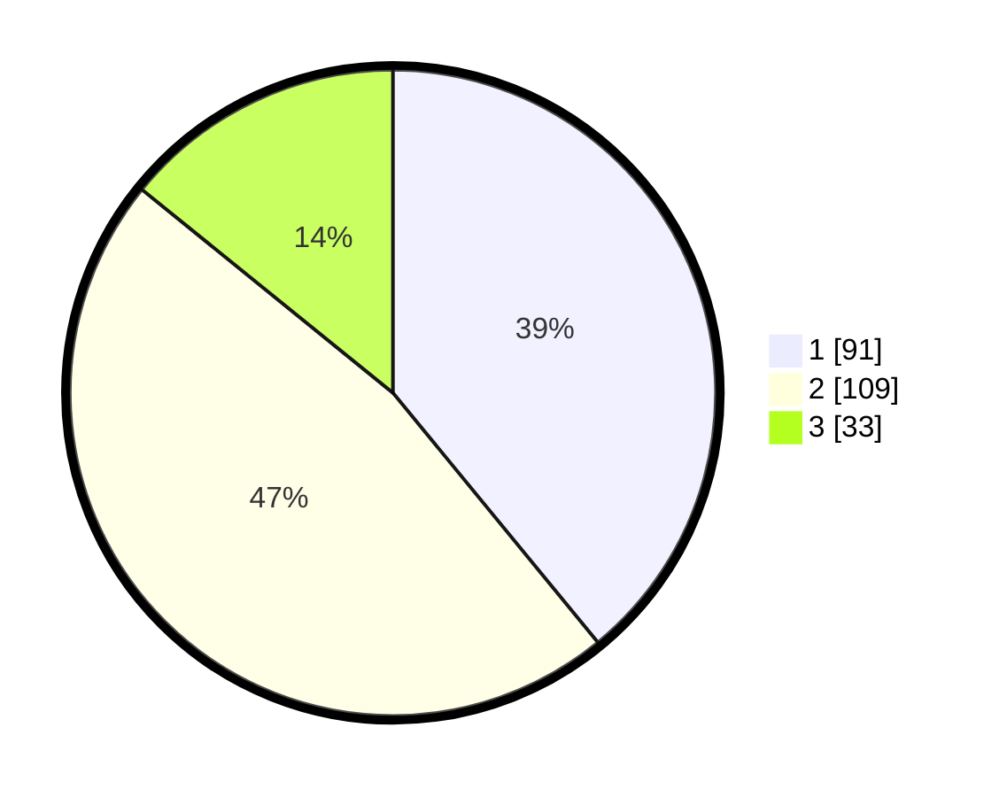

# Hasil

## Grafik

## Tabel

| No.    | Nama Paslon    | Suara | Suara (raw) | Persentase |
|:------ |:-------------- | -----:| -----------:| ----------:|
| 100025 | ANIES MUHAIMIN | 91    | [91][p-1]   | 39,06      |
| 100026 | PRABOWO GIBRAN | 109   | [109][p-2]  | 46,78      |
| 100027 | GANJAR MAHFUD  | 33    | [33][p-3]   | 14,16      |

[p-1]: https://github.com/gigit-pemilu/pemilu-2024/blob/main/pilpres/hitung-suara/sub/31-dki-jakarta/sub/73-jakarta-barat/sub/01-cengkareng/sub/1002-duri-kosambi/sub/069-tps/sub/paslon-1.txt
[p-2]: https://github.com/gigit-pemilu/pemilu-2024/blob/main/pilpres/hitung-suara/sub/31-dki-jakarta/sub/73-jakarta-barat/sub/01-cengkareng/sub/1002-duri-kosambi/sub/069-tps/sub/paslon-2.txt
[p-3]: https://github.com/gigit-pemilu/pemilu-2024/blob/main/pilpres/hitung-suara/sub/31-dki-jakarta/sub/73-jakarta-barat/sub/01-cengkareng/sub/1002-duri-kosambi/sub/069-tps/sub/paslon-3.txt

## Foto C Plano

https://sirekap-obj-formc.kpu.go.id/6000/pemilu/ppwp/31/73/01/10/02/3173011002069-20240214-204103--1163af11-ff8e-4245-9728-ee2d81f99a91.jpg

https://sirekap-obj-formc.kpu.go.id/6000/pemilu/ppwp/31/73/01/10/02/3173011002069-20240214-204148--2aa20818-92d2-4ea3-876c-4161a6dd3a71.jpg

https://sirekap-obj-formc.kpu.go.id/6000/pemilu/ppwp/31/73/01/10/02/3173011002069-20240214-204221--c463cb89-ae60-4d23-82d2-6d5953ff01f8.jpg

## Metadata

| Key        | Value               |
| ---------- | ------------------- |
| Time Stamp | 2024-02-17 18:30:00 |

