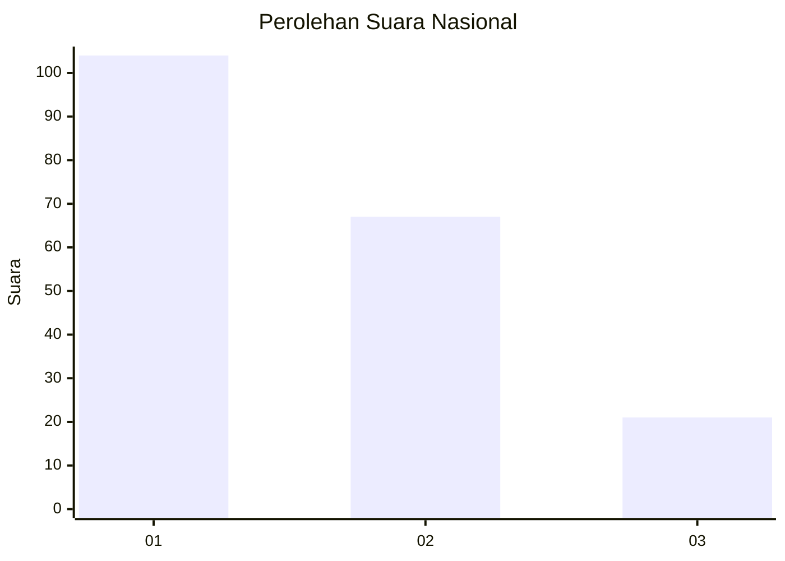
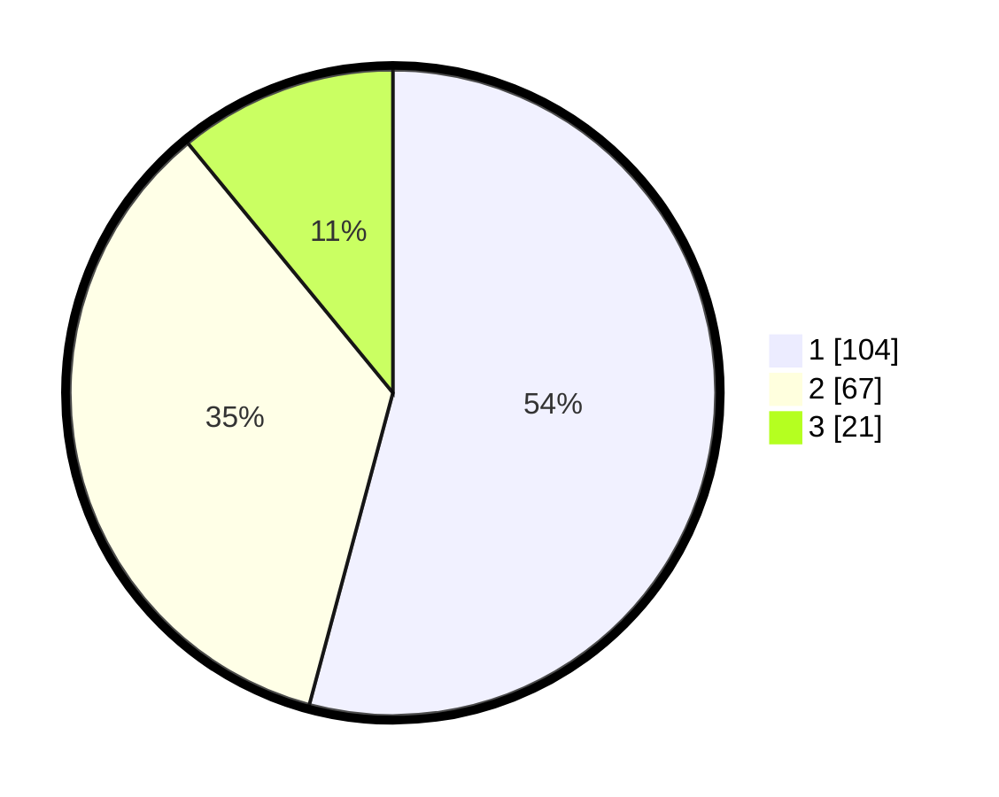

# Hasil

## Grafik

## Tabel

| No.    | Nama Paslon    | Suara | Suara (raw) | Persentase |
|:------ |:-------------- | -----:| -----------:| ----------:|
| 100025 | ANIES MUHAIMIN | 104   | [104][p-1]  | 54,17      |
| 100026 | PRABOWO GIBRAN | 67    | [67][p-2]   | 34,90      |
| 100027 | GANJAR MAHFUD  | 21    | [21][p-3]   | 10,94      |

[p-1]: https://github.com/gigit-pemilu/pemilu-2024/blob/main/pilpres/hitung-suara/sub/31-dki-jakarta/sub/73-jakarta-barat/sub/01-cengkareng/sub/1002-duri-kosambi/sub/074-tps/sub/paslon-1.txt
[p-2]: https://github.com/gigit-pemilu/pemilu-2024/blob/main/pilpres/hitung-suara/sub/31-dki-jakarta/sub/73-jakarta-barat/sub/01-cengkareng/sub/1002-duri-kosambi/sub/074-tps/sub/paslon-2.txt
[p-3]: https://github.com/gigit-pemilu/pemilu-2024/blob/main/pilpres/hitung-suara/sub/31-dki-jakarta/sub/73-jakarta-barat/sub/01-cengkareng/sub/1002-duri-kosambi/sub/074-tps/sub/paslon-3.txt

## Foto C Plano

https://sirekap-obj-formc.kpu.go.id/2912/pemilu/ppwp/31/73/01/10/02/3173011002074-20240214-233545--118f588d-9fe0-4c96-aa50-fbcfe0aabab7.jpg

https://sirekap-obj-formc.kpu.go.id/2912/pemilu/ppwp/31/73/01/10/02/3173011002074-20240214-194810--ca90a0a6-c7c1-4865-9e6a-4c8455da31cb.jpg

https://sirekap-obj-formc.kpu.go.id/2912/pemilu/ppwp/31/73/01/10/02/3173011002074-20240214-193559--0151e997-ac57-4984-8ef5-b48589da93d9.jpg

## Metadata

| Key        | Value               |
| ---------- | ------------------- |
| Time Stamp | 2024-02-15 00:41:44 |

