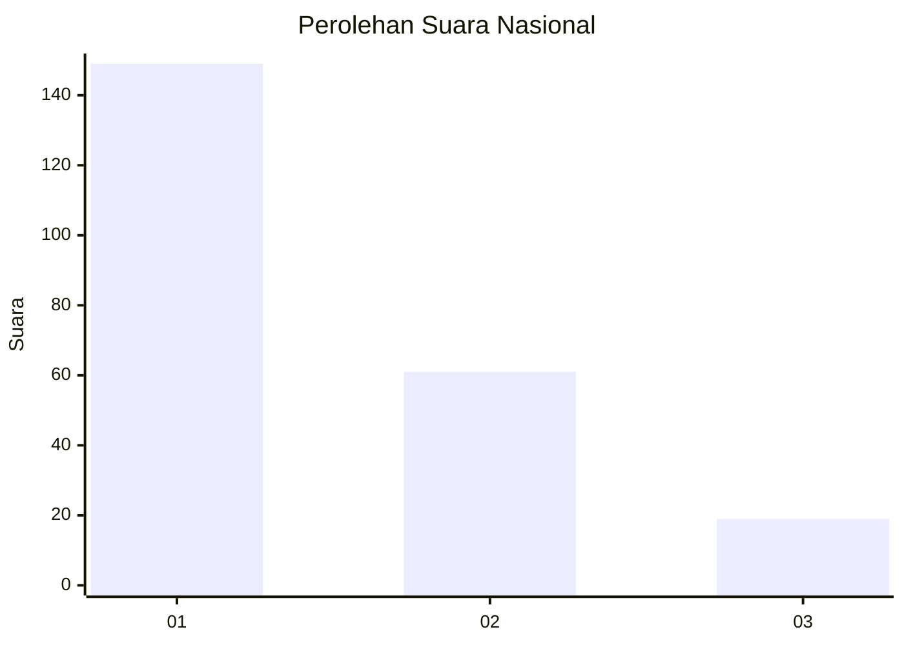
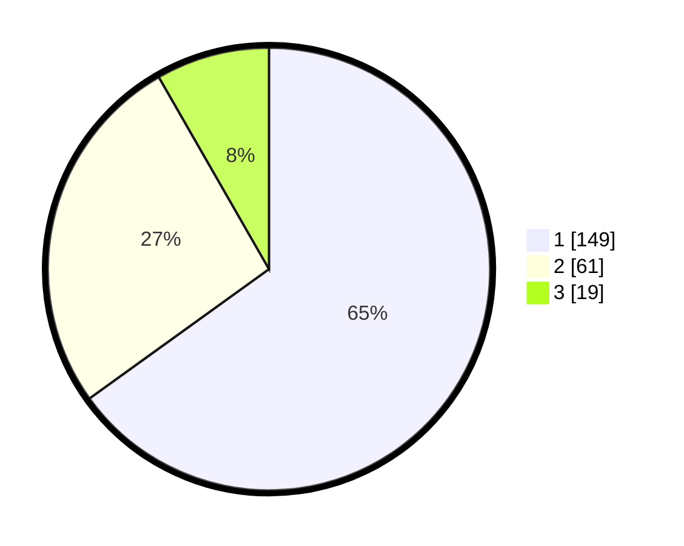

# Hasil

## Grafik

## Tabel

| No. | Nama Paslon    | Suara | Suara (raw) | Persentase |
|:--- |:-------------- | -----:| -----------:| ----------:|
| 1   | ANIES MUHAIMIN | 149   | [149][p-1]  | 65,07      |
| 2   | PRABOWO GIBRAN | 61    | [61][p-2]   | 26,64      |
| 3   | GANJAR MAHFUD  | 19    | [19][p-3]   | 8,30       |

[p-1]: https://github.com/gigit-pemilu/pemilu-2024/blob/main/pilpres/hitung-suara/sub/31-dki-jakarta/sub/73-jakarta-barat/sub/01-cengkareng/sub/1002-duri-kosambi/sub/079-tps/sub/paslon-1.txt
[p-2]: https://github.com/gigit-pemilu/pemilu-2024/blob/main/pilpres/hitung-suara/sub/31-dki-jakarta/sub/73-jakarta-barat/sub/01-cengkareng/sub/1002-duri-kosambi/sub/079-tps/sub/paslon-2.txt
[p-3]: https://github.com/gigit-pemilu/pemilu-2024/blob/main/pilpres/hitung-suara/sub/31-dki-jakarta/sub/73-jakarta-barat/sub/01-cengkareng/sub/1002-duri-kosambi/sub/079-tps/sub/paslon-3.txt

## Foto C Plano

https://sirekap-obj-formc.kpu.go.id/98c2/pemilu/ppwp/31/73/01/10/02/3173011002079-20240214-231825--93caa02e-2902-433b-b72f-0fcfb7215a8a.jpg

https://sirekap-obj-formc.kpu.go.id/98c2/pemilu/ppwp/31/73/01/10/02/3173011002079-20240214-231627--e5eb5084-ad2e-4b5f-afca-1928f4d65ef3.jpg

https://sirekap-obj-formc.kpu.go.id/98c2/pemilu/ppwp/31/73/01/10/02/3173011002079-20240214-231732--e20dd2a3-265d-41b2-afa5-3212b6912805.jpg

## Metadata

| Key        | Value               |
| ---------- | ------------------- |
| Time Stamp | 2024-02-16 01:30:27 |

