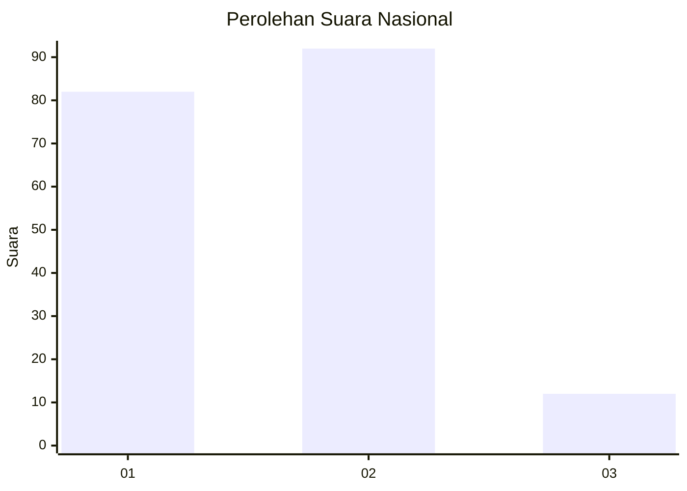
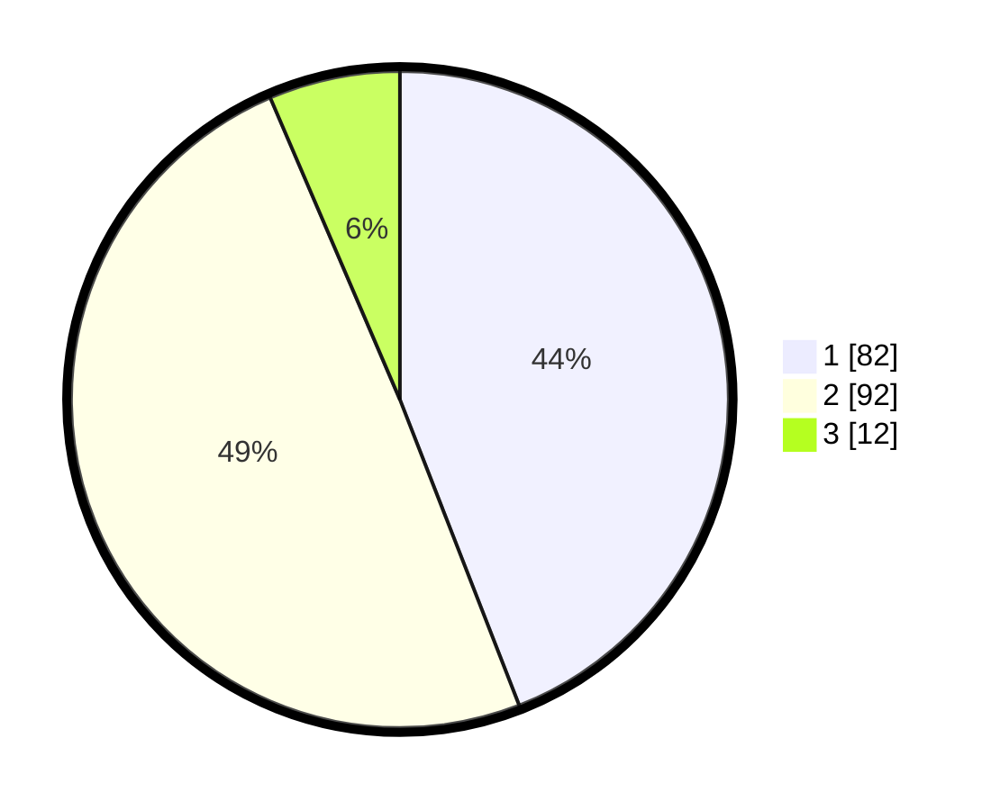

# Hasil

## Grafik

## Tabel

| No.    | Nama Paslon    | Suara | Suara (raw) | Persentase |
|:------ |:-------------- | -----:| -----------:| ----------:|
| 100025 | ANIES MUHAIMIN | 82    | [82][p-1]   | 44,09      |
| 100026 | PRABOWO GIBRAN | 92    | [92][p-2]   | 49,46      |
| 100027 | GANJAR MAHFUD  | 12    | [12][p-3]   | 6,45       |

[p-1]: https://github.com/gigit-pemilu/pemilu-2024/blob/main/pilpres/hitung-suara/sub/31-dki-jakarta/sub/73-jakarta-barat/sub/01-cengkareng/sub/1002-duri-kosambi/sub/091-tps/sub/paslon-1.txt
[p-2]: https://github.com/gigit-pemilu/pemilu-2024/blob/main/pilpres/hitung-suara/sub/31-dki-jakarta/sub/73-jakarta-barat/sub/01-cengkareng/sub/1002-duri-kosambi/sub/091-tps/sub/paslon-2.txt
[p-3]: https://github.com/gigit-pemilu/pemilu-2024/blob/main/pilpres/hitung-suara/sub/31-dki-jakarta/sub/73-jakarta-barat/sub/01-cengkareng/sub/1002-duri-kosambi/sub/091-tps/sub/paslon-3.txt

## Foto C Plano

https://sirekap-obj-formc.kpu.go.id/e01c/pemilu/ppwp/31/73/01/10/02/3173011002091-20240215-075935--21001384-e0fc-45d9-acee-0a9b876d6d7f.jpg

https://sirekap-obj-formc.kpu.go.id/e01c/pemilu/ppwp/31/73/01/10/02/3173011002091-20240216-135830--59deb878-5747-461a-81c1-0c03aab2ba7d.jpg

https://sirekap-obj-formc.kpu.go.id/e01c/pemilu/ppwp/31/73/01/10/02/3173011002091-20240216-135829--6073c7c8-e40b-4338-bdca-89f5b38c3238.jpg

## Metadata

| Key        | Value               |
| ---------- | ------------------- |
| Time Stamp | 2024-02-16 16:25:10 |

