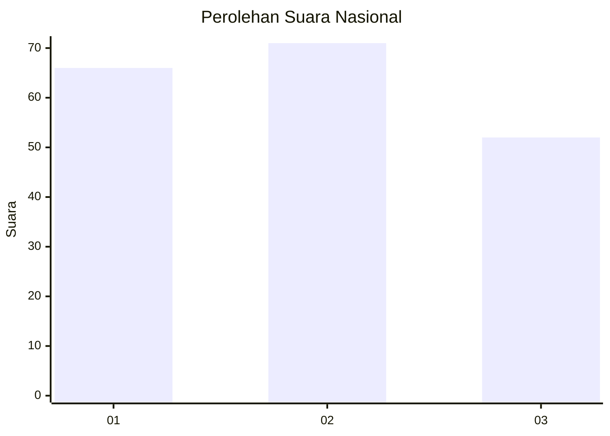
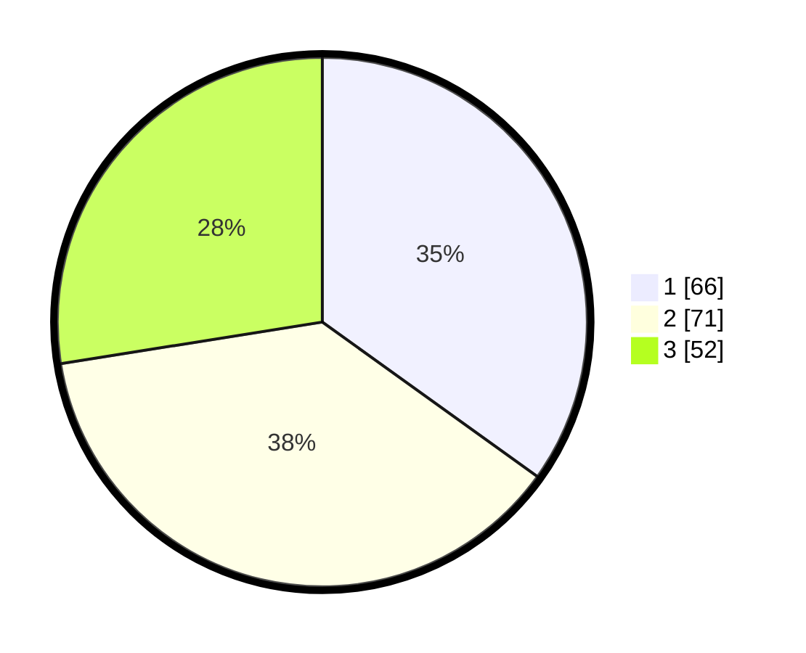

# Hasil

## Grafik

## Tabel

| No.    | Nama Paslon    | Suara | Suara (raw) | Persentase |
|:------ |:-------------- | -----:| -----------:| ----------:|
| 100025 | ANIES MUHAIMIN | 66    | [66][p-1]   | 34,92      |
| 100026 | PRABOWO GIBRAN | 71    | [71][p-2]   | 37,57      |
| 100027 | GANJAR MAHFUD  | 52    | [52][p-3]   | 27,51      |

[p-1]: https://github.com/gigit-pemilu/pemilu-2024/blob/main/pilpres/hitung-suara/sub/31-dki-jakarta/sub/73-jakarta-barat/sub/01-cengkareng/sub/1002-duri-kosambi/sub/153-tps/sub/paslon-1.txt
[p-2]: https://github.com/gigit-pemilu/pemilu-2024/blob/main/pilpres/hitung-suara/sub/31-dki-jakarta/sub/73-jakarta-barat/sub/01-cengkareng/sub/1002-duri-kosambi/sub/153-tps/sub/paslon-2.txt
[p-3]: https://github.com/gigit-pemilu/pemilu-2024/blob/main/pilpres/hitung-suara/sub/31-dki-jakarta/sub/73-jakarta-barat/sub/01-cengkareng/sub/1002-duri-kosambi/sub/153-tps/sub/paslon-3.txt

## Foto C Plano

https://sirekap-obj-formc.kpu.go.id/d7ae/pemilu/ppwp/31/73/01/10/02/3173011002153-20240215-000303--ae96315f-0e6a-42ff-9370-d1d107c7f3aa.jpg

https://sirekap-obj-formc.kpu.go.id/d7ae/pemilu/ppwp/31/73/01/10/02/3173011002153-20240215-000341--e7bb505b-c7af-4fb9-bad7-25d1f66cb278.jpg

https://sirekap-obj-formc.kpu.go.id/d7ae/pemilu/ppwp/31/73/01/10/02/3173011002153-20240215-015110--14b9b792-32d4-4382-976f-c48cb96f890f.jpg

## Metadata

| Key        | Value               |
| ---------- | ------------------- |
| Time Stamp | 2024-02-19 14:00:00 |

