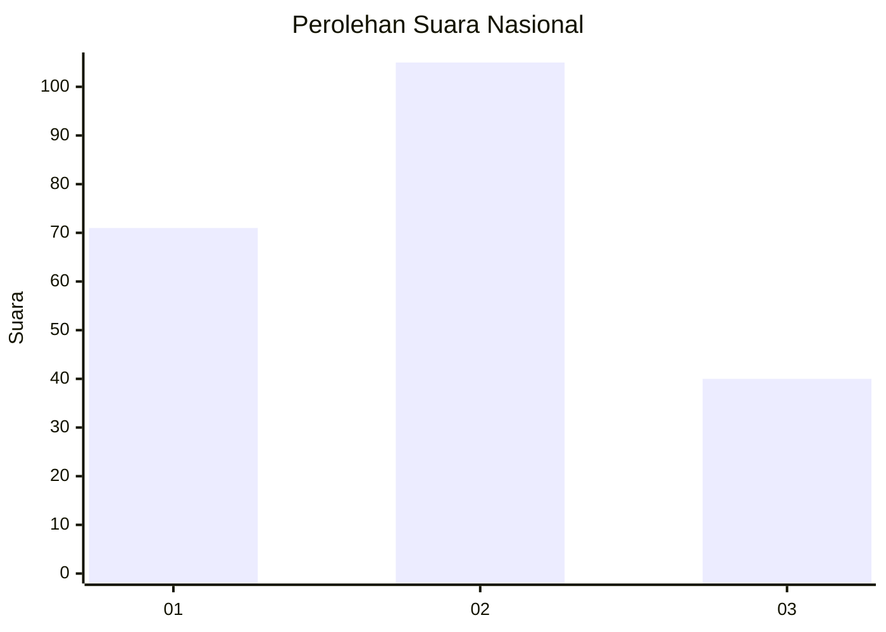
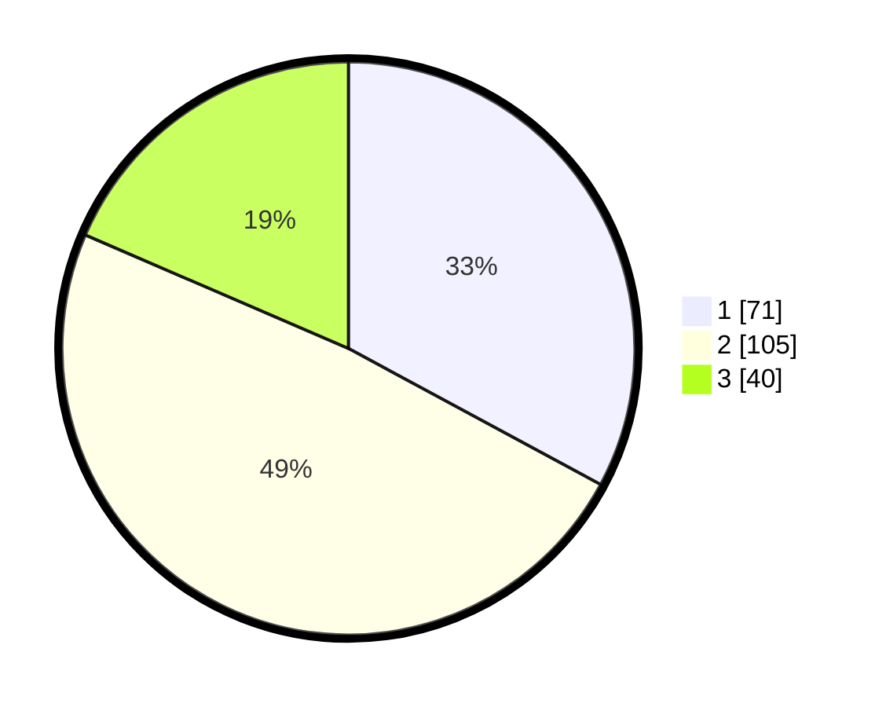

# Hasil

## Grafik

## Tabel

| No.    | Nama Paslon    | Suara | Suara (raw) | Persentase |
|:------ |:-------------- | -----:| -----------:| ----------:|
| 100025 | ANIES MUHAIMIN | 71    | [71][p-1]   | 32,87      |
| 100026 | PRABOWO GIBRAN | 105   | [105][p-2]  | 48,61      |
| 100027 | GANJAR MAHFUD  | 40    | [40][p-3]   | 18,52      |

[p-1]: https://github.com/gigit-pemilu/pemilu-2024/blob/main/pilpres/hitung-suara/sub/31-dki-jakarta/sub/73-jakarta-barat/sub/01-cengkareng/sub/1002-duri-kosambi/sub/173-tps/sub/paslon-1.txt
[p-2]: https://github.com/gigit-pemilu/pemilu-2024/blob/main/pilpres/hitung-suara/sub/31-dki-jakarta/sub/73-jakarta-barat/sub/01-cengkareng/sub/1002-duri-kosambi/sub/173-tps/sub/paslon-2.txt
[p-3]: https://github.com/gigit-pemilu/pemilu-2024/blob/main/pilpres/hitung-suara/sub/31-dki-jakarta/sub/73-jakarta-barat/sub/01-cengkareng/sub/1002-duri-kosambi/sub/173-tps/sub/paslon-3.txt

## Foto C Plano

https://sirekap-obj-formc.kpu.go.id/a561/pemilu/ppwp/31/73/01/10/02/3173011002173-20240214-190109--f111ac2f-eb00-4b46-bc7a-ea9ebb3859d7.jpg

https://sirekap-obj-formc.kpu.go.id/a561/pemilu/ppwp/31/73/01/10/02/3173011002173-20240214-190118--7998af17-c059-489e-8bf5-defcf40c9a8b.jpg

https://sirekap-obj-formc.kpu.go.id/a561/pemilu/ppwp/31/73/01/10/02/3173011002173-20240214-190128--b766ebb9-920f-4c87-8380-34f70b2584e4.jpg

## Metadata

| Key        | Value               |
| ---------- | ------------------- |
| Time Stamp | 2024-02-17 19:00:04 |

