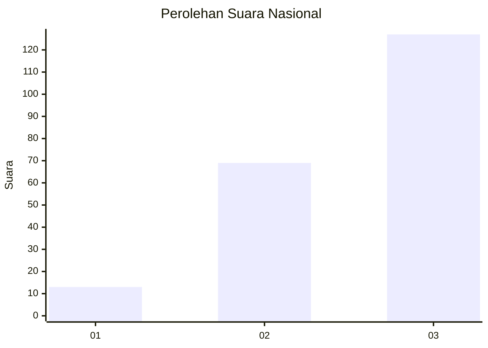
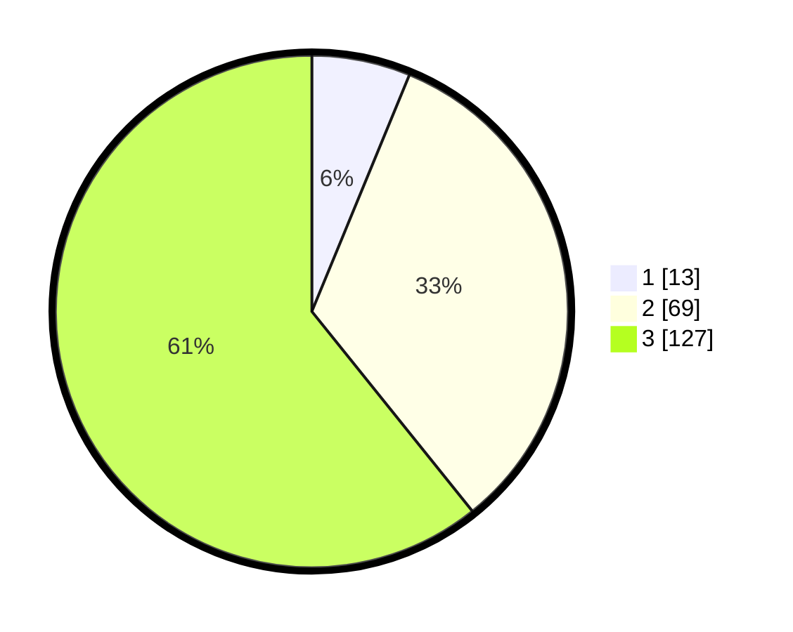

# Hasil

## Grafik

## Tabel

| No.    | Nama Paslon    | Suara | Suara (raw) | Persentase |
|:------ |:-------------- | -----:| -----------:| ----------:|
| 100025 | ANIES MUHAIMIN | 13    | [13][p-1]   | 6,22       |
| 100026 | PRABOWO GIBRAN | 69    | [69][p-2]   | 33,01      |
| 100027 | GANJAR MAHFUD  | 127   | [127][p-3]  | 60,77      |

[p-1]: https://github.com/gigit-pemilu/pemilu-2024/blob/main/pilpres/hitung-suara/sub/31-dki-jakarta/sub/73-jakarta-barat/sub/01-cengkareng/sub/1002-duri-kosambi/sub/191-tps/sub/paslon-1.txt
[p-2]: https://github.com/gigit-pemilu/pemilu-2024/blob/main/pilpres/hitung-suara/sub/31-dki-jakarta/sub/73-jakarta-barat/sub/01-cengkareng/sub/1002-duri-kosambi/sub/191-tps/sub/paslon-2.txt
[p-3]: https://github.com/gigit-pemilu/pemilu-2024/blob/main/pilpres/hitung-suara/sub/31-dki-jakarta/sub/73-jakarta-barat/sub/01-cengkareng/sub/1002-duri-kosambi/sub/191-tps/sub/paslon-3.txt

## Foto C Plano

https://sirekap-obj-formc.kpu.go.id/f536/pemilu/ppwp/31/73/01/10/02/3173011002191-20240214-215335--6514e2b7-7692-454c-a5a5-e8d20e24e9b3.jpg

https://sirekap-obj-formc.kpu.go.id/f536/pemilu/ppwp/31/73/01/10/02/3173011002191-20240214-215556--b73d9536-398d-43c3-915b-06461e269d96.jpg

https://sirekap-obj-formc.kpu.go.id/f536/pemilu/ppwp/31/73/01/10/02/3173011002191-20240214-215753--0a4a0d39-0f29-41dc-8e7c-ac9051694a17.jpg

## Metadata

| Key        | Value               |
| ---------- | ------------------- |
| Time Stamp | 2024-02-19 15:00:00 |

