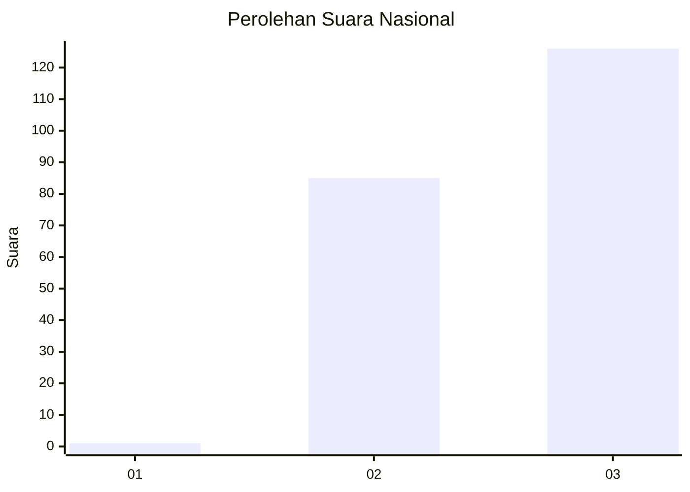
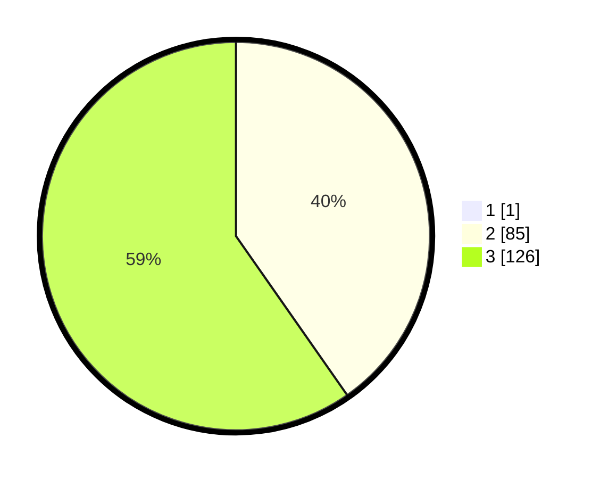

# Hasil

## Grafik

## Tabel

| No.    | Nama Paslon    | Suara | Suara (raw) | Persentase |
|:------ |:-------------- | -----:| -----------:| ----------:|
| 100025 | ANIES MUHAIMIN | 1     | [1][p-1]    | 0,47       |
| 100026 | PRABOWO GIBRAN | 85    | [85][p-2]   | 40,09      |
| 100027 | GANJAR MAHFUD  | 126   | [126][p-3]  | 59,43      |

[p-1]: https://github.com/gigit-pemilu/pemilu-2024/blob/main/pilpres/hitung-suara/sub/31-dki-jakarta/sub/73-jakarta-barat/sub/01-cengkareng/sub/1002-duri-kosambi/sub/201-tps/sub/paslon-1.txt
[p-2]: https://github.com/gigit-pemilu/pemilu-2024/blob/main/pilpres/hitung-suara/sub/31-dki-jakarta/sub/73-jakarta-barat/sub/01-cengkareng/sub/1002-duri-kosambi/sub/201-tps/sub/paslon-2.txt
[p-3]: https://github.com/gigit-pemilu/pemilu-2024/blob/main/pilpres/hitung-suara/sub/31-dki-jakarta/sub/73-jakarta-barat/sub/01-cengkareng/sub/1002-duri-kosambi/sub/201-tps/sub/paslon-3.txt

## Foto C Plano

https://sirekap-obj-formc.kpu.go.id/c154/pemilu/ppwp/31/73/01/10/02/3173011002201-20240214-203938--ec521aea-06c9-4e84-9b76-ea40ed301e55.jpg

https://sirekap-obj-formc.kpu.go.id/c154/pemilu/ppwp/31/73/01/10/02/3173011002201-20240214-212804--1d85d4af-e3c0-4635-b568-26d8d3ccf8b4.jpg

https://sirekap-obj-formc.kpu.go.id/c154/pemilu/ppwp/31/73/01/10/02/3173011002201-20240214-204231--97b16680-8786-40e9-b4dc-c54a10c81d47.jpg

## Metadata

| Key        | Value               |
| ---------- | ------------------- |
| Time Stamp | 2024-02-19 14:00:00 |

