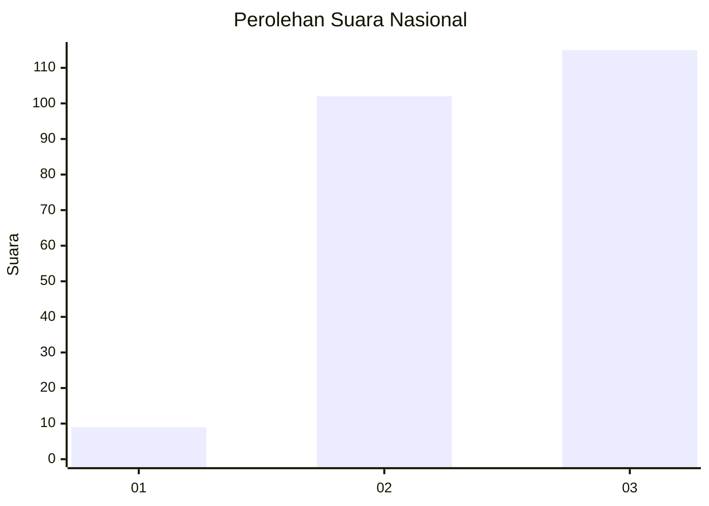
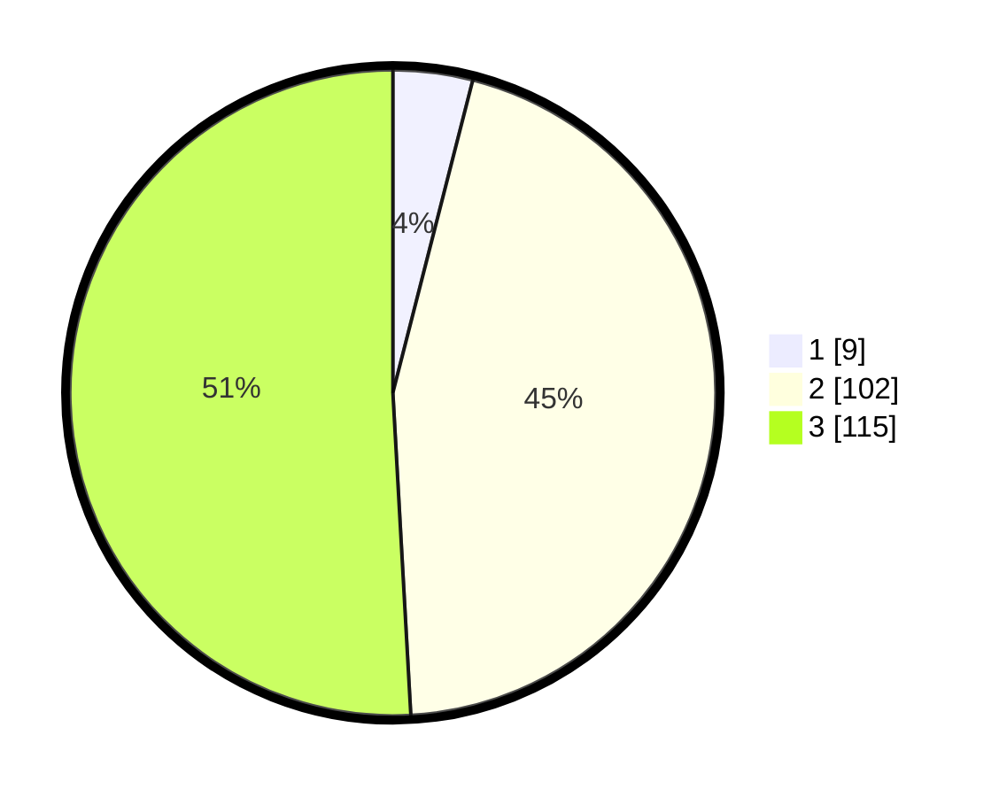

# Hasil

## Grafik

## Tabel

| No.    | Nama Paslon    | Suara | Suara (raw) | Persentase |
|:------ |:-------------- | -----:| -----------:| ----------:|
| 100025 | ANIES MUHAIMIN | 9     | [9][p-1]    | 3,98       |
| 100026 | PRABOWO GIBRAN | 102   | [102][p-2]  | 45,13      |
| 100027 | GANJAR MAHFUD  | 115   | [115][p-3]  | 50,88      |

[p-1]: https://github.com/gigit-pemilu/pemilu-2024/blob/main/pilpres/hitung-suara/sub/31-dki-jakarta/sub/73-jakarta-barat/sub/01-cengkareng/sub/1002-duri-kosambi/sub/219-tps/sub/paslon-1.txt
[p-2]: https://github.com/gigit-pemilu/pemilu-2024/blob/main/pilpres/hitung-suara/sub/31-dki-jakarta/sub/73-jakarta-barat/sub/01-cengkareng/sub/1002-duri-kosambi/sub/219-tps/sub/paslon-2.txt
[p-3]: https://github.com/gigit-pemilu/pemilu-2024/blob/main/pilpres/hitung-suara/sub/31-dki-jakarta/sub/73-jakarta-barat/sub/01-cengkareng/sub/1002-duri-kosambi/sub/219-tps/sub/paslon-3.txt

## Foto C Plano

https://sirekap-obj-formc.kpu.go.id/6d57/pemilu/ppwp/31/73/01/10/02/3173011002219-20240215-053240--678a492a-83c7-46e3-9c08-b15866117451.jpg

https://sirekap-obj-formc.kpu.go.id/6d57/pemilu/ppwp/31/73/01/10/02/3173011002219-20240215-054055--91ad4394-367c-4f24-98c8-9b94182f02a6.jpg

https://sirekap-obj-formc.kpu.go.id/6d57/pemilu/ppwp/31/73/01/10/02/3173011002219-20240215-054207--1aff43c5-4d20-4f18-a723-b8ff7dac9c50.jpg

## Metadata

| Key        | Value               |
| ---------- | ------------------- |
| Time Stamp | 2024-02-19 15:00:00 |

