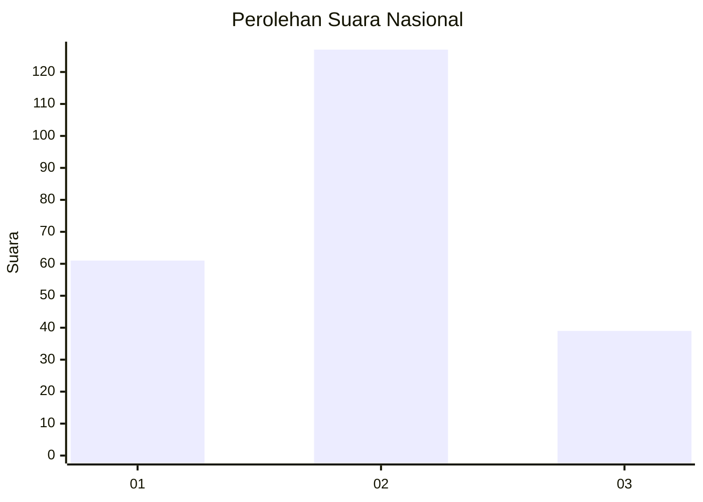
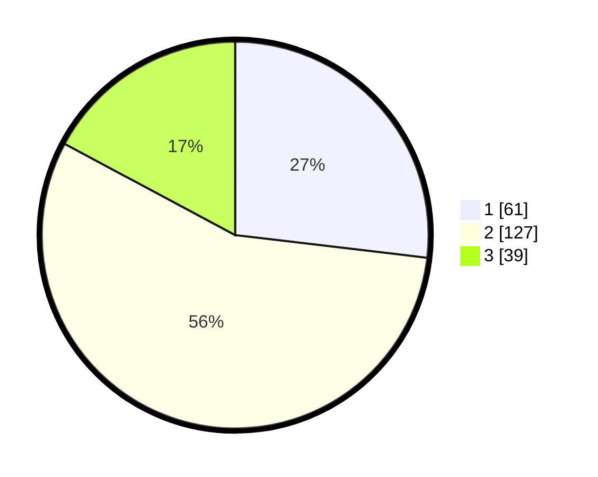

# Hasil

## Grafik

## Tabel

| No.    | Nama Paslon    | Suara | Suara (raw) | Persentase |
|:------ |:-------------- | -----:| -----------:| ----------:|
| 100025 | ANIES MUHAIMIN | 61    | [61][p-1]   | 26,87      |
| 100026 | PRABOWO GIBRAN | 127   | [127][p-2]  | 55,95      |
| 100027 | GANJAR MAHFUD  | 39    | [39][p-3]   | 17,18      |

[p-1]: https://github.com/gigit-pemilu/pemilu-2024/blob/main/pilpres/hitung-suara/sub/31-dki-jakarta/sub/73-jakarta-barat/sub/01-cengkareng/sub/1002-duri-kosambi/sub/254-tps/sub/paslon-1.txt
[p-2]: https://github.com/gigit-pemilu/pemilu-2024/blob/main/pilpres/hitung-suara/sub/31-dki-jakarta/sub/73-jakarta-barat/sub/01-cengkareng/sub/1002-duri-kosambi/sub/254-tps/sub/paslon-2.txt
[p-3]: https://github.com/gigit-pemilu/pemilu-2024/blob/main/pilpres/hitung-suara/sub/31-dki-jakarta/sub/73-jakarta-barat/sub/01-cengkareng/sub/1002-duri-kosambi/sub/254-tps/sub/paslon-3.txt

## Foto C Plano

https://sirekap-obj-formc.kpu.go.id/4020/pemilu/ppwp/31/73/01/10/02/3173011002254-20240215-113034--b281188d-ad6b-4174-aaee-0785400048cf.jpg

https://sirekap-obj-formc.kpu.go.id/4020/pemilu/ppwp/31/73/01/10/02/3173011002254-20240215-113127--cf5970cb-5e14-404d-b43b-1cf5999dc6b4.jpg

https://sirekap-obj-formc.kpu.go.id/4020/pemilu/ppwp/31/73/01/10/02/3173011002254-20240215-113205--16803543-c815-4d19-bd6f-5391429c6fcb.jpg

## Metadata

| Key        | Value               |
| ---------- | ------------------- |
| Time Stamp | 2024-02-17 19:00:04 |

