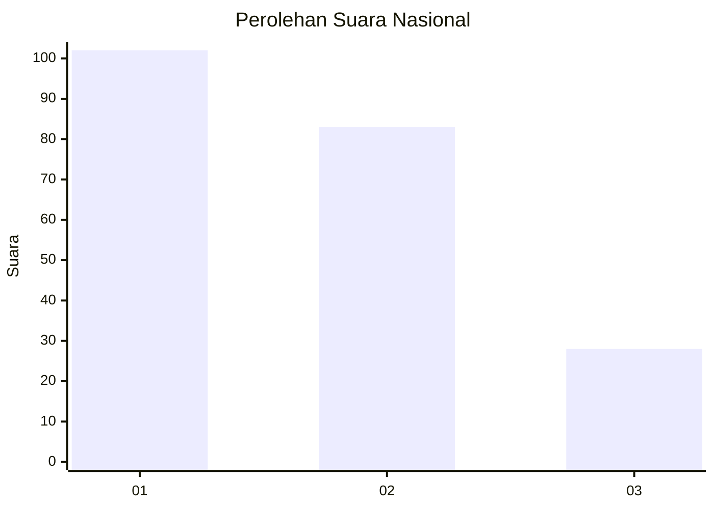
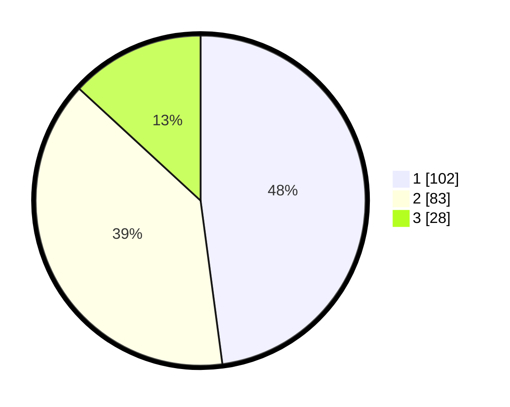

# Hasil

## Grafik

## Tabel

| No.    | Nama Paslon    | Suara | Suara (raw) | Persentase |
|:------ |:-------------- | -----:| -----------:| ----------:|
| 100025 | ANIES MUHAIMIN | 102   | [102][p-1]  | 47,89      |
| 100026 | PRABOWO GIBRAN | 83    | [83][p-2]   | 38,97      |
| 100027 | GANJAR MAHFUD  | 28    | [28][p-3]   | 13,15      |

[p-1]: https://github.com/gigit-pemilu/pemilu-2024/blob/main/pilpres/hitung-suara/sub/31-dki-jakarta/sub/73-jakarta-barat/sub/01-cengkareng/sub/1002-duri-kosambi/sub/274-tps/sub/paslon-1.txt
[p-2]: https://github.com/gigit-pemilu/pemilu-2024/blob/main/pilpres/hitung-suara/sub/31-dki-jakarta/sub/73-jakarta-barat/sub/01-cengkareng/sub/1002-duri-kosambi/sub/274-tps/sub/paslon-2.txt
[p-3]: https://github.com/gigit-pemilu/pemilu-2024/blob/main/pilpres/hitung-suara/sub/31-dki-jakarta/sub/73-jakarta-barat/sub/01-cengkareng/sub/1002-duri-kosambi/sub/274-tps/sub/paslon-3.txt

## Foto C Plano

https://sirekap-obj-formc.kpu.go.id/5d7c/pemilu/ppwp/31/73/01/10/02/3173011002274-20240214-220853--87040dbc-5024-4caf-a72f-01a6957e080f.jpg

https://sirekap-obj-formc.kpu.go.id/5d7c/pemilu/ppwp/31/73/01/10/02/3173011002274-20240214-220946--433f5b31-552b-4b67-a302-9abb9ce66f43.jpg

https://sirekap-obj-formc.kpu.go.id/5d7c/pemilu/ppwp/31/73/01/10/02/3173011002274-20240214-221044--85cb0d32-308d-4234-bd14-d53ee480f4b6.jpg

## Metadata

| Key        | Value               |
| ---------- | ------------------- |
| Time Stamp | 2024-02-17 19:00:04 |

