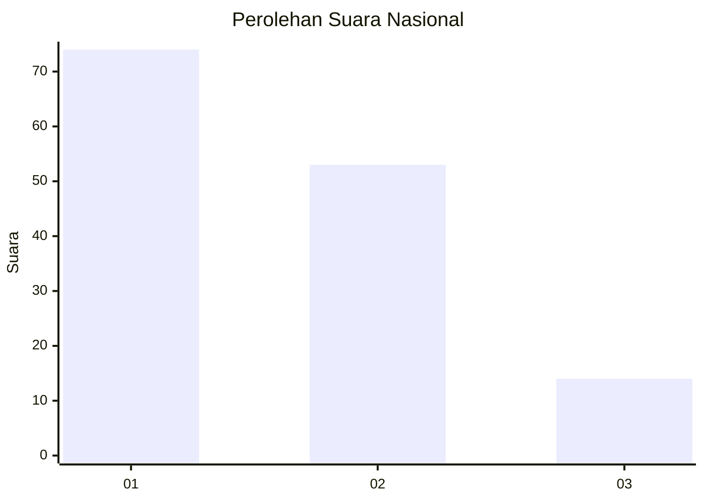
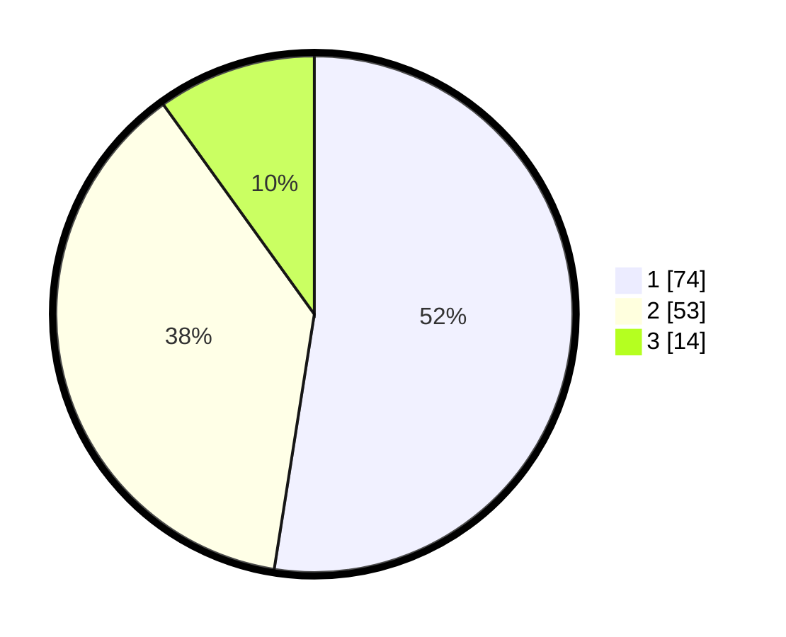

# Hasil

## Grafik

## Tabel

| No.    | Nama Paslon    | Suara | Suara (raw) | Persentase |
|:------ |:-------------- | -----:| -----------:| ----------:|
| 100025 | ANIES MUHAIMIN | 74    | [74][p-1]   | 52,48      |
| 100026 | PRABOWO GIBRAN | 53    | [53][p-2]   | 37,59      |
| 100027 | GANJAR MAHFUD  | 14    | [14][p-3]   | 9,93       |

[p-1]: https://github.com/gigit-pemilu/pemilu-2024/blob/main/pilpres/hitung-suara/sub/31-dki-jakarta/sub/73-jakarta-barat/sub/01-cengkareng/sub/1003-rawa-buaya/sub/118-tps/sub/paslon-1.txt
[p-2]: https://github.com/gigit-pemilu/pemilu-2024/blob/main/pilpres/hitung-suara/sub/31-dki-jakarta/sub/73-jakarta-barat/sub/01-cengkareng/sub/1003-rawa-buaya/sub/118-tps/sub/paslon-2.txt
[p-3]: https://github.com/gigit-pemilu/pemilu-2024/blob/main/pilpres/hitung-suara/sub/31-dki-jakarta/sub/73-jakarta-barat/sub/01-cengkareng/sub/1003-rawa-buaya/sub/118-tps/sub/paslon-3.txt

## Foto C Plano

https://sirekap-obj-formc.kpu.go.id/a79c/pemilu/ppwp/31/73/01/10/03/3173011003118-20240214-231629--577707cf-4210-41ab-a3fb-a0495f22ef92.jpg

https://sirekap-obj-formc.kpu.go.id/a79c/pemilu/ppwp/31/73/01/10/03/3173011003118-20240214-231858--540ac3b8-1f2c-4bd5-a590-3ebb8880166d.jpg

https://sirekap-obj-formc.kpu.go.id/a79c/pemilu/ppwp/31/73/01/10/03/3173011003118-20240214-232034--767b05fb-e0af-4d9e-a2d6-3c55d1884103.jpg

## Metadata

| Key        | Value               |
| ---------- | ------------------- |
| Time Stamp | 2024-02-17 19:00:04 |

