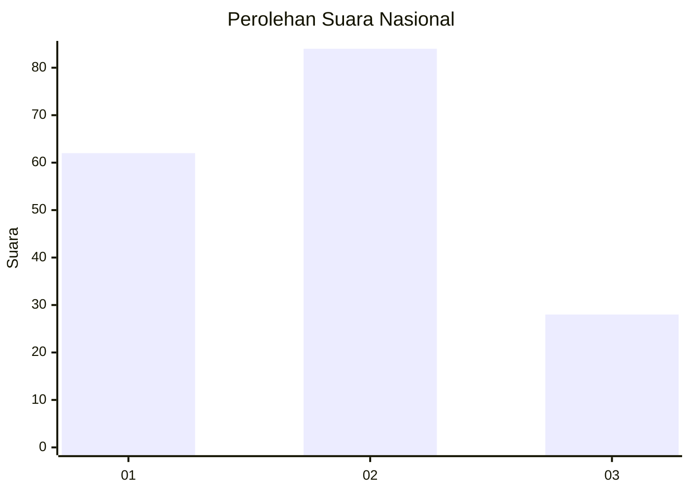
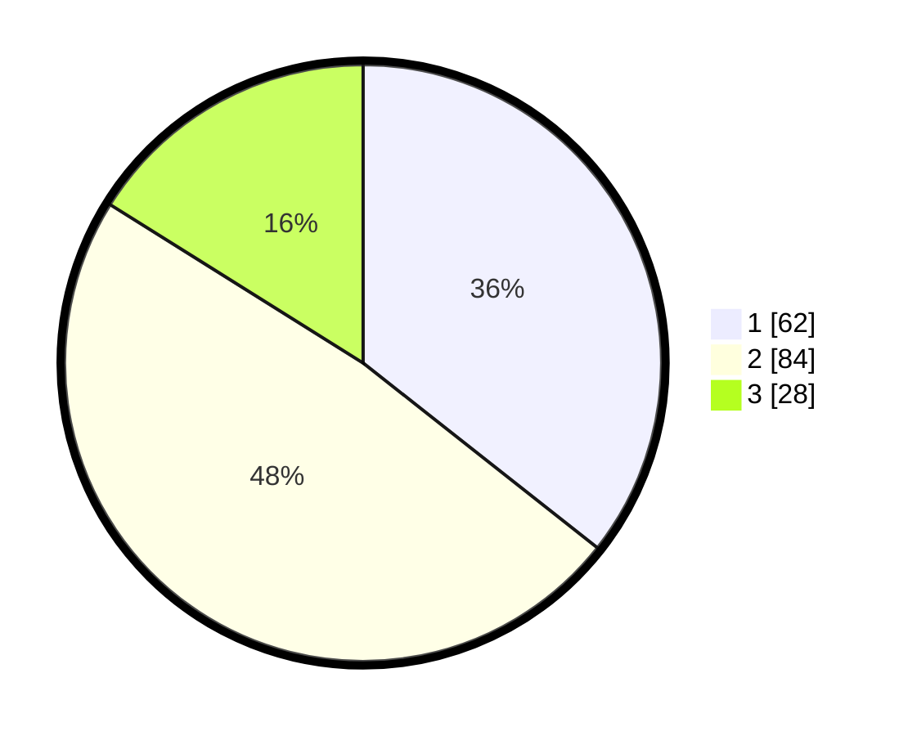

# Hasil

## Grafik

## Tabel

| No.    | Nama Paslon    | Suara | Suara (raw) | Persentase |
|:------ |:-------------- | -----:| -----------:| ----------:|
| 100025 | ANIES MUHAIMIN | 62    | [62][p-1]   | 35,63      |
| 100026 | PRABOWO GIBRAN | 84    | [84][p-2]   | 48,28      |
| 100027 | GANJAR MAHFUD  | 28    | [28][p-3]   | 16,09      |

[p-1]: https://github.com/gigit-pemilu/pemilu-2024/blob/main/pilpres/hitung-suara/sub/31-dki-jakarta/sub/73-jakarta-barat/sub/01-cengkareng/sub/1003-rawa-buaya/sub/119-tps/sub/paslon-1.txt
[p-2]: https://github.com/gigit-pemilu/pemilu-2024/blob/main/pilpres/hitung-suara/sub/31-dki-jakarta/sub/73-jakarta-barat/sub/01-cengkareng/sub/1003-rawa-buaya/sub/119-tps/sub/paslon-2.txt
[p-3]: https://github.com/gigit-pemilu/pemilu-2024/blob/main/pilpres/hitung-suara/sub/31-dki-jakarta/sub/73-jakarta-barat/sub/01-cengkareng/sub/1003-rawa-buaya/sub/119-tps/sub/paslon-3.txt

## Foto C Plano

https://sirekap-obj-formc.kpu.go.id/b9bf/pemilu/ppwp/31/73/01/10/03/3173011003119-20240214-222559--4511b0a5-155f-4a11-a4c7-7a492084f0e7.jpg

https://sirekap-obj-formc.kpu.go.id/b9bf/pemilu/ppwp/31/73/01/10/03/3173011003119-20240214-220537--274bd773-6e62-455f-b4cd-67e774fe6d27.jpg

https://sirekap-obj-formc.kpu.go.id/b9bf/pemilu/ppwp/31/73/01/10/03/3173011003119-20240214-220405--f962e0bc-9a0a-4ea8-bf2d-86c4cc7f785f.jpg

## Metadata

| Key        | Value               |
| ---------- | ------------------- |
| Time Stamp | 2024-02-17 19:00:04 |

