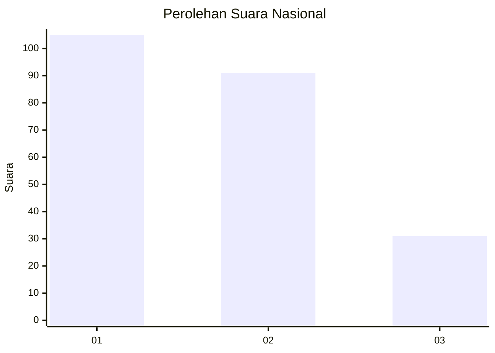

# Hasil

## Grafik

## Tabel

| No.    | Nama Paslon    | Suara | Suara (raw) | Persentase |
|:------ |:-------------- | -----:| -----------:| ----------:|
| 100025 | ANIES MUHAIMIN | 105   | [105][p-1]  | 46,26      |
| 100026 | PRABOWO GIBRAN | 91    | [91][p-2]   | 40,09      |
| 100027 | GANJAR MAHFUD  | 31    | [31][p-3]   | 13,66      |

[p-1]: https://github.com/gigit-pemilu/pemilu-2024/blob/main/pilpres/hitung-suara/sub/31-dki-jakarta/sub/73-jakarta-barat/sub/01-cengkareng/sub/1003-rawa-buaya/sub/178-tps/sub/paslon-1.txt
[p-2]: https://github.com/gigit-pemilu/pemilu-2024/blob/main/pilpres/hitung-suara/sub/31-dki-jakarta/sub/73-jakarta-barat/sub/01-cengkareng/sub/1003-rawa-buaya/sub/178-tps/sub/paslon-2.txt
[p-3]: https://github.com/gigit-pemilu/pemilu-2024/blob/main/pilpres/hitung-suara/sub/31-dki-jakarta/sub/73-jakarta-barat/sub/01-cengkareng/sub/1003-rawa-buaya/sub/178-tps/sub/paslon-3.txt

## Foto C Plano

https://sirekap-obj-formc.kpu.go.id/156a/pemilu/ppwp/31/73/01/10/03/3173011003178-20240214-214453--554c875c-a065-4659-bd80-bc78ba166d51.jpg

https://sirekap-obj-formc.kpu.go.id/156a/pemilu/ppwp/31/73/01/10/03/3173011003178-20240214-214713--31ca42cc-5930-4ba3-88a2-d0d84023715c.jpg

https://sirekap-obj-formc.kpu.go.id/156a/pemilu/ppwp/31/73/01/10/03/3173011003178-20240214-214803--a9fdd359-806a-49a7-b085-b9183638915c.jpg

## Metadata

| Key        | Value               |
| ---------- | ------------------- |
| Time Stamp | 2024-02-17 19:00:04 |

