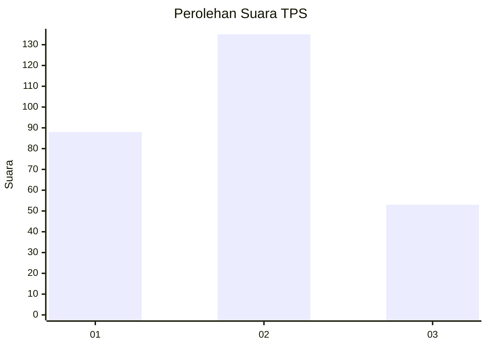
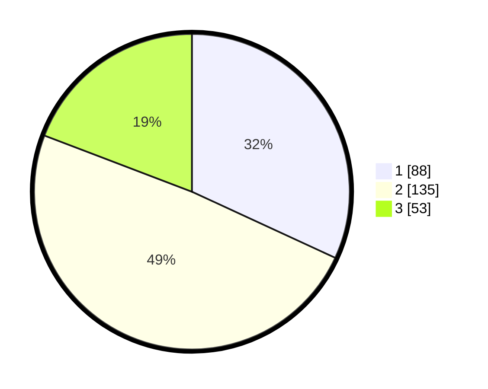

# Hasil

## Grafik

## Tabel

| No. | Nama Paslon    | Suara | Suara (raw) | Persentase |
|:--- |:-------------- | -----:| -----------:| ----------:|
| 1   | ANIES MUHAIMIN | 88    | [88][p-1]   | 31,88      |
| 2   | PRABOWO GIBRAN | 135   | [135][p-2]  | 48,91      |
| 3   | GANJAR MAHFUD  | 53    | [53][p-3]   | 19,20      |

[p-1]: https://github.com/gigit-pemilu/pemilu-2024-31-dki-jakarta/blob/main/pilpres/hitung-suara/sub/31-dki-jakarta/sub/73-jakarta-barat/sub/01-cengkareng/sub/1003-rawa-buaya/sub/186-tps/sub/paslon-1.txt
[p-2]: https://github.com/gigit-pemilu/pemilu-2024-31-dki-jakarta/blob/main/pilpres/hitung-suara/sub/31-dki-jakarta/sub/73-jakarta-barat/sub/01-cengkareng/sub/1003-rawa-buaya/sub/186-tps/sub/paslon-2.txt
[p-3]: https://github.com/gigit-pemilu/pemilu-2024-31-dki-jakarta/blob/main/pilpres/hitung-suara/sub/31-dki-jakarta/sub/73-jakarta-barat/sub/01-cengkareng/sub/1003-rawa-buaya/sub/186-tps/sub/paslon-3.txt

## Foto C Plano

https://sirekap-obj-formc.kpu.go.id/cdcc/pemilu/ppwp/31/73/01/10/03/3173011003186-20240214-234038--c82abf19-687f-4190-aaca-cbb3653c0170.jpg

https://sirekap-obj-formc.kpu.go.id/cdcc/pemilu/ppwp/31/73/01/10/03/3173011003186-20240214-234052--ac5a8ad9-886e-4892-a822-2f4cc29d8166.jpg

https://sirekap-obj-formc.kpu.go.id/cdcc/pemilu/ppwp/31/73/01/10/03/3173011003186-20240214-234108--944adb2d-0bda-4b38-82d5-e5d2259b6bf4.jpg

## Metadata

| Key        | Value               |
| ---------- | ------------------- |
| Time Stamp | 2024-02-17 19:00:04 |

