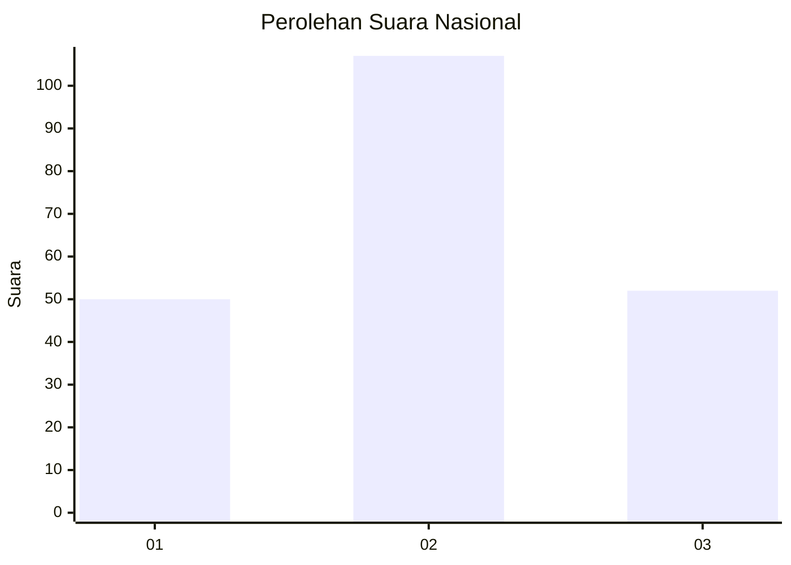
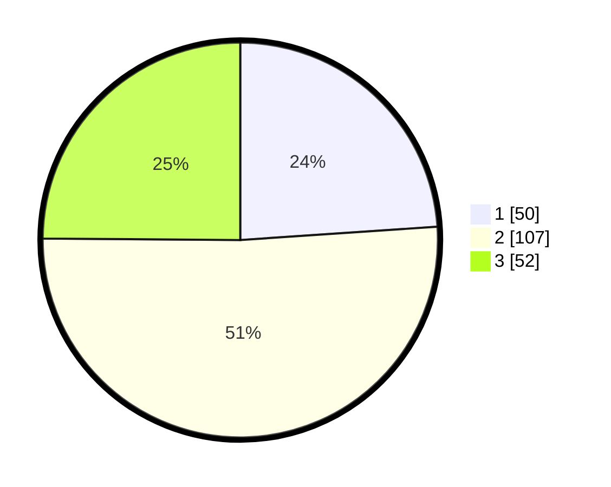

# Hasil

## Grafik

## Tabel

| No.    | Nama Paslon    | Suara | Suara (raw) | Persentase |
|:------ |:-------------- | -----:| -----------:| ----------:|
| 100025 | ANIES MUHAIMIN | 50    | [50][p-1]   | 23,92      |
| 100026 | PRABOWO GIBRAN | 107   | [107][p-2]  | 51,20      |
| 100027 | GANJAR MAHFUD  | 52    | [52][p-3]   | 24,88      |

[p-1]: https://github.com/gigit-pemilu/pemilu-2024/blob/main/pilpres/hitung-suara/sub/31-dki-jakarta/sub/73-jakarta-barat/sub/01-cengkareng/sub/1003-rawa-buaya/sub/205-tps/sub/paslon-1.txt
[p-2]: https://github.com/gigit-pemilu/pemilu-2024/blob/main/pilpres/hitung-suara/sub/31-dki-jakarta/sub/73-jakarta-barat/sub/01-cengkareng/sub/1003-rawa-buaya/sub/205-tps/sub/paslon-2.txt
[p-3]: https://github.com/gigit-pemilu/pemilu-2024/blob/main/pilpres/hitung-suara/sub/31-dki-jakarta/sub/73-jakarta-barat/sub/01-cengkareng/sub/1003-rawa-buaya/sub/205-tps/sub/paslon-3.txt

## Foto C Plano

https://sirekap-obj-formc.kpu.go.id/0bce/pemilu/ppwp/31/73/01/10/03/3173011003205-20240215-202807--002e4866-869d-42b0-88a7-495f5bb2ff90.jpg

https://sirekap-obj-formc.kpu.go.id/0bce/pemilu/ppwp/31/73/01/10/03/3173011003205-20240215-203955--9e5447fe-a446-4e47-8ac9-b13b710b4ada.jpg

https://sirekap-obj-formc.kpu.go.id/0bce/pemilu/ppwp/31/73/01/10/03/3173011003205-20240215-003916--8bec937f-b79f-4d94-bc6d-f20a7576bae5.jpg

## Metadata

| Key        | Value               |
| ---------- | ------------------- |
| Time Stamp | 2024-02-21 16:00:00 |

