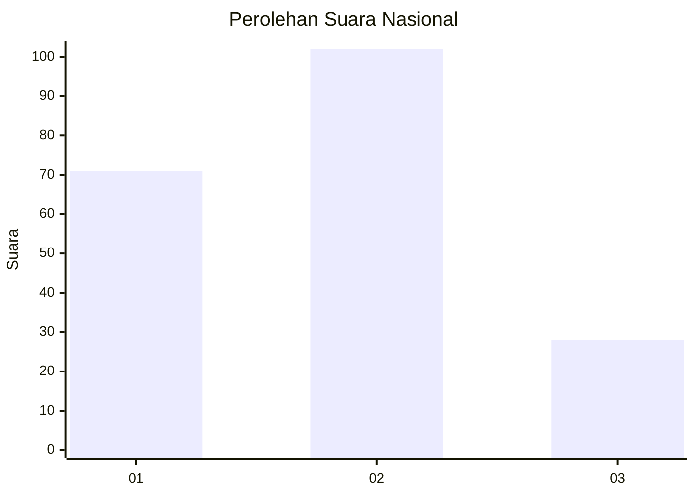
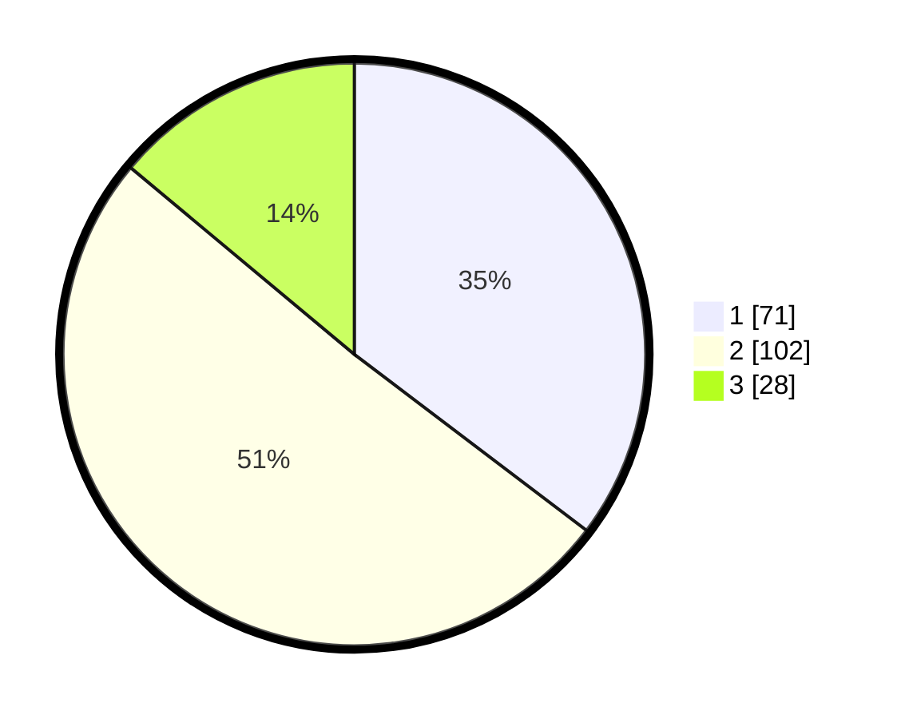

# Hasil

## Grafik

## Tabel

| No.    | Nama Paslon    | Suara | Suara (raw) | Persentase |
|:------ |:-------------- | -----:| -----------:| ----------:|
| 100025 | ANIES MUHAIMIN | 71    | [71][p-1]   | 35,32      |
| 100026 | PRABOWO GIBRAN | 102   | [102][p-2]  | 50,75      |
| 100027 | GANJAR MAHFUD  | 28    | [28][p-3]   | 13,93      |

[p-1]: https://github.com/gigit-pemilu/pemilu-2024/blob/main/pilpres/hitung-suara/sub/31-dki-jakarta/sub/73-jakarta-barat/sub/01-cengkareng/sub/1003-rawa-buaya/sub/211-tps/sub/paslon-1.txt
[p-2]: https://github.com/gigit-pemilu/pemilu-2024/blob/main/pilpres/hitung-suara/sub/31-dki-jakarta/sub/73-jakarta-barat/sub/01-cengkareng/sub/1003-rawa-buaya/sub/211-tps/sub/paslon-2.txt
[p-3]: https://github.com/gigit-pemilu/pemilu-2024/blob/main/pilpres/hitung-suara/sub/31-dki-jakarta/sub/73-jakarta-barat/sub/01-cengkareng/sub/1003-rawa-buaya/sub/211-tps/sub/paslon-3.txt

## Foto C Plano

https://sirekap-obj-formc.kpu.go.id/105c/pemilu/ppwp/31/73/01/10/03/3173011003211-20240214-160118--c708c5b8-3008-4d88-bbd5-ea92d6ae4fcf.jpg

https://sirekap-obj-formc.kpu.go.id/105c/pemilu/ppwp/31/73/01/10/03/3173011003211-20240214-155606--a7e02ca7-6ba1-4fe3-900d-5b39c24cdbde.jpg

https://sirekap-obj-formc.kpu.go.id/105c/pemilu/ppwp/31/73/01/10/03/3173011003211-20240214-160102--fd40743c-66ef-4436-ae99-76c8c11738cd.jpg

## Metadata

| Key        | Value               |
| ---------- | ------------------- |
| Time Stamp | 2024-02-14 21:46:01 |

