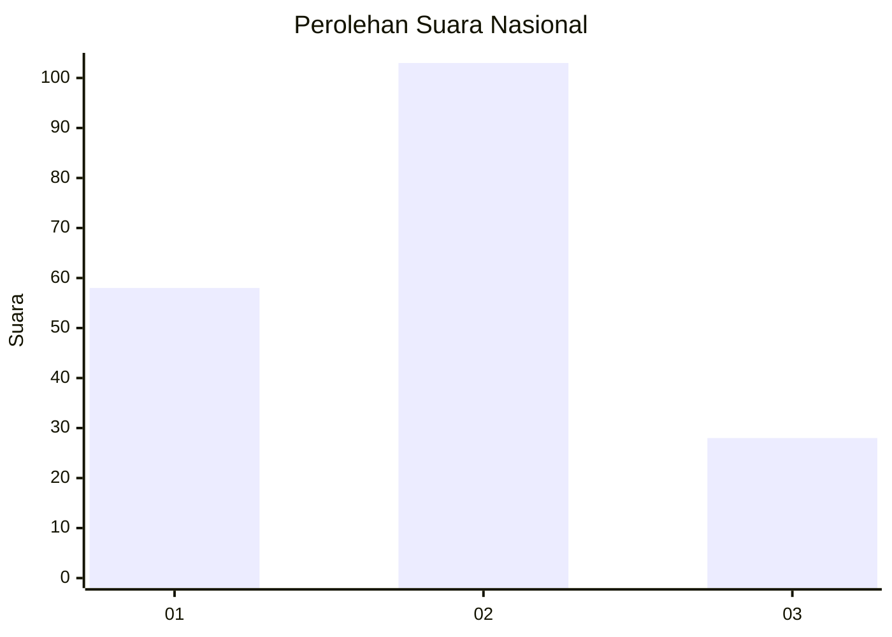
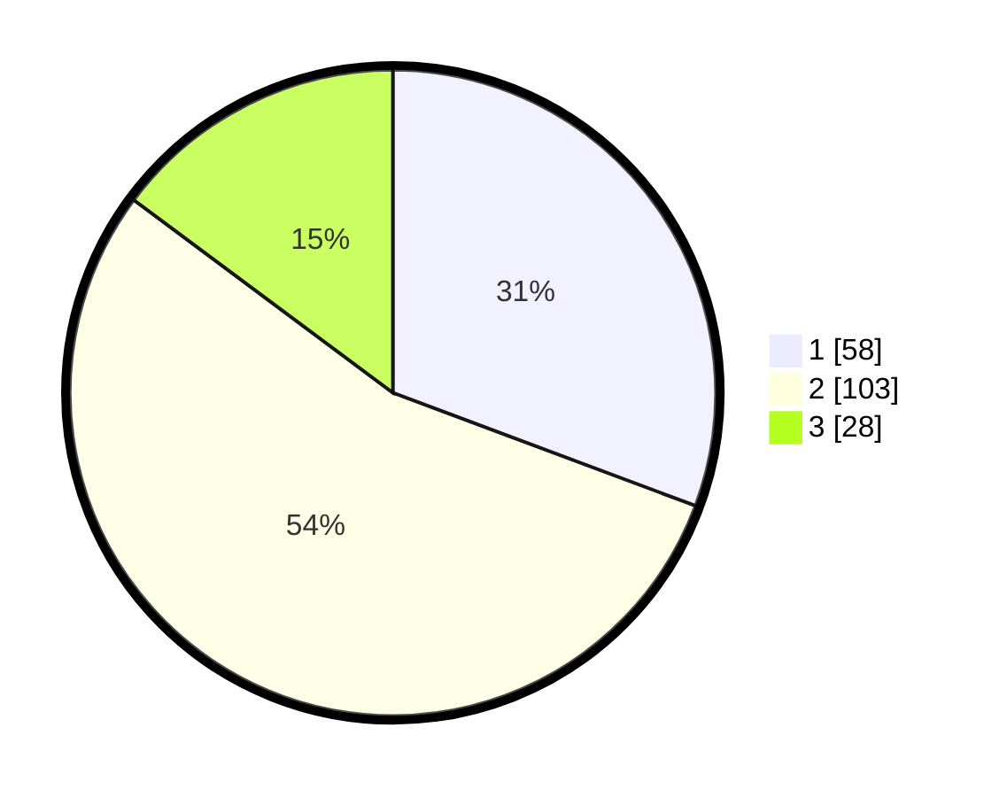

# Hasil

## Grafik

## Tabel

| No.    | Nama Paslon    | Suara | Suara (raw) | Persentase |
|:------ |:-------------- | -----:| -----------:| ----------:|
| 100025 | ANIES MUHAIMIN | 58    | [58][p-1]   | 30,69      |
| 100026 | PRABOWO GIBRAN | 103   | [103][p-2]  | 54,50      |
| 100027 | GANJAR MAHFUD  | 28    | [28][p-3]   | 14,81      |

[p-1]: https://github.com/gigit-pemilu/pemilu-2024/blob/main/pilpres/hitung-suara/sub/31-dki-jakarta/sub/73-jakarta-barat/sub/01-cengkareng/sub/1004-kedaung-kali-angke/sub/009-tps/sub/paslon-1.txt
[p-2]: https://github.com/gigit-pemilu/pemilu-2024/blob/main/pilpres/hitung-suara/sub/31-dki-jakarta/sub/73-jakarta-barat/sub/01-cengkareng/sub/1004-kedaung-kali-angke/sub/009-tps/sub/paslon-2.txt
[p-3]: https://github.com/gigit-pemilu/pemilu-2024/blob/main/pilpres/hitung-suara/sub/31-dki-jakarta/sub/73-jakarta-barat/sub/01-cengkareng/sub/1004-kedaung-kali-angke/sub/009-tps/sub/paslon-3.txt

## Foto C Plano

https://sirekap-obj-formc.kpu.go.id/7ba0/pemilu/ppwp/31/73/01/10/04/3173011004009-20240214-211321--b848892e-ca21-4140-9e63-11a36eb92769.jpg

https://sirekap-obj-formc.kpu.go.id/7ba0/pemilu/ppwp/31/73/01/10/04/3173011004009-20240214-211527--8a21899f-3e53-47aa-8da2-684351f39cd6.jpg

https://sirekap-obj-formc.kpu.go.id/7ba0/pemilu/ppwp/31/73/01/10/04/3173011004009-20240214-212154--8e6d3f46-25e7-4be1-80e5-c9515986c657.jpg

## Metadata

| Key        | Value               |
| ---------- | ------------------- |
| Time Stamp | 2024-02-17 19:00:04 |

