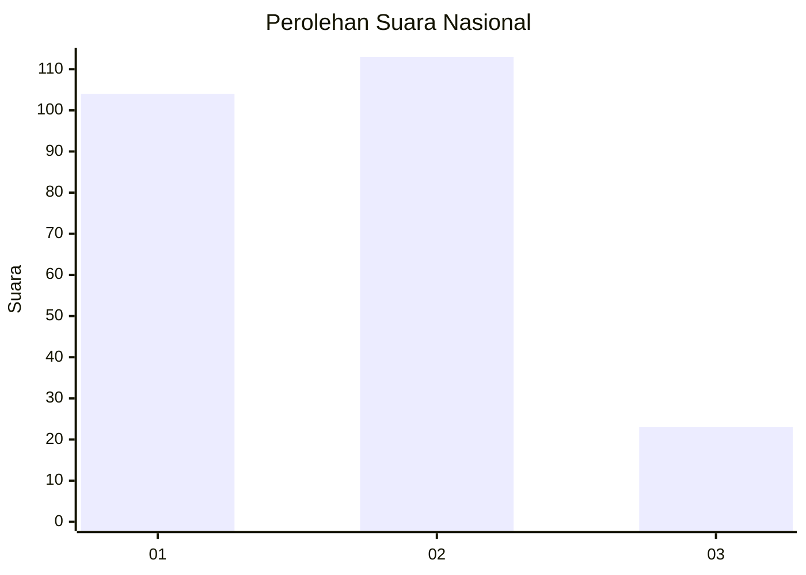
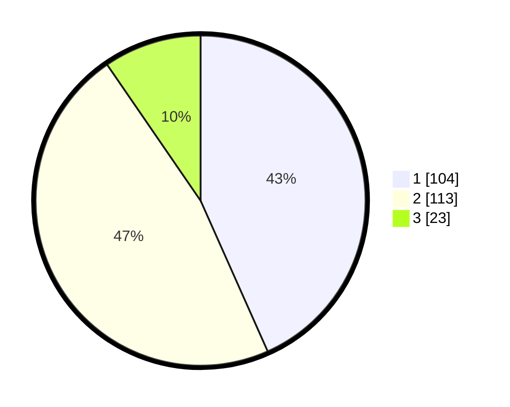

# Hasil

## Grafik

## Tabel

| No.    | Nama Paslon    | Suara | Suara (raw) | Persentase |
|:------ |:-------------- | -----:| -----------:| ----------:|
| 100025 | ANIES MUHAIMIN | 104   | [104][p-1]  | 43,33      |
| 100026 | PRABOWO GIBRAN | 113   | [113][p-2]  | 47,08      |
| 100027 | GANJAR MAHFUD  | 23    | [23][p-3]   | 9,58       |

[p-1]: https://github.com/gigit-pemilu/pemilu-2024/blob/main/pilpres/hitung-suara/sub/31-dki-jakarta/sub/73-jakarta-barat/sub/01-cengkareng/sub/1004-kedaung-kali-angke/sub/015-tps/sub/paslon-1.txt
[p-2]: https://github.com/gigit-pemilu/pemilu-2024/blob/main/pilpres/hitung-suara/sub/31-dki-jakarta/sub/73-jakarta-barat/sub/01-cengkareng/sub/1004-kedaung-kali-angke/sub/015-tps/sub/paslon-2.txt
[p-3]: https://github.com/gigit-pemilu/pemilu-2024/blob/main/pilpres/hitung-suara/sub/31-dki-jakarta/sub/73-jakarta-barat/sub/01-cengkareng/sub/1004-kedaung-kali-angke/sub/015-tps/sub/paslon-3.txt

## Foto C Plano

https://sirekap-obj-formc.kpu.go.id/7320/pemilu/ppwp/31/73/01/10/04/3173011004015-20240215-040133--ef4e4659-53d0-483b-aded-eeea76329804.jpg

https://sirekap-obj-formc.kpu.go.id/7320/pemilu/ppwp/31/73/01/10/04/3173011004015-20240215-040248--a4f82801-7b42-4868-b598-aab22054f40f.jpg

https://sirekap-obj-formc.kpu.go.id/7320/pemilu/ppwp/31/73/01/10/04/3173011004015-20240215-040356--dbf7e332-d330-41b0-8293-59e3113a82bc.jpg

## Metadata

| Key        | Value               |
| ---------- | ------------------- |
| Time Stamp | 2024-02-17 19:30:00 |

